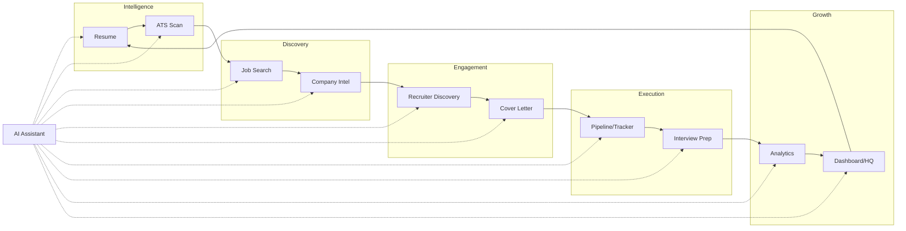

# AiVance — Career Operating System Information Architecture

This document defines the foundational Information Architecture (IA) for AiVance as a **Career Operating System**. It moves the application from a collection of isolated features to a unified, workflow-first ecosystem where every screen answers: *"What is the next best career action?"*

---

## 1. Career Operating System Information Architecture

The Career OS is structured as a **Continuous Career Loop**. Data flows from intelligence to discovery to engagement to execution, with the Assistant and Dashboard providing the connective tissue.

### Core Architecture Entity: The User's Career
| Category | Component | Data Context |
| :--- | :--- | :--- |
| **Intelligence** | Resume & ATS | The "Product" (The User) |
| **Discovery** | Jobs & Company | The "Market" (Opportunities) |
| **Engagement** | Recruiter & Cover Letter | The "Connection" (Outreach) |
| **Execution** | Pipeline & Interview | The "Transaction" (Conversion) |
| **Growth** | Analytics & Roadmap | The "Strategy" (Direction) |

---

## 2. Final Screen Hierarchy

### Layer 1: Authentication & Onboarding (Gate)
- **Splash** (Identity)
- **Welcome** (Value Prop)
- **Auth** (Secure Entry)
- **Provider Setup** (The Engine - LLM/API keys)

### Layer 2: Primary Navigation (The Core Loop)
Accessible via the Navigation Suite (Bottom Bar / Rail / Drawer).
- **Dashboard (Career HQ)**: Mission Control.
- **Intelligence Hub**:
    - Resume List → Detail → Editor.
    - ATS Scanner → Score History → Optimization Plan.
- **Job Discovery**:
    - Search → Filters → Map/List view.
    - Company Detail → Cultural Intelligence → Recent News.
- **Pipeline (The Tracker)**:
    - Kanban Board → Application Detail (Workspace).
    - Status History → Timeline.
- **Prep Studio (Execution)**:
    - Q&A Bank → Role-specific sets.
    - Mock Interview → AI Coach → Feedback Report.

### Layer 3: Contextual & Modal Flows
- **Cover Letter Workspace**: Template Selection → AI Generation → Export.
- **Recruiter Discovery**: Search → Contact Profile → Outreach Draft.
- **AI Assistant Overlay**: Context-aware chat (available globally).

### Layer 4: Growth & Account
- **Career Analytics**: Funnel charts, Score progression, Activity heatmaps.
- **Profile Hub**: Roadmap, Skills, Portfolio.
- **Settings Hub**: Appearance, Security, Data Management, About.

---

## 3. Navigation Ownership Matrix

| Surface | Responsibility | Behavior |
| :--- | :--- | :--- |
| **Bottom Navigation Bar** | Primary Hubs | Swaps between Dashboard, Intelligence, Jobs, Pipeline, Prep Studio. |
| **Top App Bar** | Context & Actions | Displays Page Title, Profile Avatar (links to Hub), and Contextual Menu (Settings). |
| **Navigation Rail** | Adaptive Support | Replaces Bottom Bar on Medium/Wide screens (Foldables/Tablets). |
| **FAB (Floating Action)** | Contextual Creation | Dashboard: "Quick AI Ask"; Jobs: "New Search"; Resume: "Add Version". |
| **Navigation Drawer** | Secondary Hubs | Access to Analytics, Roadmap, and Settings. |
| **Bottom Sheets** | Transactional Input | Changing job status, selecting an AI model, or filtering search. |
| **Backstack** | Temporal Consistency | Standard LIFO stack; root destinations clear the stack. |

---

## 4. Workflow Diagram (The Career Loop)

---

## 5. User Journey Maps

### Journey A: The "New User" (Zero to One)
1. **Welcome** → Explains Career OS concept.
2. **Auth** → Secure login.
3. **Provider Setup** → Guide through Gemini/Groq setup (Critical for OS functionality).
4. **Dashboard** → Prompt: "Your Career HQ is empty. Upload your first resume to begin."
5. **Resume Hub** → Upload PDF → AI parses into structured data.
6. **ATS Scan** → Input target JD → Receive first Score.

### Journey B: The "Active Applicant"
1. **Dashboard** → Notifies: "Interview with Google in 2 days. Ready to practice?"
2. **Prep Studio** → Opens Interview Coach for "Senior Product Manager".
3. **Session** → 15-minute mock interview.
4. **Feedback** → Score: 85. Improvement: "Be more specific with STAR method results."
5. **Analytics** → Sees Interview Score trend upwards.

---

## 6. Feature Relationship Matrix

| Source Module | Target Module | Data/Dependency Flow |
| :--- | :--- | :--- |
| **Resume** | **ATS** | Passes text content for alignment analysis. |
| **ATS** | **Jobs** | Uses missing keywords to filter/rank job searches. |
| **Jobs** | **Company** | Triggers deep-dive into the hiring organization. |
| **Company** | **Recruiter** | Identifies hiring managers at the target organization. |
| **Recruiter** | **Cover Letter** | Personalizes the letter to a specific name/role. |
| **Jobs/Resume** | **Pipeline** | Creates a tracking entry with the JD and Resume version. |
| **Pipeline** | **Interview** | Triggers prep sessions when status is "Interviewing". |
| **All** | **Analytics** | Emits events (success, failures, scores) to growth engine. |
| **All** | **Assistant** | Provides contextual "Current Screen" metadata for AI help. |

---

## 7. Dashboard Ownership Document (Career HQ)

The Dashboard is the **Brain of the OS**. It is NOT a list of shortcuts; it is a live summary of the user's career status.

### Content Priority (The "Z-Pattern" of Careers)
1. **The Hero Score**: Unified Career Score (Weighted average of ATS, Prep, and Activity).
2. **The Pulse**: "Next Best Action" (e.g., "Follow up on Netflix", "Fix 3 keywords in Resume").
3. **The Pipeline**: Active applications and their current status highlights.
4. **The Recommendations**: Jobs matching the latest high-score resume.
5. **The Assistant**: A "Live Prompt" related to the current biggest hurdle.

---

## 8. UX Decision Document

- **Rule 1: Context Preservation.** When moving from Jobs to Cover Letter, the app MUST carry over the Job ID and Resume ID automatically.
- **Rule 2: Zero Dead Ends.** Every "Success" or "Error" screen must have a primary button leading to the "Next Best Action."
- **Rule 3: Honest Feedback.** If a score is low, don't just show a number; show the "Path to Green."
- **Rule 4: Progressive Disclosure.** Don't show complex settings (AI temperatures, raw JSON) unless the user specifically enters "Advanced Mode."

---

## 9. Navigation Principles

1. **Hierarchy depth** must not exceed 3 levels (Home → Hub → Detail).
2. **State Restoration**: If the user is in the middle of a mock interview and leaves, the app must resume the session upon return.
3. **Back behavior**: System back should always return to the Hub; Hub back returns to Dashboard.
4. **Transitions**: Use horizontal slides for same-level navigation; vertical slides (modals) for task-specific overlays (Cover Letter gen).

---

## 10. Architecture Validation Report

- **Compatibility**: The proposed 5 primary destinations map perfectly to existing `:feature:dashboard`, `:feature:resume`/`:feature:ats`, `:feature:jobs`, `:feature:tracker`, and `:feature:interview`.
- **Module Separation**: No features need to depend on each other; all communication happens via `:navigation` routes and shared `:core:database` state.
- **Provider Alignment**: The "Provider Setup" as a first-class citizen aligns with the `:core:sdk` and `:core:ai-providers` architecture.
- **Ready for v2**: This IA supports the future roadmap (Cloud sync, Workspace mode) without requiring a core refactor.

---
*Generated by the Lead Product Architect for the AiVance Career Operating System.*
