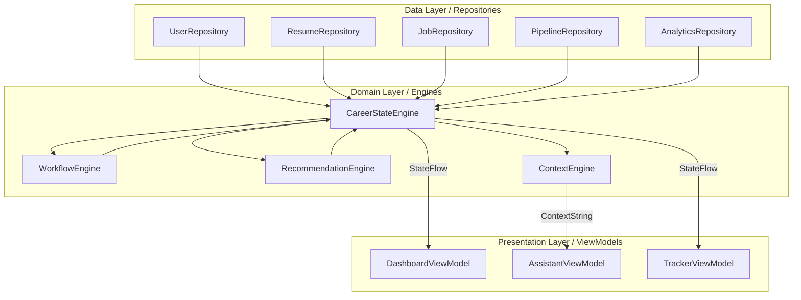
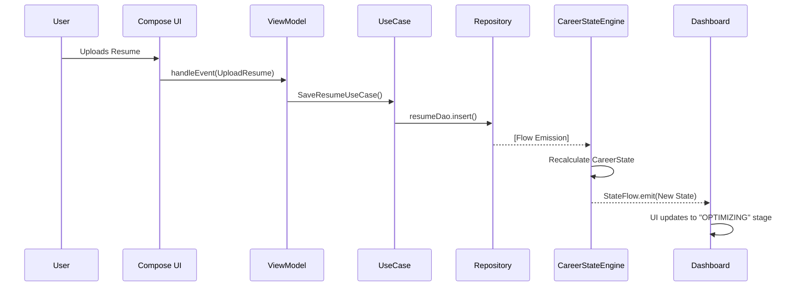

# AiVance — Career State Architecture

This document defines the unified **Career State** model and the reactive engine that powers the Career Operating System.

## 1. Unified Career State Model

The `CareerState` is an immutable aggregate model that represents the user's complete context.

```kotlin
data class CareerState(
    val profile: ProfileState,
    val intelligence: IntelligenceState,
    val discovery: DiscoveryState,
    val pipeline: PipelineState,
    val growth: GrowthState,
    val recommendations: List<CareerRecommendation>,
    val nextBestAction: CareerAction?,
    val lifecycleStage: CareerLifecycleStage
)

data class ProfileState(
    val name: String,
    val targetRole: String,
    val skills: List<String>,
    val completionPercentage: Int
)

data class IntelligenceState(
    val latestResumeId: Long?,
    val atsScore: Int,
    val lastScanDate: Long?,
    val totalResumes: Int
)

data class DiscoveryState(
    val savedJobsCount: Int,
    val lastSearchQuery: String?,
    val matchingJobsCount: Int
)

data class PipelineState(
    val activeApplications: Int,
    val upcomingInterviews: List<UpcomingInterview>,
    val pipelineDistribution: Map<String, Int>
)

data class GrowthState(
    val careerScore: Int,
    val weeklyApplicationCount: Int,
    val topStrengths: List<String>,
    val keyBlockers: List<String>
)
```

## 2. State Ownership Diagram



## 3. State Synchronization (Reactive Flow)

1.  **Room/DataStore**: Persistent source of truth.
2.  **Repositories**: Expose `Flow<T>` from DAOs/DataStore.
3.  **CareerStateEngine**:
    - `combine(repo1.data, repo2.data, ...) { r1, r2, ... -> CareerState(...) }`
    - Uses `stateIn` to provide a hot, replayable `@Singleton` state.
4.  **ViewModels**: Inject `CareerStateEngine` and collect the `StateFlow`.
5.  **Compose**: Re-renders automatically when any underlying data changes.

## 4. Career Lifecycle Stages

The `CareerLifecycleStage` determines the primary focus of the OS at any given time.

| Stage | Trigger | Primary Goal |
| :--- | :--- | :--- |
| **ONBOARDING** | No provider configured | Setup Engine |
| **PREPARING** | No resume uploaded | Create Resume |
| **OPTIMIZING** | ATS score < 70% | Fix Keywords |
| **EXPLORING** | Saved jobs < 5 | Discover Market |
| **APPLYING** | Active apps < 3 | Submit Applications |
| **INTERVIEWING** | Status == INTERVIEW | Practice & Prep |
| **STRATEGIZING** | Offer received | Negotiate & Analyze |

---

## 5. Event Flow Diagram (Action -> State)


