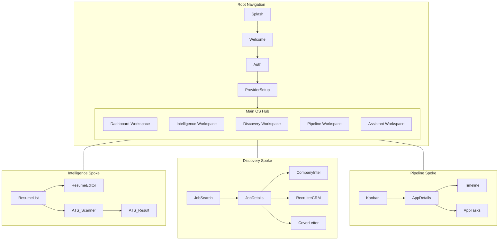

# AiVance — Navigation Architecture Specification

This document defines the nested workspace navigation and adaptive UI rules for the Career Operating System.

## 1. Complete Navigation Graph

AiVance uses a **Nested Hub-and-Spoke** architecture. Each root destination in the bottom navigation is a **Workspace Hub**.

---

## 2. Adaptive Navigation Specification

The UI layout dynamically adapts based on the Window Size Class.

| Device Type | Navigation Component | Positioning |
| :--- | :--- | :--- |
| **Phone** (Compact) | Bottom Navigation Bar | Fixed at bottom |
| **Foldable** (Medium) | Navigation Rail | Fixed at start (left) |
| **Tablet** (Expanded) | Permanent Nav Drawer | Fixed at start (left) |

### Adaptive Principles
- **Workflow Continuity**: The selection in the bottom bar must match the selection in the rail/drawer exactly.
- **Context Preservation**: Changing orientation or window size must NOT reset the backstack of the active workspace.

---

## 3. Back Stack Rules

1.  **Top-Level (Hub) Switching**: Switching between HQ, Intel, Discover, etc., does NOT pop the backstack. It merely swaps the visible spoke.
2.  **LIFO Spokes**: Within a workspace (e.g., Intelligence), navigation follows standard Last-In-First-Out.
3.  **Cross-Workspace Navigation**: If a user navigates from **Discovery** (Job Detail) to **Intelligence** (ATS Scan), the app:
    - Switches the root tab to **Intelligence**.
    - Clears the **Intelligence** backstack.
    - Pushes the **ATS Scan** screen with the passed Job context.
4.  **Predictive Back**: Standard Android 14+ predictive back support for all spoke screens.

---

## 4. Deep Link Specification

Deep links are mapped to specific workspace spokes with context re-hydration.

| URI | Target Workspace | State Injection |
| :--- | :--- | :--- |
| `aivance://jobs/{id}` | Discovery | Pushes `JobDetails(id)` |
| `aivance://resume/scan` | Intelligence | Pushes `ATS_Scanner` |
| `aivance://pipeline/{id}` | Pipeline | Pushes `AppDetails(id)` |
| `aivance://chat?q=...` | Assistant | Opens Overlay + Sends prompt |

---

## 5. AI Assistant Overlay Design

The AI Assistant is a **Global Floating Layer** accessible via a persistent button (or top-bar action).

- **Type**: Modal Bottom Sheet (Expanded) or Floating Circular Action.
- **Behavior**:
    - **Trigger**: Swipe up from a specific gesture area or tap the AI icon.
    - **Persistence**: Opening the AI does not trigger a navigation event. It is a UI state change on the `AppShell`.
    - **Context Awareness**: The Assistant automatically reads the `uiState` of the screen *underneath* it to provide relevant advice.
