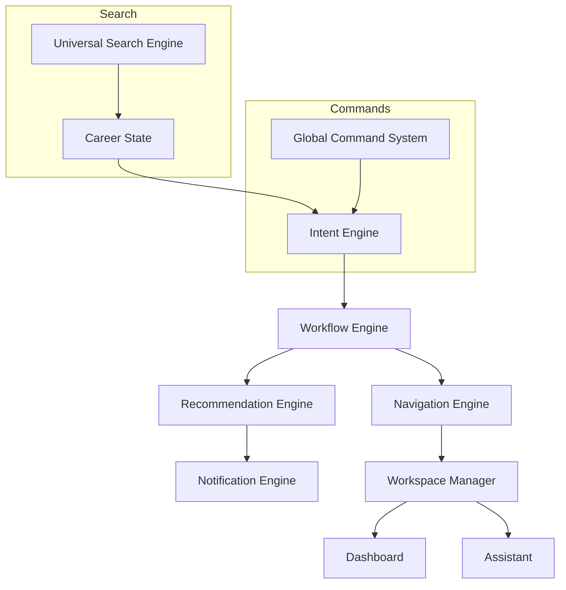
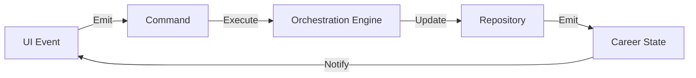

# AiVance — Career Intelligence Orchestrator Architecture

This document defines the centralized orchestration layer that coordinates User Intent, Workflow State, and Navigation to create a unified Career Operating System.

## 1. Orchestration Master Coordination

The orchestrator sits between the **Career State** (The Truth) and the **User Interface** (The Surface).



---

## 2. Intent Engine Specification

The `IntentEngine` translates raw inputs into structured **Career Objectives**.

### Intent Mapping Logic
| Input (Implicit/Explicit) | Detected Intent | Target Workflow |
| :--- | :--- | :--- |
| "I need a better job" | `MARKET_EXPLORATION` | Discovery Hub |
| "Interview tomorrow at Google" | `PREP_EXECUTION` | Prep Studio |
| ATS Score < 40% | `QUALITY_IMPROVEMENT` | Intelligence Hub |
| 5 matches found | `OPPORTUNITY_CAPTURE` | Pipeline Hub |

### Intent Data Model
```kotlin
data class CareerIntent(
    val id: String,
    val type: IntentType,
    val priority: Priority,
    val metadata: Map<String, String>,
    val expiration: Long?
)
```

---

## 3. Workflow Engine Expansion

The expanded `WorkflowEngine` tracks the completion of **Career Lifecycle Objectives**.

### Progress Tracking
- **Stage Completion %**: Derived from the ratio of completed vs. required tasks in a stage.
- **Goal Dependency**: Objectives are blocked until prerequisite objectives are met (e.g., cannot "Apply" without a "Resume").

### Stage Definition (Dynamic)
Stages are no longer hardcoded enums but are derived from the active **Career Objective** list.

---

## 4. Workspace Manager Design

The `WorkspaceManager` ensures every hub preserves its "Live" context across temporal boundaries.

### State Persistence Rules
1.  **Draft Preservation**: Auto-save text buffers in the Resume Editor or Cover Letter gen.
2.  **View State**: Store scroll positions and selected filter chips.
3.  **Context Lock**: Keep the active Job ID or Resume Version active across the Discovery -> Intelligence loop.
4.  **Recovery**: Automatic restoration of the last active workspace on app launch.

---

## 5. Global Command System

A registry of all available "Atomic Actions" in the OS.

### Command Registry (Sample)
- `NAV_TO_WORKSPACE(hubId)`
- `GENERATE_CONTENT(type, contextId)`
- `START_ANALYSIS(type, targetId)`
- `SEARCH_ENTITY(query, scope)`
- `UPDATE_STATUS(applicationId, newStatus)`

Commands can be triggered by:
1.  User clicking a button.
2.  Assistant executing an intent.
3.  Automation (Notification Engine).

---

## 6. Universal Search Specification

The `UniversalSearchEngine` provides a unified entry point for data discovery.

### Indexing Rules
- **Entities**: Jobs, Companies, Recruiters, Resumes, Applications, Interview Sessions, Settings.
- **Contextual Weighting**: Boost results relevant to the current `CareerLifecycleStage`.
- **Fuzzy Matching**: Supported across all textual fields.

---

## 7. Notification Engine Design

Derives push and in-app alerts from the `CareerState` and `RecommendationEngine`.

### Trigger Rules
- **Time-based**: "Interview in 1 hour."
- **State-based**: "ATS score dropped below 80% after update."
- **Event-based**: "Recruiter contact info found for Apple."

---

## 8. Event Flow Architecture

The OS uses a **Command-Query Responsibility Segregation (CQRS)** pattern for internal events.



---

## 9. Context Propagation & Orchestrator Sequence

### Sequence: Life of an Intent
1.  **User**: "Help me prepare for my Microsoft interview."
2.  **IntentEngine**: Detects `PREP_EXECUTION`, metadata: `{company: "Microsoft"}`.
3.  **WorkflowEngine**: Adds "Practice behavioral questions" and "Research Microsoft culture" to objectives.
4.  **RecommendationEngine**: Generates "Start Mock Interview" high-priority card.
5.  **NavigationEngine**: Prepares deep-link to `PrepStudioHub`.
6.  **Dashboard**: Updates to show Microsoft prep context.

---

## 10. Repository Integration Report

- **Alignment**: Engines will live in `:core:domain` and consume interfaces from `:core:data`.
- **Independence**: Each engine is a pure Kotlin component, making it easily testable.
- **Scalability**: The modular design allows adding new scrapers or AI models without changing the orchestration logic.
