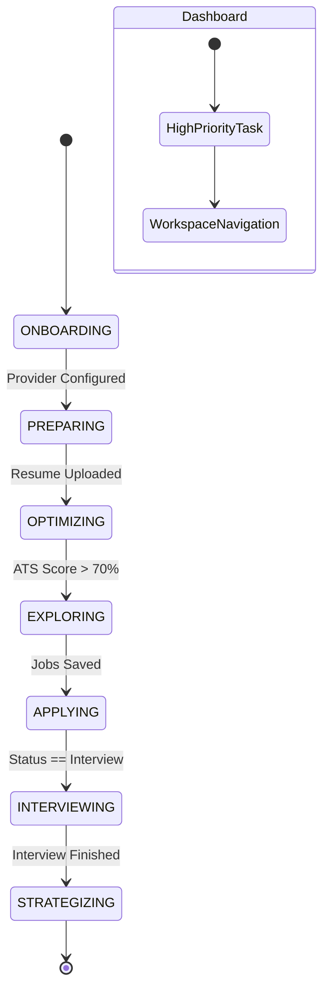

# AiVance — Workflow Navigation Specification

This document defines how the `CareerState` drive the user's journey through the application.

## 1. Navigation State Diagram



---

## 2. Workflow Navigation Engine Logic

The `NavigationWorkflowEngine` maps `CareerState` to **Navigation Intents**.

### Logic Table
| Career Stage | Navigation Recommendation | Action Label | Destination |
| :--- | :--- | :--- | :--- |
| **PREPARING** | "No resume found. Let's create one." | "Create Resume" | `Intelligence/ResumeList` |
| **OPTIMIZING** | "Your resume is 40% match for Google." | "Fix Keywords" | `Intelligence/ATS_Scanner` |
| **EXPLORING** | "Market is hot for Android Devs today." | "Search Jobs" | `Discovery/JobSearch` |
| **INTERVIEWING** | "Interview with Netflix in 2 hours." | "Start Practice" | `PrepStudio/Coach` |

---

## 3. Navigation Event Flow (UDF)

To maintain a pure Unidirectional Data Flow, all navigation follows this chain:

1.  **User Action**: Taps a button (e.g., "Fix keywords").
2.  **ViewModel**: Receives `UiEvent.OnNextActionClick`.
3.  **ViewModel**: Emits `UiEffect.Navigate(Destination.Intelligence.AtsScanner(id))`.
4.  **NavGraph**: Collects the effect and executes `navController.navigate(...)`.

### Shared Navigation Effect
```kotlin
sealed interface NavigationEffect {
    data class To(val destination: Destination) : NavigationEffect
    data object Back : NavigationEffect
    data class External(val url: String) : NavigationEffect
}
```

---

## 4. Navigation Testing Plan

### 1. Backstack Integrity Test
- **Action**: Open Discovery -> View Job -> Switch to Intelligence -> Switch back to Discovery.
- **Expected**: Discovery remains on "View Job" screen.

### 2. Deep Link Context Test
- **Action**: Trigger `aivance://jobs/123`.
- **Expected**: Discovery Hub becomes active, `JobDetails` screen is pushed onto the stack for ID `123`.

### 3. Adaptive Layout Test
- **Action**: Start in Portrait (Phone) -> Rotate to Landscape (Large screen).
- **Expected**: Bottom Bar disappears, Navigation Rail appears at the start. Current screen state is preserved.

### 4. Workflow Redirection Test
- **Action**: Clear all data -> Launch App.
- **Expected**: App immediately routes to `ProviderSetup`, bypassing Dashboard.
