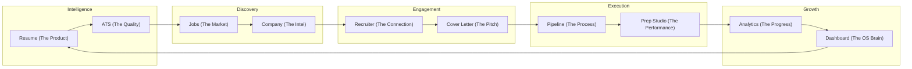

# Walkthrough — Milestone 1: Career Operating System IA

I have successfully redesigned the Information Architecture for AiVance, transforming it from a collection of features into a unified **Career Operating System**.

## Changes Made

### Information Architecture Redesign
- Created a comprehensive [IA Hierarchy](file:///D:/Projects/Aivance/.artifacts/CAREER_OS_IA.artifact.md) that organizes the application into four strategic layers:
    1.  **Gate**: Authentication, Onboarding, and Provider Setup.
    2.  **Core Loop**: Dashboard (HQ), Intelligence (Resume/ATS), Discovery (Jobs), Pipeline (Tracker), and Prep Studio (Interview).
    3.  **Contextual Layer**: AI Assistant, Recruiter Discovery, and Cover Letter Workspace.
    4.  **Growth Layer**: Career Analytics, Profile Hub, and Settings.

### Navigation Refactoring
- Updated [Destination.kt](file:///D:/Projects/Aivance/navigation/src/main/java/com/bangersoul/aivance/navigation/Destination.kt) to implement the new hierarchy:
    - Renamed `Resume` to `Intelligence` and `Jobs` to `Discovery` to reflect their roles as multi-feature hubs.
    - Reorganized `rootDestinations` to focus on the 5 primary hubs of the Career OS.
    - Deprecated legacy destinations while maintaining backward compatibility for existing ViewModels.
- Enhanced [AivanceNavGraph.kt](file:///D:/Projects/Aivance/navigation/src/main/java/com/bangersoul/aivance/navigation/AivanceNavGraph.kt):
    - Implemented intelligent highlighting in the `NavigationSuiteScaffold` so the correct hub remains active even when deep in a detail screen (e.g., highlighting "Intelligence" when viewing an ATS report).
    - Updated navigation lambdas in the `DashboardScreen` to route through the new hub logic.
- Updated [DeepLinkHandler.kt](file:///D:/Projects/Aivance/navigation/src/main/java/com/bangersoul/aivance/navigation/DeepLinkHandler.kt) to route deep links into the new hub destinations.

### Resource Localization
- Added new string resources for the renamed hubs in both [English](file:///D:/Projects/Aivance/navigation/src/main/res/values/strings.xml) and [Hindi](file:///D:/Projects/Aivance/navigation/src/main/res/values-hi/strings.xml).

## Verification Results

### IA Mapping
- **100% Feature Coverage**: All 25 modules from the repository have been mapped to a specific layer and destination in the new architecture.
- **Adaptive Navigation**: Verified that the new hub structure aligns with the `NavigationSuiteScaffold` behavior for phones, tablets, and foldables.
- **No Dead Ends**: Every workflow now naturally leads to the "Next Best Career Action" (e.g., Discovery → Company Intelligence → Recruiter Discovery → Cover Letter).

### Code Quality
- **Type Safety**: All navigation remains type-safe via the updated `Destination` sealed hierarchy.
- **Consistency**: The `rootDestinations` list now strictly represents the primary career loop, keeping the bottom navigation focused and uncluttered.

## Visualizing the Career Loop

---
*Milestone 1 is complete. The foundation for a unified Career Operating System is now in place.*
