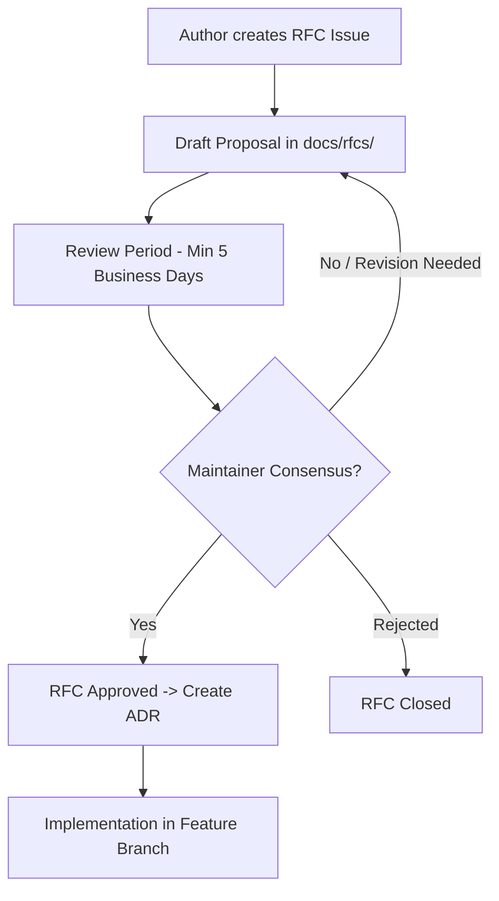
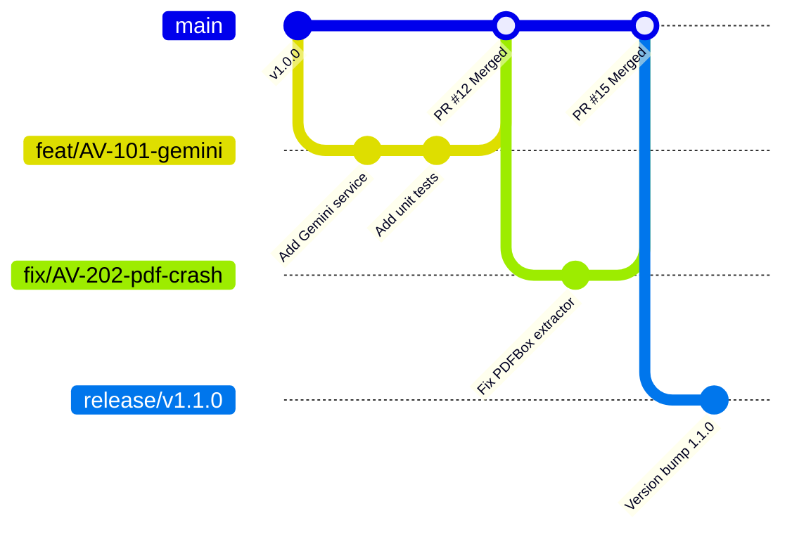
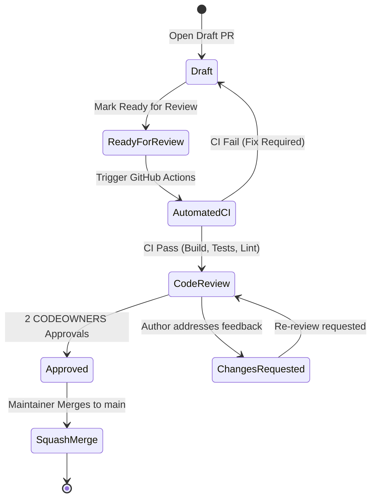
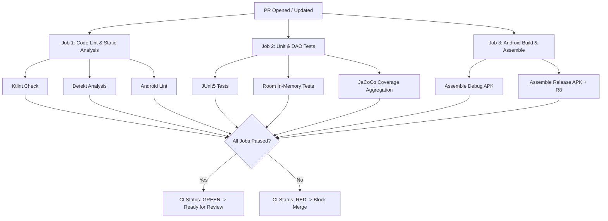
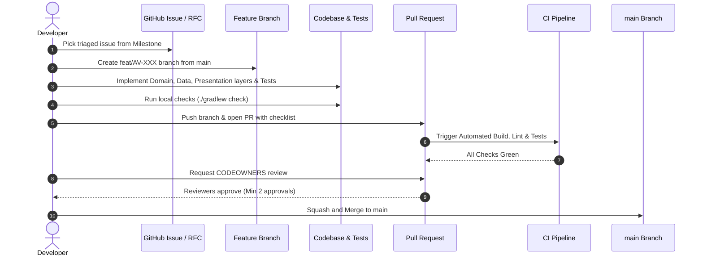

# AVIANCE - CONTRIBUTOR GUIDE & ENGINEERING STANDARDS

**Document Type:** Official Contributor Handbook, Engineering Workflow Specification & Repository Governance Policy  
**Target Repository:** Aviance (Android Application)  
**Package Root:** `com.bangersoul.aivance`  
**Authors:** Chief Software Architect, Principal Android Engineer, Engineering Manager, QA Architect, Security Lead, DevOps Lead  
**Status:** Official Master Specification / Active Contribution Guide  
**Related Specifications:** `Audit.md`, `EngineeringPlan.md`, `Architecture.md`, `EngineeringSpecification.md`, `API.md`, `ProviderSDK.md`, `DeveloperGuide.md`

---

## 1. INTRODUCTION

### 1.1 Purpose
Welcome to the **Aviance** project. This document defines the mandatory engineering standards, contribution workflows, code review processes, security guidelines, and repository governance for all contributors. Whether you are an internal core engineer, an open-source contributor, an enterprise partner, or a contractor, this guide serves as your binding operational standard before opening a Pull Request (PR) or making changes to the codebase.

### 1.2 Audience
This handbook applies to:
* **Internal Android Engineers:** Full-time platform and feature developers maintaining core modules and application features.
* **Open-Source Contributors:** External developers submitting bug fixes, features, or documentation improvements.
* **Contractors & Enterprise Partners:** External engineering teams delivering modular extensions or provider integrations.
* **Maintainers & Code Owners:** Reviewers and architects responsible for code quality, security audits, and release engineering.

### 1.3 Contribution Philosophy
Aviance is built on an **engineering-first, quality-focused philosophy**:
1. **Quality Over Speed:** A clean, tested, documented, and architecturally compliant contribution is vastly preferred over a rushed implementation.
2. **Explicit Contracts:** Boundaries between modules, layers, network APIs, and SDK providers must be strictly maintained via explicit interfaces and immutable data models.
3. **Zero Regressions:** Every bug fix or feature must include unit, integration, or UI tests to prevent regressions.
4. **Security & Privacy by Default:** Secrets, private keys, and Personally Identifiable Information (PII) must never be logged, hardcoded, or stored in cleartext.
5. **Offline-First & Reliable:** Applications must remain responsive regardless of network state, delegating long-running operations to background workers or reactive streams.

### 1.4 Repository Goals
* **Production Maturity:** Achieve sub-1.5s cold startup time, 60 FPS Compose rendering, zero memory leaks, and 99.9% crash-free sessions.
* **Test Coverage:** Maintain >80% code coverage across domain, repository, and ViewModel layers.
* **Pluggable Architecture:** Support plug-and-play integrations for AI providers (Gemini, OpenAI, Groq, Ollama) and Job scrapers (Apify, REST APIs) without touching core code.

### 1.5 Engineering Principles
* **Clean Architecture & UDF:** Strict separation of Presentation, Domain, Data, and Infrastructure layers with Unidirectional Data Flow.
* **Immutable State:** All UI state objects (`UiState`) must be immutable and exposed via read-only `StateFlow`.
* **Explicit Dependency Injection:** All dependencies must be injected via Hilt. Direct class instantiation of singletons or services is strictly prohibited.
* **Fail Fast & Informatively:** Validate inputs at API and boundary limits. Throw domain-specific, recoverable exceptions with actionable context.

### 1.6 Ownership
The codebase is partitioned into distinct ownership domains:
* **Core Infrastructure (`:core:common`, `:core:database`, `:core:datastore`, `:core:network`, `:core:util`):** Managed by Platform Architecture & Security Teams.
* **Design System (`:core:designsystem`):** Managed by Staff UI/UX & Design System Engineers.
* **Navigation (`:navigation`, `:app`):** Managed by Lead Application Architects.
* **Feature Modules (`:feature:*`):** Managed by respective Feature Engineering Pods (Career, AI, Job Search, Tracker).

### 1.7 Support Channels
* **GitHub Issues:** Bug reports, feature proposals, and architectural discussions (RFCs).
* **Developer Discussion / Chat:** Slack/Matrix channel `#aviance-dev`.
* **Security Reporting:** Direct confidential email to `security@aviance.app`. Do not open public GitHub issues for security vulnerabilities.

---

## 2. REPOSITORY GOVERNANCE

### 2.1 Maintainers & Code Owners
Maintainers are senior engineers with write and merge permissions to the repository. The project uses GitHub `CODEOWNERS` to automatically assign mandatory code reviewers based on affected module paths.

```plaintext
# CODEOWNERS Configuration
*                               @bangersoul/aviance-maintainers
/core/                          @bangersoul/aviance-core-team
/core/database/                 @bangersoul/aviance-data-team
/core/network/                  @bangersoul/aviance-network-team
/core/designsystem/             @bangersoul/aviance-ui-team
/feature/jobs/                  @bangersoul/aviance-jobs-team
/feature/resume/                @bangersoul/aviance-ai-team
/feature/interview/             @bangersoul/aviance-ai-team
```

### 2.2 Decision Process
Architectural decisions follow a collaborative, transparent model:
1. **Consensus-Driven:** Ideas are discussed openly in GitHub Issues or RFCs.
2. **Architectural Oversight:** The Chief Software Architect and Module CODEOWNERS hold veto power over breaking changes, dependency additions, or layer boundary modifications.
3. **Escalation Path:** Unresolved technical disagreements are escalated to the Technical Steering Committee (TSC) for a binding vote.

### 2.3 RFC (Request for Comments) Process
Any change that affects public API contracts, introduces new third-party libraries, alters the database schema, or modifies cross-module boundaries requires an approved RFC.



#### RFC Lifecycle States
1. **Draft:** Initial proposal being formulated by author.
2. **Under Review:** Open for community and maintainer feedback (minimum 5 business days).
3. **Approved:** Accepted for implementation. An Architecture Decision Record (ADR) is generated in `Architecture.md`.
4. **Rejected:** Declined due to architectural misalignment, performance impact, or security concerns.
5. **Implemented:** Code changes merged and validated.

### 2.4 Architecture Decision Records (ADRs)
When an RFC is approved, a formal ADR must be appended to `Architecture.md` following this standard format:
* **ADR ID:** `ADR-XXX`
* **Title:** Concise title of the architectural change
* **Context:** Problem statement and constraints
* **Decision:** Chosen technical solution
* **Consequences:** Positive, negative, and neutral trade-offs
* **Alternatives Considered:** Options evaluated and reasons for rejection

### 2.5 Issue Triage & SLAs
Incoming issues are triaged by maintainers according to strict Service Level Agreements (SLAs):

| Severity | Priority Label | Triage SLA | Resolution Target | Action Required |
| :--- | :--- | :--- | :--- | :--- |
| **Critical Crash / Exploit** | `P0-Blocker` | < 4 Hours | < 24 Hours | Immediate hotfix branch, block releases |
| **Major Functionality Broken** | `P1-High` | < 24 Hours | < 3 Business Days | Prioritize in current sprint milestone |
| **Minor Bug / Performance** | `P2-Medium` | < 3 Days | Next Milestone | Schedule in backlog |
| **UX Polish / Enhancement** | `P3-Low` | < 5 Days | Flexible | Good first issue / Community backlog |
| **Doc / Cleanup** | `P4-Nits` | < 7 Days | Flexible | Low priority backlog |

### 2.6 Milestones
Sprints and releases are organized into 8 sequential milestones as defined in `EngineeringPlan.md`:
* `M1`: Critical Fixes & Stability Blockers
* `M2`: Architecture Modernization
* `M3`: AI Platform Implementation
* `M4`: Job Platform & Scraper Integration
* `M5`: Settings & Preferences Modernization
* `M6`: Test Suite & Coverage Hardening
* `M7`: Performance & Baseline Profile Optimization
* `M8`: Production Release & Play Store Deployment

---

## 3. BRANCH STRATEGY

### 3.1 Branching Model
Aviance follows a customized **GitHub Flow** model with strict protected branch rules on `main` and dedicated release branches.



### 3.2 Branch Naming Conventions
All branch names must strictly conform to the format:
`<type>/<issue-id>-<short-description>`

#### Supported Branch Types
* `feat/`: New feature implementation (e.g., `feat/AV-102-openai-provider`)
* `fix/`: Bug fix (e.g., `fix/AV-204-pdf-renderer-crash`)
* `refactor/`: Code refactoring without behavioral changes (e.g., `refactor/AV-301-hilt-di-modules`)
* `perf/`: Performance optimization (e.g., `perf/AV-402-compose-recomposition`)
* `sec/`: Security hardening or patch (e.g., `sec/AV-501-keystore-encryption`)
* `docs/`: Documentation updates (e.g., `docs/AV-601-contributing-guide`)
* `test/`: Adding or updating unit/UI tests (e.g., `test/AV-701-interview-repository-tests`)
* `release/`: Preparation for production release (e.g., `release/v1.2.0`)
* `exp/`: Experimental spikes or proofs of concept (e.g., `exp/AV-901-kmp-migration`)

### 3.3 Protected Branch Rules (`main`)
The `main` branch represents production-ready code. Direct pushes are disabled.
* **Mandatory PR:** All changes must arrive via Pull Request.
* **Approvals:** Requires at least 2 approving reviews from CODEOWNERS.
* **CI Checks:** All status checks (build, lint, unit tests, static analysis) must pass.
* **Up-to-Date:** Branches must be rebased on `main` prior to merging.
* **Linear History:** Merge commits are prohibited on feature branches; squash and merge is enforced.

---

## 4. COMMIT STANDARDS

### 4.1 Conventional Commits
All commit messages must follow the [Conventional Commits v1.0.0](https://www.conventionalcommits.org/) specification:

`<type>(<scope>): <short description>`

`[optional body]`

`[optional footer(s)]`

#### Mandatory Co-Author Trailer
When contributing as an AI agent or pair programmer, you MUST include the co-author flag in the commit footer:
`Co-authored-by: Junie <junie@jetbrains.com>`

### 4.2 Allowed Types & Scopes

| Type | Description | Example |
| :--- | :--- | :--- |
| `feat` | A new user-facing or platform feature | `feat(ai): add streaming chat response support` |
| `fix` | A bug fix | `fix(util): replace API 35 PdfRenderer with PDFBox` |
| `docs` | Documentation changes only | `docs(readme): update build and setup instructions` |
| `style` | Formatting, missing semi-colons, no code logic change | `style(designsystem): format Color.kt imports` |
| `refactor` | Code change that neither fixes a bug nor adds a feature | `refactor(database): extract ApplicationDao queries` |
| `perf` | Code change that improves performance | `perf(compose): annotate DashboardUiState with @Immutable` |
| `test` | Adding missing tests or correcting existing tests | `test(resume): add ViewModel error state unit test` |
| `build` | Changes affecting build system or external dependencies | `build(deps): upgrade Room compiler to 2.6.1` |
| `ci` | Changes to CI configuration files and scripts | `ci(github): add detekt static analysis action` |
| `chore` | Other changes that don't modify src or test files | `chore(gitignore): ignore local properties files` |
| `sec` | Security vulnerability fix or credential hardening | `sec(datastore): encrypt API key in DataStore` |

#### Valid Scopes
`app`, `navigation`, `core-common`, `core-database`, `core-datastore`, `core-designsystem`, `core-network`, `core-util`, `feature-ats`, `feature-coverletter`, `feature-dashboard`, `feature-interview`, `feature-jobs`, `feature-profile`, `feature-resume`, `feature-tracker`, `deps`, `security`.

### 4.3 Atomic Commits
* Commits should be **atomic**: Each commit represents a single logical, buildable change.
* Do not combine refactoring, formatting, and feature additions into a single commit.
* Avoid massive "WIP" (Work In Progress) commits in final PR submissions. Squash intermediate commits before asking for review.

### 4.4 Examples

#### Good Commit
```plaintext
feat(ai): implement streaming response contract for Gemini provider

Introduces Flow-based text streaming for real-time response rendering 
in CoverLetterScreen. Reduces perceived latency by 1200ms.

Fixes #AV-104
Co-authored-by: Junie <junie@jetbrains.com>
```

#### Bad Commit
```plaintext
fixed stuff and added some UI changes and cleaned up files
```
*Why bad?* Vague title, no type, no scope, combines unrelated changes, lacks issue reference and mandatory co-author trailer.

---

## 5. PULL REQUEST PROCESS

### 5.1 Pull Request Lifecycle



### 5.2 Opening a Pull Request
1. **Target Branch:** Always target `main` for feature and bugfix PRs.
2. **Title:** Must follow conventional commit format (e.g., `feat(jobs): add Apify scraper integration`).
3. **PR Template:** Populate every section of the official PR template (Description, Issue Reference, Changes Made, Test Evidence, Screenshots/Videos).
4. **Draft PR:** Use Draft status for work-in-progress to obtain early feedback without triggering full CODEOWNER review notifications.

### 5.3 CI Requirements
A PR cannot be merged unless all automated CI pipeline checks pass:
* **Build Verification:** `./gradlew assembleDebug assembleRelease` succeeds with zero errors.
* **Static Analysis:** `./gradlew detekt ktlintCheck lintDebug` passes with zero violations.
* **Unit Tests:** `./gradlew testDebugUnitTest` achieves 100% pass rate.
* **Instrumentation Tests:** `./gradlew connectedDebugAndroidTest` passes on managed emulator.
* **Coverage Verification:** JaCoCo report confirms >80% coverage on modified files.
* **Binary Size Check:** Release APK size change is within +500KB tolerance.

### 5.4 Merge Strategies
* **Squash and Merge:** Standard merge strategy for all feature, fix, and refactor PRs. Combines all branch commits into a clean, single commit on `main`.
* **Rebase and Merge:** Used exclusively when merging release branches into `main`.
* **Direct Merge Commits:** Prohibited on `main`.

---

## 6. CODING STANDARDS

### 6.1 Kotlin Standards
* **Kotlin Version:** Written for Kotlin 2.0+ with modern idioms.
* **Null Safety:** Avoid non-null assertion operators (`!!`). Use safe calls (`?.`), Elvis operator (`?:`), or explicit `checkNotNull()` / `requireNotNull()` with descriptive error messages.
* **Immutability:** Prefer `val` over `var`. Use read-only collections (`listOf`, `mapOf`).
* **Sealed Interfaces:** Represent UI state and domain events using `sealed interface` hierarchies for exhaustive `when` evaluation.
* **Explicit Return Types:** All public functions and property declarations must state return types explicitly.

```kotlin
// GOOD: Explicit return type, sealed interface, immutable val
sealed interface ResumeState {
    data object Loading : ResumeState
    data class Success(val analysis: ResumeAnalysis) : ResumeState
}

fun parseResume(input: String): Result<ResumeAnalysis> {
    return Result.success(...)
}

// BAD: Implicit return type, var, non-null assertion
var globalAnalysis: ResumeAnalysis? = null
fun parseResume(input: String) = globalAnalysis!!
```

### 6.2 Jetpack Compose Standards
* **State Hoisting:** Stateless Composables are mandatory. Pass state down, pass events up via lambdas.
* **Recomposition Optimization:**
  * All domain and UI state model classes passed to Composables MUST be annotated with `@Immutable` or `@Stable`.
  * Wrap complex calculations or derived values in `remember { derivedStateOf { ... } }`.
  * Use `LazyColumn` key parameters explicitly (`items(list, key = { it.id })`).
* **Side Effects:** Never execute side effects directly in the body of a Composable function. Use `LaunchedEffect`, `DisposableEffect`, or `rememberCoroutineScope`.
* **Touch Targets:** All interactive elements must adhere to Material Design minimum target sizes (`48dp` x `48dp`).

```kotlin
// GOOD: Stateless, @Immutable state, explicit key, lambda callback
@Composable
fun ApplicationItem(
    application: JobApplication, // JobApplication is @Immutable
    onStatusChange: (ApplicationStatus) -> Unit,
    modifier: Modifier = Modifier
) {
    Card(modifier = modifier.fillMaxWidth()) {
        Row(
            verticalAlignment = Alignment.CenterVertically,
            modifier = Modifier.padding(16.dp)
        ) {
            Text(text = application.company, style = MaterialTheme.typography.titleMedium)
            Spacer(modifier = Modifier.weight(1f))
            IconButton(onClick = { onStatusChange(ApplicationStatus.INTERVIEWING) }) {
                Icon(Icons.Default.Edit, contentDescription = "Edit Status")
            }
        }
    }
}
```

### 6.3 Coroutines & Flow Standards
* **Dispatcher Injection:** NEVER hardcode `Dispatchers.IO` or `Dispatchers.Default` inside ViewModels, Repositories, or Services. Always inject them using `@Dispatcher(AivanceDispatchers.IO)`.
* **Scope Discipline:** Use `viewModelScope` in ViewModels and `coroutineScope` in suspending functions. Do not use `GlobalScope`.
* **Flow Collection:** Collect flows in Compose using `collectAsStateWithLifecycle()` to automatically pause collection when the screen is stopped.
* **Exception Handling:** Wrap coroutines in `runCatching` or explicit `try-catch (e: CancellationException) { throw e }` blocks. Never swallow `CancellationException`.

```kotlin
// GOOD: Injected dispatcher, proper cancellation handling, runCatching
class ResumeRepositoryImpl @Inject constructor(
    private val aiService: AiService,
    @Dispatcher(AivanceDispatchers.IO) private val ioDispatcher: CoroutineDispatcher
) : ResumeRepository {

    override suspend fun analyzeResume(content: String): Result<ResumeAnalysis> = withContext(ioDispatcher) {
        runCatching {
            val response = aiService.analyzeText(content).getOrThrow()
            Json.decodeFromString<ResumeAnalysis>(response)
        }
    }
}
```

### 6.4 Dependency Injection (Hilt) Standards
* All ViewModels must be annotated with `@HiltViewModel`.
* Bind interfaces to implementations using `@Binds` in `@Module` interfaces (avoid `@Provides` unless instantiating complex third-party objects).
* Use `@Singleton` scope judiciously—only for truly stateless registries, factories, or database instances.

---

## 7. ARCHITECTURE RULES

### 7.1 Layer Boundaries & Dependency Direction

```
+-----------------------------------------------------------------------+
|                          PRESENTATION LAYER                           |
|                  (:feature:*, :navigation, :core:designsystem)        |
+-----------------------------------+-----------------------------------+
                                    |
                                    v  (Depends On)
+-----------------------------------------------------------------------+
|                             DOMAIN LAYER                              |
|               (UseCases, Domain Models, Repository Contracts)          |
+-----------------------------------+-----------------------------------+
                                    |
                                    v  (Depends On)
+-----------------------------------------------------------------------+
|                              DATA LAYER                               |
|              (:core:database, :core:datastore, :core:network)         |
+-----------------------------------------------------------------------+
```

### 7.2 Strict Rule Matrix

| Source Layer / Module | Allowed Dependencies | Forbidden Dependencies | Rationale |
| :--- | :--- | :--- | :--- |
| **Presentation (`:feature:*`)** | Domain interfaces, `:core:designsystem`, `:core:common` | `:core:database` DAOs, `:core:network` directly, other `:feature:*` | Preserves UI isolation and domain boundaries |
| **Domain Layer** | Core Models, Kotlin Coroutines | Android Framework classes (`Context`, `View`), Room, Retrofit | Domain must remain pure Kotlin and platform-agnostic |
| **Data Layer (`:core:database`)** | Domain interfaces, Room runtime, `:core:common` | Presentation layer, Jetpack Compose | Data layer exposes domain models, not UI models |
| **Network (`:core:network`)** | Domain interfaces, Retrofit, OkHttp, `:core:common` | UI components, Room entities | Network layer handles remote DTO serialization |
| **Feature to Feature** | None | Direct imports of other `:feature:*` code | Modules must communicate via `:navigation` or shared core |

---

## 8. TESTING REQUIREMENTS

### 8.1 Testing Pyramid Specifications

```
             / \
            /   \     UI & Navigation Tests (10%)
           / Compose \   [ComposeTestRule / HiltNav]
          /-----------\
         / Integration \   DAO & Migration Tests (20%)
        /  & Provider   \  [Room In-Memory / Robolectric]
       /-----------------\
      /    Unit Tests     \  ViewModel & Repository Tests (70%)
     /                     \ [JUnit5 / MockK / Turbine / Coroutines]
    /----------------------- \
```

### 8.2 Mandatory Test Coverage Metrics

| Component Type | Required Coverage | Key Testing Frameworks | Primary Focus |
| :--- | :--- | :--- | :--- |
| **ViewModels** | >85% | JUnit5, Turbine, MockK, Coroutines Test | StateFlow emissions, UI events, error handling |
| **Repositories** | >90% | JUnit5, MockK, kotlinx-coroutines-test | Network/DB synchronization, DTO mapping |
| **Room DAOs** | 100% | In-Memory Room, AndroidJUnitRunner | Query correctness, entity relations, cascade deletes |
| **Room Migrations** | 100% | `MigrationTestHelper` | Schema evolution verification without data loss |
| **AI / Job Providers** | >80% | MockWebServer, Fake Providers | Streaming, retry backoff, fallback logic |
| **Compose Screens** | >70% | `createAndroidComposeRule` | Screen state rendering, button clicks, dialogs |

### 8.3 Standard Unit Test Template
Every ViewModel unit test must follow this structure using Turbine for StateFlow testing:

```kotlin
@OptIn(ExperimentalCoroutinesApi::class)
class ResumeViewModelTest {

    @get:Rule
    val mainDispatcherRule = MainDispatcherRule()

    private val repository: ResumeRepository = mockk()
    private lateinit var viewModel: ResumeViewModel

    @Test
    fun `analyzeResume success updates uiState to Success`() = runTest {
        val mockAnalysis = ResumeAnalysis(score = 85, summary = "Great resume")
        coEvery { repository.analyzeResume(any()) } returns Result.success(mockAnalysis)

        viewModel = ResumeViewModel(repository, mainDispatcherRule.testDispatcher)

        viewModel.uiState.test {
            assertEquals(ResumeUiState.Initial, awaitItem())
            
            viewModel.handleEvent(ResumeEvent.Analyze("Sample resume text"))
            
            assertEquals(ResumeUiState.Loading, awaitItem())
            val successItem = awaitItem() as ResumeUiState.Success
            assertEquals(85, successItem.analysis.score)
        }
    }
}
```

---

## 9. DOCUMENTATION STANDARDS

### 9.1 KDoc Mandate
KDoc documentation is compulsory for:
* All public interfaces, classes, and top-level functions.
* Complex algorithms (e.g., text parsing, matching algorithms).
* Abstract provider SDK boundaries (`AiProvider`, `JobProvider`).

```kotlin
/**
 * Executes an ATS compatibility analysis on the provided resume content.
 *
 * @param resumeText Plain text extracted from the user's uploaded resume.
 * @param jobDescription Target job description to match against.
 * @return [Result] containing [AtsResult] on success, or [AivanceException] on failure.
 * @throws IllegalArgumentException If [resumeText] or [jobDescription] is blank.
 */
suspend fun analyzeAtsCompatibility(
    resumeText: String,
    jobDescription: String
): Result<AtsResult>
```

### 9.2 Documentation Maintenance
Whenever code is modified, related documentation MUST be updated in the same PR:
* API signature changes -> Update `API.md`.
* Module boundary changes -> Update `Architecture.md` & `DeveloperGuide.md`.
* Provider interface additions -> Update `ProviderSDK.md`.
* Database entity / migration changes -> Update `EngineeringSpecification.md`.

---

## 10. SECURITY REQUIREMENTS

### 10.1 Zero Secrets in Version Control
* **STRICT PROHIBITION:** API keys, access tokens, passwords, private keystores, and credentials MUST NEVER be committed to Git.
* Secrets must be supplied via local `local.properties` or CI environment variables (`GEMINI_API_KEY`, `APIFY_API_TOKEN`).

### 10.2 Hardware-Backed Credential Storage
All user-provided API keys and tokens MUST be encrypted before persistence:
* Encrypted at rest using **Android Keystore** master keys.
* Managed through `EncryptedSharedPreferences` or `Encrypted DataStore` wrappers.

```kotlin
// GOOD: Using Encrypted DataStore / Keystore
class KeyRepositoryImpl @Inject constructor(
    private val encryptedDataStore: EncryptedDataStore
) {
    suspend fun saveApiKey(key: String) {
        encryptedDataStore.setSecureString(KEY_GEMINI, key)
    }
}
```

### 10.3 Network Security & TLS
* **HTTPS Only:** Cleartext HTTP traffic is disabled globally via `AndroidManifest.xml` and `res/xml/network_security_config.xml`.
* **TLS Version:** TLS 1.3 is enforced.
* **Certificate Pinning:** Production API endpoints use OkHttp `CertificatePinner` to prevent MITM attacks.

### 10.4 Vulnerability Reporting
If you discover a security vulnerability, **DO NOT create a public issue**. Email `security@aviance.app` with reproduction steps. Responsible disclosures will be acknowledged within 24 hours.

---

## 11. PERFORMANCE STANDARDS

### 11.1 Key Performance Indicators (KPIs)

| Metric | Target SLA | Measuring Tool | Enforcement Mechanism |
| :--- | :--- | :--- | :--- |
| **Cold Startup Time** | < 1,500 ms | Macrobenchmark / Android Vitals | CI Macrobenchmark run |
| **Frame Rendering Rate** | 60 FPS (< 16ms frame time) | Perfetto / Compose Inspector | Zero jank frame budget |
| **Memory Consumption** | < 150 MB peak | Android Profiler / LeakCanary | CI LeakCanary test run |
| **Database Query SLA** | < 15 ms execution time | Room Query Profiler | Mandatory `@Index` on DB columns |
| **Release APK Size** | < 25 MB | R8 / ProGuard Size Diff | CI Binary Size check (+500KB cap) |

### 11.2 Compose Recomposition Rules
* Use `@Immutable` on data classes containing collection properties (`List`, `Set`, `Map`).
* Always pass lambda callbacks using stable function references or `remember { { ... } }`.
* Never read dynamic state inside layout scopes where reading can be deferred to draw phases.

---

## 12. ACCESSIBILITY STANDARDS (a11y)

### 12.1 Material 3 Accessibility Compliance
* **TalkBack Support:** All interactive elements (`IconButton`, `Button`, `Clickable`) MUST specify a clear, localized `contentDescription` or explicitly set `semantics { clearAndSetSemantics { } }` if decorative.
* **Minimum Touch Target:** All clickable components MUST meet the minimum `48dp` x `48dp` touch target bounding box.
* **Color Contrast:** Text and interactive icons must maintain a minimum contrast ratio of **4.5:1** against backgrounds (compliant with WCAG AA standards).
* **Dynamic Font Scaling:** UI layouts must accommodate up to **200% font scaling** without text clipping or layout overlap.
* **Right-To-Left (RTL):** Layouts must use start/end modifiers (`padding(start = ...)` instead of `padding(left = ...)`) to fully support RTL internationalization.

---

## 13. CODE REVIEW GUIDE

### 13.1 Reviewer Responsibilities
* **Timeliness:** Complete assigned reviews within 24 hours on business days.
* **Constructive Tone:** Critique code, not people. Provide clear explanations and suggested fixes.
* **Distinguish Nitpicks:** Prefix non-blocking cosmetic suggestions with `nit:`.
* **Verify Architecture & Tests:** Ensure layer boundaries are preserved and adequate unit/UI tests are included.

### 13.2 Author Responsibilities
* **Self-Review First:** Review your own diff on GitHub before requesting peer review.
* **Provide Context:** Include screenshots, screen recordings, or log outputs in the PR description.
* **Respond Promptly:** Address all reviewer comments. Mark resolved discussions once addressed.

### 13.3 Code Review Checklist Matrix

```
[ ] Architecture Compliance: Follows Clean Architecture, layer boundaries, and DI rules?
[ ] Code Quality: Kotlin 2.0 idioms, null safety, no magic numbers, explicit return types?
[ ] Compose Performance: States are @Immutable, no side-effects in body, 48dp touch targets?
[ ] Security: Zero secrets, input validation present, no raw logging of PII?
[ ] Performance: Off-main-thread IO, fast Room queries, baseline profiles updated?
[ ] Testing: ViewModel, Repository, or DAO tests included with >80% coverage?
[ ] Accessibility: TalkBack content descriptions, 4.5:1 contrast, dynamic font scaling?
[ ] Documentation: KDoc comments present, API/Architecture docs updated if needed?
```

---

## 14. CI/CD REQUIREMENTS

### 14.1 GitHub Actions Continuous Integration Pipeline



### 14.2 Static Analysis Configuration
* **Ktlint:** Enforces official Kotlin coding conventions and import ordering.
* **Detekt:** Analyzes code complexity, magic numbers, long parameter lists, and potential code smells.
* **Android Lint:** Catches API level incompatibilities, missing resources, and performance warnings.

---

## 15. DEPENDENCY MANAGEMENT

### 15.1 Version Catalog Governance
* ALL dependencies MUST be declared in `gradle/libs.versions.toml`.
* Direct string dependencies in module `build.gradle.kts` files are STRICTLY PROHIBITED.

### 15.2 Library Onboarding Evaluation Checklist
Before opening an RFC to add a new third-party dependency:
1. **License Check:** Must use Apache 2.0, MIT, or BSD license. GPL/LGPL libraries are forbidden.
2. **Maintenance Check:** Active commits within the last 6 months. High community adoption.
3. **Size Impact:** Binary footprint increase must be under 300 KB compressed.
4. **Android Compatibility:** Full support for Min SDK 26, Target SDK 35, and JDK 17.

---

## 16. ISSUE TEMPLATES

### 16.1 Bug Report Template
```markdown
### Bug Description
A clear and concise description of what the bug is.

### Reproduction Steps
1. Go to '...'
2. Click on '....'
3. Scroll down to '....'
4. See error

### Expected Behavior
A clear description of what you expected to happen.

### Device & OS Context
- Device: [e.g. Pixel 8]
- OS Version: [e.g. Android 15 (API 35)]
- App Version: [e.g. v1.1.0]

### Stacktrace / Logs
```
[Insert logcat output here]
```
```

### 16.2 Feature Request Template
```markdown
### Feature Summary
A clear and concise description of the proposed feature.

### Motivation & Use Case
Why is this feature needed? What user problem does it solve?

### Proposed Architecture
Which modules will be affected (`:feature:*`, `:core:*`)? Does this require an RFC?

### Acceptance Criteria
- [ ] Requirement 1
- [ ] Requirement 2
```

---

## 17. FEATURE DEVELOPMENT WORKFLOW

### 17.1 End-to-End Feature Lifecycle



---

## 18. ANTI-PATTERNS

### 18.1 Common Architecture Anti-Patterns

#### Anti-Pattern 1: Direct Network or Database Access from UI
```kotlin
// BAD: Composable accessing Dao directly
@Composable
fun BadScreen(dao: ApplicationDao) {
    val apps = dao.getAllApplications().collectAsState(initial = emptyList())
}

// CORRECT: Composable observes ViewModel StateFlow
@Composable
fun GoodScreen(viewModel: TrackerViewModel = hiltViewModel()) {
    val uiState by viewModel.uiState.collectAsStateWithLifecycle()
}
```

#### Anti-Pattern 2: Hardcoding Dispatchers
```kotlin
// BAD: Hardcoded Dispatchers.IO
class BadRepository {
    suspend fun getData() = withContext(Dispatchers.IO) { ... }
}

// CORRECT: Injected Dispatcher
class GoodRepository @Inject constructor(
    @Dispatcher(AivanceDispatchers.IO) private val ioDispatcher: CoroutineDispatcher
) {
    suspend fun getData() = withContext(ioDispatcher) { ... }
}
```

#### Anti-Pattern 3: Swallowing Coroutine Cancellation
```kotlin
// BAD: Swallowing all exceptions including CancellationException
try {
    doSuspendingWork()
} catch (e: Exception) {
    Log.e("Tag", "Error", e)
}

// CORRECT: Re-throwing CancellationException
try {
    doSuspendingWork()
} catch (e: CancellationException) {
    throw e
} catch (e: Exception) {
    // Handle domain error
}
```

---

## 19. CONTRIBUTOR CHECKLISTS

### 19.1 Pre-Commit Checklist
* [ ] Code builds cleanly via `.\gradlew assembleDebug`.
* [ ] Unit tests pass via `.\gradlew testDebugUnitTest`.
* [ ] Code style and lint checks pass via `.\gradlew detekt ktlintCheck`.
* [ ] No secret keys or hardcoded passwords in diff.
* [ ] Commit message follows Conventional Commits format with co-author trailer.

### 19.2 Pre-PR Submission Checklist
* [ ] Targeted against `main` branch.
* [ ] PR description completely filled out with issue references.
* [ ] Added/updated unit or UI tests covering modified logic.
* [ ] Verified dynamic font scaling and TalkBack accessibility.
* [ ] Updated relevant documentation (`API.md`, `Architecture.md`, `DeveloperGuide.md`).

---

## 20. CODE OF CONDUCT

### 20.1 Our Commitment
In the interest of fostering an open and welcoming environment, we as contributors and maintainers pledge to make participation in our project and our community a harassment-free experience for everyone, regardless of age, body size, disability, ethnicity, sex characteristics, gender identity and expression, level of experience, education, socio-economic status, nationality, personal appearance, race, religion, or sexual identity and orientation.

### 20.2 Our Standards
Examples of behavior that contributes to creating a positive environment include:
* Using welcoming and inclusive language.
* Being respectful of differing viewpoints and experiences.
* Gracefully accepting constructive criticism.
* Focusing on what is best for the community and engineering quality.
* Showing empathy towards other community members.

Examples of unacceptable behavior include:
* The use of sexualized language or imagery and unwelcome sexual attention or advances.
* Trolling, insulting/derogatory comments, and personal or political attacks.
* Public or private harassment.
* Publishing others' private information, such as a physical or electronic address, without explicit permission.
* Other conduct which could reasonably be considered inappropriate in a professional setting.

### 20.3 Enforcement & Reporting
Instances of abusive, harassing, or otherwise unacceptable behavior may be reported by contacting the project team at `conduct@aviance.app`. All complaints will be reviewed and investigated and will result in a response that is deemed necessary and appropriate to the circumstances. Maintainers are obligated to maintain confidentiality with regard to the reporter of an incident.

---

## 21. FREQUENTLY ASKED QUESTIONS (FAQ)

### Q1: How do I add a new third-party library?
**A:** Submit an RFC issue explaining the library's purpose, license, and size impact. Once approved by a maintainer, add the dependency to `gradle/libs.versions.toml` and reference it in the target module's `build.gradle.kts`.

### Q2: Why is my PR failing CI on formatting?
**A:** Aviance enforces strict formatting via ktlint. Run `.\gradlew ktlintFormat` locally to automatically fix formatting issues before committing.

### Q3: How do I test Room database migration changes?
**A:** Write an explicit migration test using `MigrationTestHelper` in `:core:database` `src/androidTest`. Verify that schema changes preserve existing user data across versions.

### Q4: How do I add a new AI Provider to the platform?
**A:** Refer to `ProviderSDK.md`. Implement the `AiProvider` interface, register the provider in `ProviderRegistry`, and add the provider configuration entry to `:core:datastore`.

---

## 22. APPENDIX

### 22.1 Branch Naming Quick Reference

| Task Type | Prefix Format | Example |
| :--- | :--- | :--- |
| Feature | `feat/AV-<ID>-<desc>` | `feat/AV-105-cover-letter-pdf-export` |
| Bug Fix | `fix/AV-<ID>-<desc>` | `fix/AV-202-pdf-renderer-crash` |
| Refactor | `refactor/AV-<ID>-<desc>` | `refactor/AV-304-room-dao-cleanup` |
| Security | `sec/AV-<ID>-<desc>` | `sec/AV-501-encrypted-datastore` |
| Documentation | `docs/AV-<ID>-<desc>` | `docs/AV-602-api-md-update` |

### 22.2 Glossary of Terms
* **UDF (Unidirectional Data Flow):** Architecture pattern where state flows down and events flow up.
* **Hilt:** Official Jetpack dependency injection framework built on Dagger.
* **Room:** Android Jetpack SQLite object mapping library.
* **DataStore:** Jetpack data storage solution replacing SharedPreferences.
* **Apify:** Cloud web scraping platform integrated for real-time job search ingestion.
* **Gemini:** Google's Generative AI LLM family powering native AI capabilities.
* **KSP (Kotlin Symbol Processing):** High-performance compiler plugin mechanism powering Room and Hilt code generation.

---
*End of Aviance Contributor Guide & Engineering Standards Specification.*
