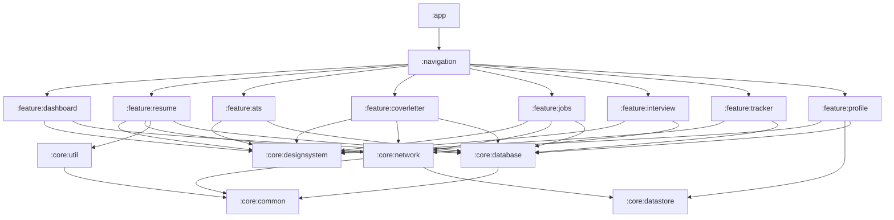

# AVIANCE - DEVELOPER ONBOARDING & ENGINEERING GUIDE

**Document Type:** Official Developer Onboarding, Engineering & Operations Manual  
**Target Repository:** Aviance (Android Application)  
**Package Root:** `com.bangersoul.aivance`  
**Authors:** Chief Software Architect, Principal Android Engineer, Technical Documentation Lead, Engineering Standards Lead  
**Status:** Official Master Specification / Active Developer Handbook  
**Related Specifications:** `Audit.md`, `EngineeringPlan.md`, `Architecture.md`, `EngineeringSpecification.md`, `API.md`, `ProviderSDK.md`

---

## 1. INTRODUCTION

### 1.1 Purpose
Welcome to **Aviance**. This Developer Guide is the primary onboarding and operational manual for engineers contributing to the Aviance Android application. Designed as a standalone, self-contained reference, this document provides the exact setup instructions, architectural walkthroughs, workflows, coding standards, debugging techniques, and troubleshooting steps required for a developer to clone the repository and become productive immediately without external intervention.

### 1.2 Audience
This handbook is authored for:
* **New Engineering Hires & Contributors:** Android developers joining the team who need to understand the codebase, environment setup, and development workflows.
* **Core Platform Engineers:** Engineers building and maintaining infrastructure modules (`:core:*`), database schemas, network pipelines, or CI/CD pipelines.
* **Feature Engineers:** Developers creating new user-facing features (`:feature:*`) or extending existing ones.
* **SDK & Extension Developers:** Integrators expanding the platform with custom AI or Job search providers.

### 1.3 Goals
* **Zero-Assistance Onboarding:** Enable a developer to set up the environment, build, run, test, and debug the application on day one.
* **Architectural Consistency:** Maintain strict adherence to Clean Architecture, Unidirectional Data Flow (UDF), Modularization, and Security guidelines.
* **Standardized Workflows:** Eliminate ambiguity in Git branching, commit conventions, testing expectations, database migrations, and pull requests.
* **High Operational Quality:** Enforce performance targets, security standards, and code quality checklists across all modules.

### 1.4 Prerequisites & Knowledge Expectations
To work effectively on Aviance, developers are expected to possess strong proficiency in:
* **Kotlin 2.0+:** Advanced knowledge of coroutines, Flow/StateFlow, scope functions, sealed interfaces, and delegation.
* **Jetpack Compose & Material Design 3:** Declarative UI, state hoisting, recomposition optimization, layouts, and animations.
* **Modern Android Architecture:** Clean Architecture principles, Repository pattern, ViewModels, and Hilt Dependency Injection.
* **Room & DataStore:** Room DAOs, entities, reactive queries (`Flow`), migrations, and Proto/Preferences DataStore.
* **Gradle & Build System:** Kotlin DSL (`build.gradle.kts`), Version Catalog (`gradle/libs.versions.toml`), and multi-module dependency graphs.

### 1.5 Repository Overview
Aviance is an AI-powered career co-pilot and job search platform natively built for Android. The repository is structured as a modern, multi-module Android project comprising 16 Gradle modules designed around Clean Architecture boundaries:
* `:app`: Application entry point, Hilt setup, global manifest, WorkManager initializer.
* `:navigation`: App-wide navigation graph, Navigation 3 / Adaptive Navigation Suite bindings.
* `:core:*`: Shared infrastructure modules (`:common`, `:database`, `:datastore`, `:designsystem`, `:network`, `:util`).
* `:feature:*`: Independent feature domain modules (`:ats`, `:coverletter`, `:dashboard`, `:interview`, `:jobs`, `:profile`, `:resume`, `:tracker`).

### 1.6 Technology Stack

```
+---------------------------------------------------------------------------------+
|                                 APPLICATION LAYER                               |
|                     Jetpack Compose 1.7+ | Material Design 3                    |
|                Navigation 3 (Alpha) | Adaptive Navigation Suite                 |
+----------------------------------------+----------------------------------------+
                                         |
                                         v
+---------------------------------------------------------------------------------+
|                                PRESENTATION LAYER                               |
|              AndroidX ViewModel | Kotlin StateFlow | Compose State              |
+----------------------------------------+----------------------------------------+
                                         |
                                         v
+---------------------------------------------------------------------------------+
|                                  DOMAIN LAYER                                   |
|                UseCases | Domain Models | Repository Contracts                  |
+----------------------------------------+----------------------------------------+
                                         |
                                         v
+---------------------------------------------------------------------------------+
|                                   DATA LAYER                                    |
|         Room Database 2.6+ | Encrypted DataStore | Retrofit 2.11+ / OkHttp        |
|             Google Generative AI SDK | Apify Scraper Engine                     |
+---------------------------------------------------------------------------------+
```

| Component | Library / Framework | Version | Purpose |
| :--- | :--- | :--- | :--- |
| **Language** | Kotlin | `2.0.21` | Core language across all modules |
| **UI Engine** | Jetpack Compose | `2.0.21` (Compiler) | Declarative user interface |
| **Design System** | Material Design 3 | `1.3.1` / Extended `1.7.5` | UI components and dynamic theme |
| **Navigation** | Navigation 3 / Nav Suite | `1.0.0-alpha01` / `1.3.1` | Screen routing and adaptive layouts |
| **Dependency Injection** | Hilt / Dagger | `2.51.1` | Compile-time dependency injection |
| **Persistence** | Room | `2.6.1` | Local SQLite database |
| **Preferences** | DataStore Preferences | `1.1.1` | Key-value settings storage |
| **Networking** | Retrofit / OkHttp | `2.11.0` / `4.12.0` | REST API communication & interceptors |
| **Serialization** | kotlinx.serialization | `1.7.3` | Type-safe JSON decoding |
| **Async Processing** | Kotlin Coroutines / Flow | `1.9.0` | Concurrent non-blocking tasks |
| **Background Work** | WorkManager | `2.9.1` | Deferred & periodic background jobs |
| **PDF Extraction** | Apache PDFBox Android | `2.0.27.0` | Document parsing & text extraction |

### 1.7 Architecture Summary
Aviance follows the official **Google Android Architecture Recommendations**:
1. **Unidirectional Data Flow (UDF):** State flows down from ViewModels to Composables via immutable `UiState` StateFlow objects; events flow up via user interactions triggered through lambdas.
2. **Offline-First:** Room DB acts as the single source of truth for persistent user data (resumes, cover letters, application tracking). Network operations synchronize into Room.
3. **Pluggable Extensions:** AI and Job Search integrations are decoupled into extensible SDK provider abstractions (`AiProvider`, `JobProvider`) managed by registries and factories.

### 1.8 Development Philosophy
* **Code Quality First:** Every pull request must compile cleanly without warnings, pass static analysis (Lint/Detekt), and pass all unit/integration tests.
* **Security by Default:** Secrets and API keys must never be hardcoded or written in cleartext. Hardware-backed security (Android Keystore / Encrypted DataStore) is mandatory.
* **Fail Fast, Fail Informatively:** Validate inputs at boundaries. Throw explicit exceptions (`InvalidCredentialsException`, `ValidationException`) rather than swallowing errors.
* **Minimal Footprint:** Memory usage, recompositions, and battery consumption must be actively monitored and minimized.

---

## 2. REPOSITORY STRUCTURE

### 2.1 Complete Directory Tree

```
Aivance/
├── .gitignore
├── build.gradle.kts                    # Root build configuration
├── settings.gradle.kts                 # Subproject declarations & plugin management
├── gradle.properties                   # JVM & Gradle build flags
├── local.properties                    # Local SDK paths & secret keys (Git ignored)
├── gradlew / gradlew.bat               # Gradle wrapper executables
├── README.md                           # Repository high-level overview
├── Audit.md                            # Comprehensive codebase audit
├── EngineeringPlan.md                  # Implementation roadmap
├── Architecture.md                     # System architecture specification
├── EngineeringSpecification.md         # Detailed engineering & SDS contracts
├── API.md                              # API interface contracts
├── ProviderSDK.md                      # AI & Job Provider extension SDK guide
├── DeveloperGuide.md                   # Onboarding & developer guide (This document)
├── gradle/
│   ├── wrapper/
│   │   ├── gradle-wrapper.jar
│   │   └── gradle-wrapper.properties
│   └── libs.versions.toml             # Centralized Version Catalog
├── app/                                # Application entry point module
│   ├── build.gradle.kts
│   ├── proguard-rules.pro
│   └── src/main/
│       ├── AndroidManifest.xml
│       └── java/com/bangersoul/aivance/
│           ├── AivanceApp.kt
│           ├── MainActivity.kt
│           └── worker/
│               └── FollowUpWorker.kt
├── navigation/                         # Central navigation module
│   ├── build.gradle.kts
│   └── src/main/java/com/bangersoul/aivance/navigation/
│       ├── AivanceNavGraph.kt
│       └── Route.kt
├── core/                               # Infrastructure modules
│   ├── common/                         # Coroutine dispatchers & Result wrappers
│   │   └── src/main/java/com/bangersoul/aivance/core/common/
│   │       ├── dispatchers/
│   │       └── result/
│   ├── database/                       # Room Entities, DAOs, Database
│   │   └── src/main/java/com/bangersoul/aivance/core/database/
│   │       ├── dao/
│   │       ├── model/
│   │       └── AivanceDatabase.kt
│   ├── datastore/                      # DataStore & Encrypted Preferences
│   │   └── src/main/java/com/bangersoul/aivance/core/datastore/
│   │       ├── DataStoreModule.kt
│   │       └── UserPreferences.kt
│   ├── designsystem/                   # Compose Material 3 components & theme
│   │   └── src/main/java/com/bangersoul/aivance/core/designsystem/
│   │       ├── components/
│   │       └── theme/
│   ├── network/                        # Retrofit, OkHttp, AI Service abstractions
│   │   └── src/main/java/com/bangersoul/aivance/core/network/
│   │       ├── AiService.kt
│   │       ├── DelegatingAiService.kt
│   │       ├── GeminiAiService.kt
│   │       └── MockAiService.kt
│   └── util/                           # FileUtils & PDF text extractors
│       └── src/main/java/com/bangersoul/aivance/core/util/
│           ├── FileUtils.kt
│           └── PdfTextExtractor.kt
└── feature/                            # Feature modules
    ├── ats/                            # ATS analysis history feature
    ├── coverletter/                    # Cover Letter generator feature
    ├── dashboard/                      # Main user dashboard feature
    ├── interview/                      # Interactive mock interview feature
    ├── jobs/                           # Job search & scraper feature
    ├── profile/                        # User profile & career roadmap feature
    ├── resume/                         # Resume upload & AI analysis feature
    └── tracker/                        # Job application Kanban tracker feature
```

### 2.2 Module Purpose Matrix

| Module | Purpose | Ownership | Build Order Group |
| :--- | :--- | :--- | :--- |
| `:app` | Application entry point, Hilt root, WorkManager configuration | Core Team | Phase 4 (Final Assembly) |
| `:navigation` | App-wide screen routing and adaptive navigation suite | Navigation / UI Team | Phase 3 |
| `:core:common` | Coroutine dispatchers, Result<T> utility, shared domain models | Core Infrastructure | Phase 1 (Base Layer) |
| `:core:database` | Room database definition, entities, DAOs, migrations | Data Platform Team | Phase 1 (Base Layer) |
| `:core:datastore` | User preferences, API key encryption, Datastore serialisation | Security & Data Team | Phase 1 (Base Layer) |
| `:core:designsystem` | Reusable Compose components, typography, colors, theme | UI/UX Design System | Phase 1 (Base Layer) |
| `:core:network` | Retrofit services, OkHttp clients, AI/Job network abstractions | Network / AI Team | Phase 1 (Base Layer) |
| `:core:util` | File parsing, PDF extraction, Uri conversion utilities | Core Infrastructure | Phase 1 (Base Layer) |
| `:feature:ats` | ATS scan history display, breakdown, keyword matches | Career Features Team | Phase 2 (Domain Layer) |
| `:feature:coverletter` | AI cover letter generation, tone selection, text export | AI Features Team | Phase 2 (Domain Layer) |
| `:feature:dashboard` | Summary cards, recent activities, quick action launcher | Core App Team | Phase 2 (Domain Layer) |
| `:feature:interview` | AI mock interview chat session, feedback analysis | AI Features Team | Phase 2 (Domain Layer) |
| `:feature:jobs` | Job search UI, Apify scraping, filtering, saving | Job Platform Team | Phase 2 (Domain Layer) |
| `:feature:profile` | Career roadmap, user settings, API key config | Core App Team | Phase 2 (Domain Layer) |
| `:feature:resume` | Resume upload, PDF text processing, AI analysis | Career Features Team | Phase 2 (Domain Layer) |
| `:feature:tracker` | Kanban application tracker, status updates | Career Features Team | Phase 2 (Domain Layer) |

### 2.3 Module Dependency Graph



---

## 3. DEVELOPMENT ENVIRONMENT

### 3.1 Toolchain Requirements

| Component | Minimum Version | Recommended Version | Notes |
| :--- | :--- | :--- | :--- |
| **Android Studio** | 2024.1.1 (Koala) | 2024.2.1+ (Ladybug / Meerkat) | Mandatory for Kotlin 2.0 Compose Plugin support |
| **Java Development Kit** | JDK 17 | OpenJDK 17 / Corretto 17 | Configured as JVM target across all modules |
| **Kotlin Compiler** | 2.0.21 | 2.0.21 | Managed via `libs.versions.toml` |
| **Gradle** | 8.11 | 8.11 | Wrapped via `gradlew` script |
| **Android SDK** | Compile SDK 35 | Compile SDK 35 (Android 15) | Min SDK 26 (Android 8.0), Target SDK 35 |
| **Git** | 2.40.0+ | Latest Stable | Required for VCS operations |
| **Android Debug Bridge** | ADB 1.0.41+ | Latest | Bundled with Platform Tools |

### 3.2 Recommended Android Studio Settings
1. **Memory Allocation:** Set IDE Heap Size to at least `4096 MB` in `Help -> Edit Custom VM Options` (`-Xmx4096m`).
2. **Gradle JDK:** Ensure JDK 17 is selected in `Settings -> Build, Execution, Deployment -> Build Tools -> Gradle -> Gradle JDK`.
3. **Android SDK Components:** Install SDK Platforms 35, SDK Build-Tools 35.0.0, and Android Emulator 34+.

### 3.3 Recommended Android Studio Plugins
* **Kotlin (Bundled):** Language support and Kotlin 2.0 IDE integration.
* **Jetpack Compose Plugin:** Compose previews, inspector, and state debugging.
* **Detekt / Ktlint:** Real-time static analysis and linting.
* **Database Inspector (Built-in):** Live Room DB query and inspection tool.
* **Git Tool Integration (Built-in):** Branching, diffing, and co-author commit formatting.

---

## 4. LOCAL SETUP

### 4.1 Step-by-Step Setup Guide

#### Step 1: Clone the Repository
Open PowerShell or Terminal and execute:
```powershell
git clone https://github.com/bangersoul/Aivance.git
cd Aivance
```

#### Step 2: Configure `local.properties`
Create or edit `local.properties` in the project root directory. Supply your local Android SDK directory and development API keys:

```properties
# Android SDK Location
sdk.dir=C\:\\Users\\YourUsername\\AppData\\Local\\Android\\Sdk

# Development API Keys
GEMINI_API_KEY=your_google_gemini_api_key_here
APIFY_API_TOKEN=your_apify_api_token_here
```

#### Step 3: Configure `gradle.properties`
Ensure optimal JVM memory allocation for multi-module Gradle compilation:

```properties
org.gradle.jvmargs=-Xmx4096m -XX:+UseG1GC -XX:MaxMetaspaceSize=1024m
org.gradle.caching=true
org.gradle.parallel=true
android.useAndroidX=true
android.nonTransitiveRClass=true
kotlin.code.style=official
```

#### Step 4: Sync & Build Project
Execute the initial Gradle build via command line:

```powershell
# Clean and assemble debug build
.\gradlew clean assembleDebug
```

#### Step 5: Verify Test Suite
Run all unit tests to confirm setup integrity:

```powershell
.\gradlew testDebugUnitTest
```

---

## 5. PROJECT ARCHITECTURE WALKTHROUGH

### 5.1 Presentation Layer Architecture

Aviance employs a clean Unidirectional Data Flow (UDF) pattern. ViewModels expose read-only `StateFlow<UiState>` streams consumed by Jetpack Compose screens.

```
+---------------------------------------------------------------------------------+
|                                 JETPACK COMPOSE                                 |
|                                 (Screen Layout)                                 |
+----------------------------------------+----------------------------------------+
                                         |
                       Emits User Events | Listens to State
                       (e.g., onAnalyze) | (StateFlow<UiState>)
                                         v
+---------------------------------------------------------------------------------+
|                                   VIEWMODEL                                     |
|                        (Processes Business Logic)                               |
+----------------------------------------+----------------------------------------+
                                         |
                                         v
+---------------------------------------------------------------------------------+
|                                USECASE / REPOSITORY                             |
|                           (Executes Domain Operations)                          |
+---------------------------------------------------------------------------------+
```

#### ViewModels Standard
Every ViewModel must follow this template:

```kotlin
package com.bangersoul.aivance.feature.example

import androidx.lifecycle.ViewModel
import androidx.lifecycle.viewModelScope
import com.bangersoul.aivance.core.common.dispatchers.AivanceDispatchers
import com.bangersoul.aivance.core.common.dispatchers.Dispatcher
import dagger.hilt.android.lifecycle.HiltViewModel
import kotlinx.coroutines.CoroutineDispatcher
import kotlinx.coroutines.flow.MutableStateFlow
import kotlinx.coroutines.flow.StateFlow
import kotlinx.coroutines.flow.asStateFlow
import kotlinx.coroutines.launch
import javax.inject.Inject

sealed interface FeatureUiState {
    data object Loading : FeatureUiState
    data class Success(val data: String) : FeatureUiState
    data class Error(val message: String) : FeatureUiState
}

sealed interface FeatureEvent {
    data object LoadData : FeatureEvent
    data class SubmitData(val payload: String) : FeatureEvent
}

@HiltViewModel
class FeatureViewModel @Inject constructor(
    private val repository: FeatureRepository,
    @Dispatcher(AivanceDispatchers.IO) private val ioDispatcher: CoroutineDispatcher
) : ViewModel() {

    private val _uiState = MutableStateFlow<FeatureUiState>(FeatureUiState.Loading)
    val uiState: StateFlow<FeatureUiState> = _uiState.asStateFlow()

    fun handleEvent(event: FeatureEvent) {
        viewModelScope.launch(ioDispatcher) {
            when (event) {
                is FeatureEvent.LoadData -> loadData()
                is FeatureEvent.SubmitData -> submitData(event.payload)
            }
        }
    }

    private suspend fun loadData() {
        repository.getData()
            .onSuccess { data -> _uiState.value = FeatureUiState.Success(data) }
            .onFailure { error -> _uiState.value = FeatureUiState.Error(error.message ?: "Error") }
    }

    private suspend fun submitData(payload: String) {
        repository.submitData(payload)
    }
}
```

### 5.2 Navigation Architecture
Routing across feature modules is managed by the `:navigation` module using a centralized graph:

```kotlin
package com.bangersoul.aivance.navigation

sealed class Destination(val route: String) {
    data object Dashboard : Destination("dashboard")
    data object Resume : Destination("resume")
    data object Ats : Destination("ats")
    data object CoverLetter : Destination("cover_letter")
    data object Jobs : Destination("jobs")
    data object Interview : Destination("interview")
    data object Tracker : Destination("tracker")
    data object Profile : Destination("profile")
}
```

---

## 6. BUILD SYSTEM

### 6.1 Version Catalog (`libs.versions.toml`)
All dependencies are centrally declared in `gradle/libs.versions.toml`:

```toml
[versions]
agp = "8.7.2"
kotlin = "2.0.21"
coreKtx = "1.15.0"
composeBom = "2024.10.01"
hilt = "2.51.1"
room = "2.6.1"
retrofit = "2.11.0"
okhttp = "4.12.0"
pdfbox = "2.0.27.0"

[libraries]
androidx-core-ktx = { group = "androidx.core", name = "core-ktx", version.ref = "coreKtx" }
androidx-compose-bom = { group = "androidx.compose", name = "compose-bom", version.ref = "composeBom" }
hilt-android = { group = "com.google.dagger", name = "hilt-android", version.ref = "hilt" }
hilt-compiler = { group = "com.google.dagger", name = "hilt-compiler", version.ref = "hilt" }
room-runtime = { group = "androidx.room", name = "room-runtime", version.ref = "room" }
room-compiler = { group = "androidx.room", name = "room-compiler", version.ref = "room" }
room-ktx = { group = "androidx.room", name = "room-ktx", version.ref = "room" }
pdfbox-android = { group = "com.tom-roush", name = "pdfbox-android", version.ref = "pdfbox" }

[plugins]
android-application = { id = "com.android.application", version.ref = "agp" }
android-library = { id = "com.android.library", version.ref = "agp" }
kotlin-android = { id = "org.jetbrains.kotlin.android", version.ref = "kotlin" }
kotlin-compose = { id = "org.jetbrains.kotlin.plugin.compose", version.ref = "kotlin" }
hilt-android = { id = "com.google.dagger.hilt.android", version.ref = "hilt" }
```

---

## 7. RUNNING THE APPLICATION

### 7.1 Command Line Execution

```powershell
# Install Debug APK on connected physical device or running emulator
.\gradlew installDebug

# Launch application via ADB
adb shell am start -n com.bangersoul.aivance/com.bangersoul.aivance.MainActivity
```

### 7.2 Compose Previews & Live Edit
Developers can preview UI components in Android Studio using `@Preview`:

```kotlin
@Preview(showBackground = true)
@Composable
private fun FeatureScreenPreview() {
    AivanceTheme {
        FeatureScreenContent(
            uiState = FeatureUiState.Success("Sample Preview Data"),
            onEvent = {}
        )
    }
}
```

---

## 8. DEBUGGING GUIDE

### 8.1 Useful ADB Debug Commands

```powershell
# Filter Logcat output for Aviance tags
adb logcat -v time Aivance:D *:S

# Inspect Database file via ADB shell
adb shell "run-as com.bangersoul.aivance ls -l databases/"

# Force stop application
adb shell am force-stop com.bangersoul.aivance

# Clear application data & local preferences
adb shell pm clear com.bangersoul.aivance
```

### 8.2 Inspection Tools
* **Database Inspector:** Open `View -> Tool Windows -> App Inspection` -> Select `com.bangersoul.aivance` process to inspect Room SQLite entities live.
* **Layout Inspector:** Inspect Compose node hierarchies, recomposition counts, and layout bounds.
* **Network Inspector:** Inspect active HTTP requests, response payloads, headers, and latencies dispatched via Retrofit / OkHttp.

---

## 9. DATABASE DEVELOPMENT

### 9.1 Room Entities & DAOs

Database entities reside inside `:core:database`. Example DAO pattern:

```kotlin
package com.bangersoul.aivance.core.database.dao

import androidx.room.Dao
import androidx.room.Delete
import androidx.room.Insert
import androidx.room.OnConflictStrategy
import androidx.room.Query
import com.bangersoul.aivance.core.database.model.ApplicationEntity
import kotlinx.coroutines.flow.Flow

@Dao
interface ApplicationDao {
    @Query("SELECT * FROM applications ORDER BY dateApplied DESC")
    fun getAllApplications(): Flow<List<ApplicationEntity>>

    @Insert(onConflict = OnConflictStrategy.REPLACE)
    suspend fun insertApplication(app: ApplicationEntity)

    @Delete
    suspend fun deleteApplication(app: ApplicationEntity)
}
```

### 9.2 Migrations Standard
When updating database entities, increment the version in `AivanceDatabase.kt` and define explicit `Migration` paths:

```kotlin
val MIGRATION_4_5 = object : Migration(4, 5) {
    override fun migrate(db: SupportSQLiteDatabase) {
        db.execSQL("CREATE INDEX IF NOT EXISTS `index_applications_status` ON `applications` (`status`)")
    }
}
```

---

## 10. NETWORKING

### 10.1 OkHttp Interceptor Configuration
`:core:network` provides configured OkHttp clients with logging, custom timeouts, and token authentication:

```kotlin
package com.bangersoul.aivance.core.network

import dagger.Module
import dagger.Provides
import dagger.hilt.InstallIn
import dagger.hilt.components.SingletonComponent
import okhttp3.OkHttpClient
import okhttp3.logging.HttpLoggingInterceptor
import java.util.concurrent.TimeUnit
import javax.inject.Singleton

@Module
@InstallIn(SingletonComponent::class)
object NetworkModule {

    @Provides
    @Singleton
    fun provideOkHttpClient(): OkHttpClient {
        return OkHttpClient.Builder()
            .connectTimeout(30, TimeUnit.SECONDS)
            .readTimeout(30, TimeUnit.SECONDS)
            .writeTimeout(30, TimeUnit.SECONDS)
            .addInterceptor(HttpLoggingInterceptor().apply {
                level = HttpLoggingInterceptor.Level.BODY
            })
            .build()
    }
}
```

---

## 11. AI DEVELOPMENT

For detailed information regarding custom provider extension contracts, dynamic provider switching, and token metrics tracking, refer to `ProviderSDK.md`.

```kotlin
// Example AI generation invocation
val response = aiProvider.generateText(
    prompt = "Analyze the provided resume against senior Kotlin engineer keywords...",
    config = AiConfiguration(modelName = "gemini-1.5-flash", temperature = 0.2f)
)
```

---

## 12. JOB PROVIDER DEVELOPMENT

Refer to `ProviderSDK.md` for complete technical details on building scrapers, implementing pagination, and extending `JobProvider` and `ApifyJobProvider`.

---

## 13. UI DEVELOPMENT

Custom Material Design 3 components reside in `:core:designsystem`:

```kotlin
package com.bangersoul.aivance.core.designsystem.components

import androidx.compose.foundation.layout.defaultMinSize
import androidx.compose.material3.Button
import androidx.compose.material3.MaterialTheme
import androidx.compose.material3.Text
import androidx.compose.runtime.Composable
import androidx.compose.ui.Modifier
import androidx.compose.ui.unit.dp

@Composable
fun AivancePrimaryButton(
    text: String,
    onClick: () -> Unit,
    modifier: Modifier = Modifier,
    enabled: Boolean = true
) {
    Button(
        onClick = onClick,
        modifier = modifier.defaultMinSize(minHeight = 48.dp),
        enabled = enabled,
        shape = MaterialTheme.shapes.medium
    ) {
        Text(text = text, style = MaterialTheme.typography.labelLarge)
    }
}
```

---

## 14. DEPENDENCY INJECTION

Hilt manages dependency injection across all 16 modules. Every feature module exposes Hilt `@Module` bindings:

```kotlin
@Module
@InstallIn(SingletonComponent::class)
abstract class FeatureModule {

    @Binds
    @Singleton
    abstract fun bindFeatureRepository(
        impl: FeatureRepositoryImpl
    ): FeatureRepository
}
```

---

## 15. BACKGROUND PROCESSING

WorkManager dispatches deferred background jobs. Example Worker setup:

```kotlin
@HiltWorker
class FollowUpWorker @AssistedInject constructor(
    @Assisted context: Context,
    @Assisted params: WorkerParameters,
    private val repository: JobTrackerRepository
) : CoroutineWorker(context, params) {

    override suspend fun doWork(): Result {
        return try {
            repository.syncFollowUpReminders()
            Result.success()
        } catch (e: Exception) {
            Result.retry()
        }
    }
}
```

---

## 16. TESTING DURING DEVELOPMENT

### 16.1 Unit & Integration Test Execution

```powershell
# Run unit tests across all modules
.\gradlew test

# Run unit tests for a specific module (:feature:resume)
.\gradlew :feature:resume:testDebugUnitTest

# Run connected Android UI instrumentation tests on attached device
.\gradlew connectedDebugAndroidTest
```

---

## 17. LOGGING

All logging must use structured logging abstractions. Never call raw `println()` or `android.util.Log` directly in production code. Sensitive PII and API keys must be scrubbed before logging.

---

## 18. COMMON DEVELOPMENT TASKS

### 18.1 Guide: How to Add a New Screen
1. **Define Route:** Open `navigation/src/main/java/com/bangersoul/aivance/navigation/Route.kt` and add a new `data object NewScreen : Destination("new_screen")`.
2. **Create ViewModel & UI:** Create `NewScreen.kt` and `NewViewModel.kt` in the relevant `:feature:*` module.
3. **Register Destination:** Add route entry in `AivanceNavGraph.kt`.
4. **Write Tests:** Add ViewModel test covering UI state transitions.

### 18.2 Guide: How to Add a Database Table
1. **Define Entity:** Create `@Entity(tableName = "new_table") data class NewEntity(...)` in `:core:database`.
2. **Create DAO:** Create `@Dao interface NewDao` with queries.
3. **Update Database:** Add entity and DAO getter to `AivanceDatabase.kt`. Increment version and add a `Migration`.

---

## 19. TROUBLESHOOTING

| Issue | Root Cause | Solution |
| :--- | :--- | :--- |
| `NoSuchMethodError` on PDF Upload | Running native API 35 `PdfRenderer.textContents` on Android 14 or lower | Ensure PDFBox Android fallback (`PdfTextExtractor`) is used |
| Hilt Compilation Error | Missing `@AndroidEntryPoint` or `@HiltViewModel` annotation | Check class annotations and constructor `@Inject` |
| Room Migration Crash | Schema updated without incrementing DB version or adding migration | Add Room `Migration(X, Y)` script in `DatabaseModule` |
| Unresolved Reference in Compose | Missing compose compiler plugin or version catalog mismatch | Run `.\gradlew --stop` and clean Gradle build cache |

---

## 20. CODING STANDARDS

* **Package Naming:** `com.bangersoul.aivance.<module>.<layer>`
* **Formatting:** Official Kotlin Code Style enforced via Ktlint.
* **Coroutines:** Always inject `CoroutineDispatcher` via `@Dispatcher(AivanceDispatchers.IO)`. Never hardcode `Dispatchers.IO` directly.
* **Null Safety:** Avoid non-null assertion `!!`. Use safe call `?.` or Elvis operator `?:` with explicit defaults/exceptions.

---

## 21. GIT WORKFLOW

* **Branching Model:**
  * `main`: Production stable releases.
  * `develop`: Active integration branch.
  * `feature/<feature-name>`: Individual feature work.
  * `bugfix/<bug-name>`: Bug resolutions.
* **Commit Messages:** Clear descriptive titles. Append co-author trailer when working with AI assistants:
  `Co-authored-by: Junie <junie@jetbrains.com>`

---

## 22. PERFORMANCE TIPS

* **Jetpack Compose:** Mark domain state data classes with `@Immutable` or `@Stable` to allow Compose compiler to skip redundant recompositions.
* **Room Database:** Declare explicit `@Index` annotations on foreign keys and frequently queried filtering columns (`status`, `dateApplied`).
* **Memory Management:** Cancel coroutine jobs upon ViewModel `onCleared()`. Avoid leaking Context references in singletons.

---

## 23. SECURITY PRACTICES

* **API Keys & Secrets:** Store development keys in `local.properties` or encrypted preferences (`EncryptedDataStore`).
* **Cleartext Restrictions:** Enforce HTTPS strictly across network configurations.
* **PII Protection:** Never write user resume content, email addresses, or API token strings into plain-text logs.

---

## 24. FAQ

**Q: Where do I add new user preferences?**  
A: Add the preference key definition inside `core/datastore/.../UserPreferences.kt`.

**Q: How do I test AI features without consuming API quotas?**  
A: Switch the active provider to `MockAiService` in app settings or test configurations.

**Q: What minSdk is supported?**  
A: Aviance supports `minSdk = 26` (Android 8.0 Oreo) up through `targetSdk = 35` (Android 15).

---

## 25. APPENDIX

### 25.1 Useful Commands Reference

```powershell
# Full clean and assemble debug build
.\gradlew clean assembleDebug

# Run all unit tests
.\gradlew testDebugUnitTest

# Run Android Lint static analysis
.\gradlew lintDebug

# Generate dependency tree report
.\gradlew app:dependencies
```

### 25.2 Terminology Glossary
* **UDF:** Unidirectional Data Flow architecture pattern.
* **DAO:** Data Access Object for Room database operations.
* **Hilt:** Google's dependency injection framework for Android built on top of Dagger.
* **StateFlow:** Reactive, state-emitting Kotlin Flow that keeps the last emitted item in memory.
