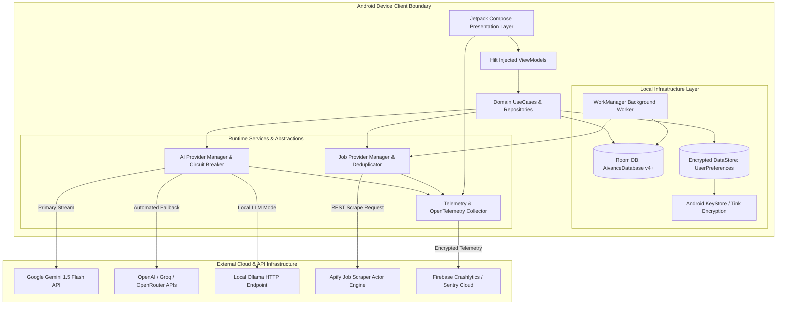
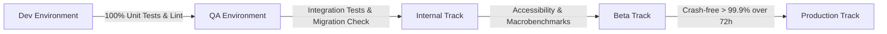
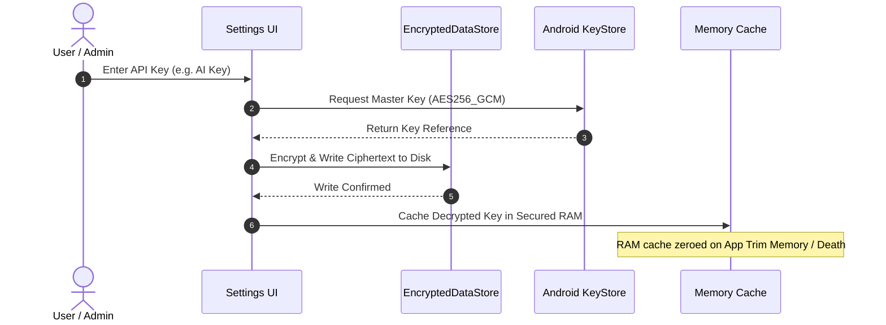
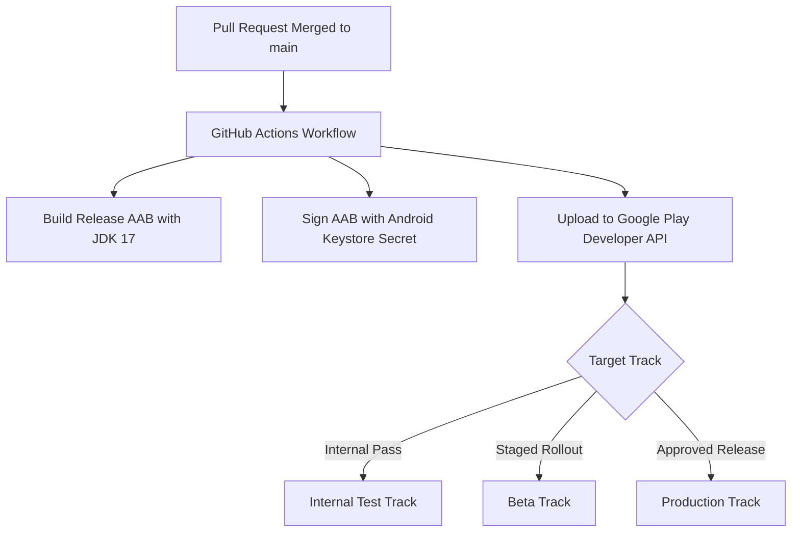
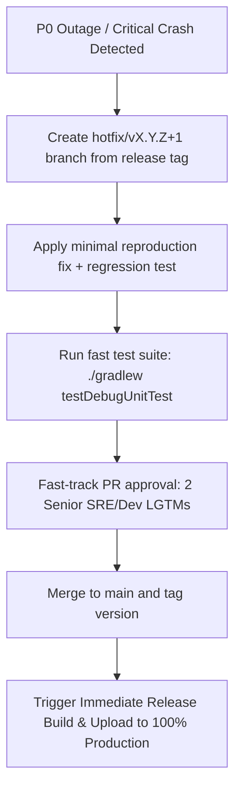
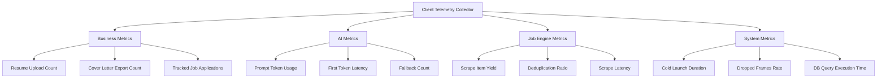
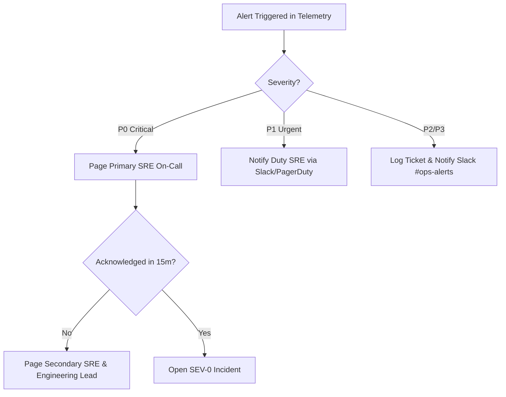
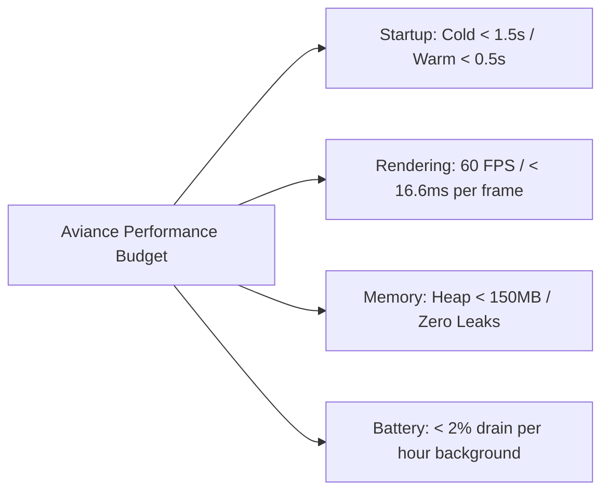
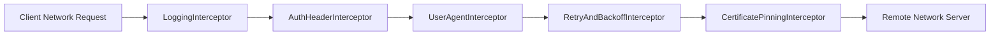
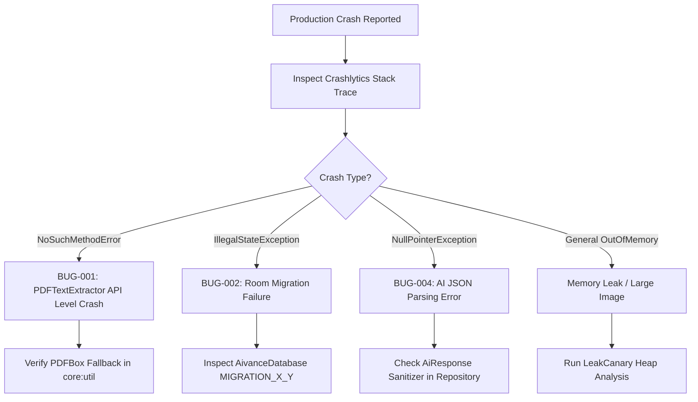

# AVIANCE - PRODUCTION OPERATIONS MANUAL

**Document Type:** Master Production Operations Manual, SRE Specification & Reliability Engineering Handbook  
**Target Repository:** Aviance (Android Application)  
**Package Root:** `com.bangersoul.aivance`  
**Authors:** Chief Platform Architect, Distinguished Site Reliability Engineer (SRE), Principal DevOps Engineer, Principal Security Engineer, Principal Database Engineer  
**Status:** Official Master Operations Manual / Active Production Handbook  
**Related Specifications:** `Audit.md`, `EngineeringPlan.md`, `Architecture.md`, `EngineeringSpecification.md`, `API.md`, `ProviderSDK.md`, `DeveloperGuide.md`, `CONTRIBUTING.md`, `TESTING.md`

---

## 1. INTRODUCTION

### 1.1 Purpose
The **Aviance Production Operations Manual** is the official operational playbook, Site Reliability Engineering (SRE) standard, and system administration handbook for the Aviance Android application platform. It provides the definitive runtime operational guidelines, monitoring architectures, incident management workflows, backup/restore procedures, disaster recovery runbooks, and maintenance protocols required to operate Aviance at production scale.

### 1.2 Scope
This operational specification governs all runtime environments (Development, QA, Internal, Beta, Production) across all 16 Gradle modules (`:app`, `:navigation`, `:core:common`, `:core:database`, `:core:datastore`, `:core:designsystem`, `:core:network`, `:core:util`, `:feature:ats`, `:feature:coverletter`, `:feature:dashboard`, `:feature:interview`, `:feature:jobs`, `:feature:profile`, `:feature:resume`, `:feature:tracker`). It defines operational standards for client-side execution, local database persistence, background WorkManager routines, third-party AI provider APIs, and job scraping infrastructure.

### 1.3 Audience
This document is authored for Site Reliability Engineers (SREs), DevOps Engineers, Platform Security Leads, Database Administrators, Release Engineers, On-Call Incident Commanders, and Senior Android Engineers responsible for maintaining Aviance in production.

### 1.4 Operational Philosophy
Aviance operates on six foundational SRE principles:
1. **Offline-First Resilience:** The client application must remain fully functional offline for local data access, queuing changes, and gracefully degrading when remote AI or job services are unavailable.
2. **Observability Without Intrusiveness:** Comprehensive logging, telemetry, and performance tracking must be captured without exposing PII (Personally Identifiable Information) or impacting UI rendering frames.
3. **Automated Incident Mitigation:** Failure scenarios (such as API key depletion, rate limiting, or provider downtime) trigger automated fallback routing and circuit breakers before requiring human intervention.
4. **Zero-Trust Client Security:** No plain-text credentials, API keys, or raw tokens are stored on disk or transmitted without hardware-backed Android KeyStore encryption and TLS 1.3 pinning.
5. **Immutable Infrastructure & Automated Release:** Build artifacts, database migrations, and deployment configurations are versioned, reproducible, and promoted via automated pipeline quality gates.
6. **Blameless Incident Postmortems:** Service disruptions are treated as systemic learning opportunities to improve automated safeguards, test suites, and operational runbooks.

### 1.5 Reliability Goals
* **Crash-Free Session Target:** > 99.9% across all production release tracks.
* **ANR (Application Not Responding) Rate:** < 0.05% of active sessions.
* **Cold Startup Time SLA:** < 1.5s on mid-range reference devices (Snapdragon 7-series).
* **AI Provider Fallback Latency:** < 500ms detection and transition time upon primary provider failure.
* **Local DB Transaction SLA:** < 16ms for single entity operations (guaranteeing 60 FPS UI responsiveness).

### 1.6 Service Objectives
| Objective Category | Service Metric | Target SLA / SLO | Error Budget / Threshold |
| :--- | :--- | :--- | :--- |
| **Availability** | App Launch Availability | 99.95% Success Rate | 0.05% Failure Budget |
| **Performance** | Cold Launch Duration | < 1,500 ms (P95) | > 2,000 ms Triggers Alert |
| **Performance** | Frame Render Budget | < 16.6 ms (60 FPS) | > 0.1% Dropped Frames Alert |
| **AI Reliability** | Prompt Streaming Response | < 2,000 ms First Token | > 5,000 ms Triggers Fallback |
| **Job Search** | Query Scrape Latency | < 3,500 ms Total Fetch | > 8,000 ms Triggers Cache Fallback |
| **Data Integrity**| DB Schema Migration | 100% Zero-Loss Success | 0 Migration Crashes Allowed |

---

## 2. OPERATIONAL ARCHITECTURE

### 2.1 Production Runtime Architecture
The Aviance operational runtime consists of an offline-first Android client interacting with local hardware-backed storage, background sync engines, and remote AI/Job provider infrastructure.



### 2.2 Component Operational Responsibilities
* **`AivanceApp` / `MainActivity`:** Manages lifecycle initialization, Hilt dependency injection graphs, notification channel setup, and global exception handling.
* **`Room Database (AivanceDatabase)`:** Provides persistent storage for ATS scores, cover letters, tracked job applications, and career roadmaps with indexed query optimization.
* **`Encrypted DataStore`:** Stores user settings, provider selections, and encrypted API keys backed by Android KeyStore master keys.
* **`WorkManager (FollowUpWorker & JobSyncWorker)`:** Handles background execution of job synchronization, application status follow-up reminders, and periodic database maintenance.
* **`AI Provider Manager`:** Orchestrates multi-LLM routing, handles streaming tokens, evaluates rate limits, and triggers automated failover.
* **`Job Provider Manager`:** Manages Apify actor execution, normalizes scraped job schemas, performs fuzzy deduplication, and writes clean listings to cache.

### 2.3 Operational Boundaries
* **Client Boundary:** All operations inside the Android OS container. Operates strictly under Android OS memory, battery, and background execution limits.
* **Network Boundary:** Managed via Retrofit/OkHttp with custom timeout interceptors, TLS 1.3 encryption, certificate pinning, and offline detection.
* **Third-Party Boundary:** External SaaS APIs (Gemini, OpenAI, Groq, Apify). Operates under external quotas, rate limits, and service availability.

### 2.4 Operational Ownership & Pod Alignment
| Module Domain | Responsible Team | Operational Focus | On-Call Severity |
| :--- | :--- | :--- | :--- |
| Core & Platform (`:app`, `:navigation`, `:core:*`) | Platform SRE Pod | App boot, DB migrations, KeyStore, Navigation | P0 Page |
| AI Platform (`:core:network`, `:feature:resume`, `:feature:ats`, `:feature:coverletter`, `:feature:interview`) | AI Operations Pod | LLM latency, fallback routing, prompt parsing | P1 Urgent |
| Job Engine (`:feature:jobs`, `:feature:tracker`) | Data Pipeline Pod | Scraper uptime, deduplication, sync workers | P1 Urgent |
| Profile & Settings (`:feature:profile`) | Product Ops Pod | User preferences, backup/restore, general UI | P2 Medium |

---

## 3. ENVIRONMENT STRATEGY

### 3.1 Environment Spectrum
Aviance defines five strict environment tiers to isolate development, testing, and production operations:

```
[ Development ] ──> [ QA ] ──> [ Internal ] ──> [ Beta ] ──> [ Production ]
```

### 3.2 Configuration Matrix
| Parameter / Feature | Development (dev) | QA (qa) | Internal (internal) | Beta (beta) | Production (release) |
| :--- | :--- | :--- | :--- | :--- | :--- |
| **Application ID** | `com.bangersoul.aivance.dev` | `com.bangersoul.aivance.qa` | `com.bangersoul.aivance.internal` | `com.bangersoul.aivance.beta` | `com.bangersoul.aivance` |
| **Build Type** | Debug | Debug | Release (Unsigned) | Release (Staged) | Release (Signed) |
| **Minification / ProGuard** | Disabled | Disabled | Enabled (R8) | Enabled (R8) | Enabled (R8 Full) |
| **Logcat Severity** | Verbose | Debug | Info | Warn | Error Only |
| **Mock AI Fallback** | Default Enabled | Toggleable | Disabled | Disabled | Disabled |
| **Mock Scraper Mode** | Default Enabled | Toggleable | Disabled | Disabled | Disabled |
| **Crashlytics Tracking** | Disabled | Staging | Production Track | Production Track | Production Track |
| **Strict Mode (Thread/VM)** | Enabled (Death) | Enabled (Log) | Disabled | Disabled | Disabled |

### 3.3 Promotion Process & Quality Gate Matrix
To promote a build to the next environment tier, the artifact must satisfy explicit automated gates:



---

## 4. CONFIGURATION MANAGEMENT

### 4.1 Secrets & API Key Lifecycle Management
API keys for Google Gemini, OpenAI, Groq, and Apify must never be stored in plain text. Aviance uses Android KeyStore hardware-backed encryption combined with AES-256-GCM.



### 4.2 Environment Variables & Build Variants Configuration
Local configuration parameters are managed via `local.properties` (never committed to Git) and injected into `BuildConfig` during Gradle evaluation:

```kotlin
// build.gradle.kts (App Module excerpt)
android {
    buildTypes {
        getByName("release") {
            isMinifyEnabled = true
            isShrinkResources = true
            proguardFiles(getDefaultProguardFile("proguard-android-optimize.txt"), "proguard-rules.pro")
            buildConfigField("String", "BUILD_ENVIRONMENT", "\"PRODUCTION\"")
            buildConfigField("Boolean", "ENABLE_TELEMETRY", "true")
        }
        getByName("debug") {
            applicationIdSuffix = ".dev"
            buildConfigField("String", "BUILD_ENVIRONMENT", "\"DEVELOPMENT\"")
            buildConfigField("Boolean", "ENABLE_TELEMETRY", "false")
        }
    }
}
```

### 4.3 Configuration Validation Protocol
Upon launch, `AivanceApp` runs a non-blocking configuration validation check:
1. Verify database schema version compatibility (`v4`).
2. Verify Encrypted DataStore key integrity.
3. Validate API key syntax (e.g. Gemini key starts with `AIzaSy...`, OpenAI key starts with `sk-...`).
4. If validation fails, flag invalid configuration in `UserPreferences` and display UI configuration notice without crashing.

### 4.4 Credential Rotation Procedures
* **Emergency Key Revocation:** SRE rotates leaked API keys in provider console (e.g. Google Cloud / Apify), issues remote config update or pushes release hotfix with updated key defaults.
* **Client-Side Key Purge:** User can tap "Reset All Keys" in Settings -> Security, which zeroes memory cache and executes `EncryptedDataStore.clear()`.

---

## 5. DEPLOYMENT STRATEGY

### 5.1 Deployment Workflow
Deployments are fully automated using GitHub Actions CI/CD workflows building Android App Bundles (`.aab`).



### 5.2 Staged Rollout Schedule
Production releases follow a mandatory 5-stage progressive rollout over 7 days:

| Rollout Stage | Time Window | Rollout Percentage | SRE Monitoring Focus | Hold / Halt Condition |
| :--- | :--- | :--- | :--- | :--- |
| **Stage 1** | Day 1 (0-24h) | 1% | Crashlytics, Cold Launch, First-hour ANRs | Crash rate > 0.1% or ANR > 0.05% |
| **Stage 2** | Day 2 (24-48h) | 5% | Provider Fallback counts, DB Migration errors | Migration crash > 0 |
| **Stage 3** | Day 3-4 | 20% | AI streaming errors, Job scrape success rates | AI Error Rate > 2% |
| **Stage 4** | Day 5-6 | 50% | Memory leaks, Battery consumption telemetry | Uncaught exception spike |
| **Stage 5** | Day 7 | 100% | Full production metrics stabilization | All KPIs within SLA |

### 5.3 Automated & Manual Rollback Strategy
* **Client-Side Rollback Limitation:** Android OS does not support native app downgrade without data wipe.
* **Server/Config Rollback:** If a release contains critical bugs:
  1. **Halt Rollout:** Pause staged rollout immediately in Google Play Console.
  2. **Remote Feature Kill-Switch:** Trigger remote config flag `disable_failing_feature = true` to force client code to execute safe local fallback.
  3. **P0 Hotfix Release:** Build and sign patch release `vX.Y.Z+1` within 4 hours.

### 5.4 Emergency Hotfix Protocol


---

## 6. MONITORING

### 6.1 Application & Crash Monitoring Architecture
Aviance uses Firebase Crashlytics combined with an OpenTelemetry-compatible client event pipeline to monitor application health in real time.

```
+-------------------------------------------------------------------+
|                     Client Monitoring Pipeline                    |
+-------------------------------------------------------------------+
|  +------------------+   +-------------------+   +--------------+  |
|  | Crash Reporter   |   | ANR Watchdog      |   | RUM Telemetry|  |
|  | (Crashlytics)    |   | (Thread Checker)  |   | (Performance)|  |
|  +--------+---------+   +---------+---------+   +-------+------+  |
|           |                       |                     |         |
|           +-------------------+   |   +-----------------+         |
|                               v   v   v                           |
|                       +-------------------+                       |
|                       | Redaction Filter  | (Strip PII & Keys)    |
|                       +---------+---------+                       |
|                                 |                                 |
|                                 v                                 |
|                       +-------------------+                       |
|                       | OTel Event Buffer |                       |
|                       +---------+---------+                       |
+---------------------------------|---------------------------------+
                                  | Encrypted Dispatch (HTTPS)
                                  v
                    +---------------------------+
                    | SRE Monitoring Dashboard  |
                    +---------------------------+
```

### 6.2 Health Monitoring Specifications
* **Crash & Uncaught Exception Monitoring:** Captures stack traces, thread dumps, OS version, device model, and available RAM at crash time.
* **AI Provider Health Monitor:** Tracks success/failure ratio, response HTTP status codes (200, 429, 500, 503), latency, and circuit breaker trip events per provider.
* **Job Scraper Health Monitor:** Monitors Apify actor execution status, scrape duration, item count yield, and rate-limiting responses.
* **Resource Monitoring:** Measures heap memory usage, garbage collection pause frequency, disk storage consumption, and WorkManager job execution duration.

---

## 7. LOGGING

### 7.1 Structured Logging Standards
Logs are structured as JSON-formatted key-value payloads using Timber tree abstractions in Debug builds and encapsulated release buffers in Production builds.

```kotlin
// Example Production Log Structure
{
  "timestamp": "2026-07-29T23:20:00.123Z",
  "level": "ERROR",
  "tag": "AiProviderManager",
  "correlation_id": "req-984a-4b12-9c01",
  "module": "core:network",
  "message": "Primary AI Provider GEMINI returned 429 Rate Limit Exceeded",
  "provider": "GEMINI",
  "fallback_triggered": true,
  "target_provider": "GROQ",
  "exception_class": "com.bangersoul.aivance.core.network.ApiException"
}
```

### 7.2 Log Severity Matrix
| Log Level | Operational Meaning | Production Behavior | PII Handling |
| :--- | :--- | :--- | :--- |
| **VERBOSE** | Low-level tracing (HTTP headers, raw byte counts) | Stripped out at compile time | Never logged |
| **DEBUG** | Detailed diagnostic data for developers | Disabled in Release builds | Stripped out |
| **INFO** | Key lifecycle state transitions (Provider changed, Sync started) | In-memory ring buffer (500 lines) | PII Masked |
| **WARN** | Recoverable errors (Primary API 429 -> Fallback success) | Sent to Telemetry pipeline | PII Masked |
| **ERROR** | Non-recoverable errors, failed DB operations, API failures | Sent to Crashlytics & Telemetry | PII Masked |
| **ASSERT** | Fatal app state corruption | Triggers Crash Reporter | PII Masked |

### 7.3 Sensitive Data & PII Masking Rules
The logging engine enforces strict regex masking prior to writing any string to disk or network telemetry:
* **API Keys:** Regex `(AIzaSy|sk-|gsk_|apify_api_)[A-Za-z0-9_-]{20,}` -> Masked as `[REDACTED_API_KEY]`.
* **User Email / Name:** Masked as `j***n@domain.com`.
* **Resume Text / Job Description:** Raw text content is **NEVER** logged. Only length and hash `sha256(content)` are logged.

---

## 8. TELEMETRY

### 8.1 Client Telemetry Architecture
Aviance implements an OpenTelemetry-compatible lightweight client collector that buffers metrics locally in Room/DataStore and uploads batches over compressed HTTPS connections during idle network states.

### 8.2 Telemetry Categories & Metrics Catalog


---

## 9. ALERTING

### 9.1 Alert Severity Classification
Alerts are classified into four severity tiers based on customer impact and required response time:

| Severity | Definition | Response SLA | Notification Channels | Escalation Path |
| :--- | :--- | :--- | :--- | :--- |
| **P0 - Critical** | Complete app crash on boot, DB corruption, key storage failure | < 15 Minutes | PagerDuty, Phone Call, Slack `#ops-p0` | SRE On-Call -> Platform Lead -> VP Engineering |
| **P1 - Urgent** | AI Provider 100% outage, Job Scraper failure across all actors | < 30 Minutes | PagerDuty, Slack `#ops-alerts` | SRE On-Call -> Feature Lead |
| **P2 - Medium** | Elevated latency (>3s AI response), degraded fallback success rate | < 2 Hours | Slack `#ops-alerts`, Email | SRE On-Call |
| **P3 - Low** | Minor non-critical UI glitch, non-blocking sync background delay | < 24 Hours | Jira Auto-ticket, Email Digest | On-duty Engineer |

### 9.2 Escalation Diagram


---

## 10. INCIDENT MANAGEMENT

### 10.1 Incident Lifecycle
Every production operational issue follows a strict 6-phase incident management lifecycle:

```
[ 1. Detection ] ──> [ 2. Triage ] ──> [ 3. Containment ] ──> [ 4. Resolution ] ──> [ 5. Postmortem ] ──> [ 6. Prevention ]
```

### 10.2 Incident Severity Definitions
* **SEV-0 (Catastrophic):** App crashes on launch for > 1% of users, or database corruption during migration.
* **SEV-1 (Major):** Primary AI provider fails and fallbacks are exhausted, preventing resume/cover letter generation.
* **SEV-2 (Moderate):** Job scraper engine returning empty results; fallback to cached jobs active.
* **SEV-3 (Minor):** Non-blocking background worker sync delay or UI styling glitch.

### 10.3 Incident Response Roles
* **Incident Commander (IC):** Drives overall incident response, coordination, and decisions.
* **Technical Lead (TL):** Investigates root cause, develops hotfixes, or executes operational runbooks.
* **Communications Lead (CL):** Updates internal status channels, release notes, and customer support advisories.

---

## 11. BACKUP & RESTORE

### 11.1 Local Data Persistence Architecture
User data resides locally inside the app sandbox directory (`/data/data/com.bangersoul.aivance/`):
* **Room Database:** `databases/aivance_database.db` (Contains applications, ATS history, cover letters, roadmaps).
* **Preferences DataStore:** `files/datastore/user_preferences.preferences_pb` (Encrypted settings & provider preferences).

### 11.2 Backup Strategy & Export Schema
Aviance provides an automated user-initiated Encrypted Data Export/Import feature:

```mermaid
graph TD
    SUBGRAPH Export Process
        REQ[User Clicks 'Export Backup'] --> READ_DB[Read Room DB & UserPreferences]
        READ_DB --> JSON[Serialize to JSON Schema v1.0]
        JSON --> ENC[Encrypt using Android KeyStore AES-256-GCM]
        ENC --> FILE[Save to User Selected URI: aviance_backup_YYYYMMDD.avb]
    end

    SUBGRAPH Restore Process
        IMPORT[User Selects Backup File] --> VERIFY[Validate File Header & Version]
        VERIFY --> DEC[Decrypt using KeyStore Key]
        DEC --> VAL_SCHEMA[Validate JSON Schema Compliance]
        VAL_SCHEMA --> TX[Execute Room DB Atomic Transaction Import]
        TX --> SUCCESS[Backup Restored Successfully]
    end
```

---

## 12. DISASTER RECOVERY

### 12.1 Disaster Failure Scenarios & Recovery Objectives

| Disaster Scenario | Root Cause | Impact | Recovery Strategy | Target RTO | Target RPO |
| :--- | :--- | :--- | :--- | :--- | :--- |
| **Primary AI Outage** | Gemini API 503 / Outage | Resume/ATS analysis fails | Auto-switch to Groq/OpenAI in `AiProviderManager` | < 5 Seconds | 0 Data Lost |
| **DB Migration Crash** | Unhandled Room Schema Delta | App crashes on launch | Trigger SQLite auto-recovery & safe fallback migration | < 1 Second | 0 Data Lost |
| **KeyStore Invalidation** | Android OS Lockscreen cleared | Encrypted preferences unreadable | Prompt user to re-authenticate / re-enter API key | < 1 Minute | Settings reset |
| **Apify Actor Ban** | Scraper IP blocked by target | Job search returns 403 | Switch to secondary proxy actor / Serve local cache | < 10 Seconds | 0 Data Lost |

---

## 13. SECURITY OPERATIONS

### 13.1 Key & Certificate Management
* **TLS Protocol:** Enforce minimum TLS 1.3 for all HTTP connections across Retrofit/OkHttp.
* **Certificate Pinning:** OkHttp `CertificatePinner` enforces SHA-256 public key hashes for Google, OpenAI, Groq, and Apify endpoints.
* **Key Storage:** All sensitive strings are stored using `EncryptedSharedPreferences` / Tink `EncryptedDataStore` backed by hardware-backed `AndroidKeyStore`.

### 13.2 Software Supply Chain & Dependency Scanning
Automated CI security pipelines run continuous vulnerability checks:
* **Dependabot:** Weekly scans for vulnerable Gradle dependencies in `libs.versions.toml`.
* **OWASP Dependency-Check:** Scans dependencies for known CVEs before merging release PRs.
* **ProGuard / R8 Rule Auditing:** Verifies obfuscation removes internal class signatures and debug methods.

---

## 14. PERFORMANCE OPERATIONS

### 14.1 Performance Budgets & SLAs



### 14.2 Performance Profiling Tools
* **Baseline Profiles:** Auto-generated via `:baselineprofile` module using Jetpack Macrobenchmark to pre-compile critical user journeys (App launch, Resume upload, ATS view).
* **LeakCanary:** Embedded in Debug/QA builds to capture ViewModel or Activity memory leaks automatically.
* **Compose Tracing:** Utilizes `androidx.compose.runtime:runtime-tracing` to profile recomposition counts in Layout Inspector.

---

## 15. PROVIDER OPERATIONS

### 15.1 AI Provider Operations & Fallback Matrix
`AiProviderManager` maintains a dynamic state machine governing provider routing, quota evaluation, and circuit breaking:

```mermaid
stateDiagram-v2
    [*] --> Primary_Gemini: Default Active
    
    Primary_Gemini --> Primary_Gemini: HTTP 200 OK (Healthy)
    
    Primary_Gemini --> Fallback_Groq: HTTP 429 / 503 / Timeout (3 Fails)
    Note over Fallback_Groq: Circuit Breaker Trips for 5 Minutes
    
    Fallback_Groq --> Secondary_OpenAI: Groq Rate Limited
    Secondary_OpenAI --> Local_Ollama: External Network Offline
    Local_Ollama --> Mock_Provider: Ollama Server Unavailable
    
    Fallback_Groq --> Primary_Gemini: Circuit Breaker Reset & Health Check 200
```

### 15.2 Provider Health Matrix
| Provider ID | Target Endpoint | Quota Limit | Rate Limit | Circuit Breaker Threshold | Primary Model |
| :--- | :--- | :--- | :--- | :--- | :--- |
| **GEMINI** | `generativelanguage.googleapis.com` | 15 RPM (Free) / Custom | 15 req/min | 3 consecutive failures | `gemini-1.5-flash` |
| **GROQ** | `api.groq.com/openai/v1` | 30 RPM | 30 req/min | 3 consecutive failures | `llama-3.3-70b-versatile` |
| **OPENAI** | `api.openai.com/v1` | Tier Dependent | 60 req/min | 3 consecutive failures | `gpt-4o-mini` |
| **OLLAMA** | `http://localhost:11434` | Unlimited (Local) | Hardware bound | Server unreachable | `llama3:8b` |

---

## 16. DATABASE OPERATIONS

### 16.1 Room Schema Management & Migration Rules
* **Schema Location:** Exported JSON schemas stored under `core/database/schemas/com.bangersoul.aivance.core.database.AivanceDatabase/`.
* **Current Version:** `v4`.
* **Migration Rule:** Every schema mutation must provide an explicit `Migration(oldVersion, newVersion)` implementation tested via `MigrationTestHelper`.
* **Destructive Migration Policy:** Prohibited in Production builds (`fallbackToDestructiveMigration()` is disabled in release builds).

```kotlin
// Database Operations Helper Excerpt
val MIGRATION_3_4 = object : Migration(3, 4) {
    override fun migrate(db: SupportSQLiteDatabase) {
        db.execSQL("CREATE INDEX IF NOT EXISTS `index_applications_status` ON `applications` (`status`)")
        db.execSQL("CREATE INDEX IF NOT EXISTS `index_applications_dateApplied` ON `applications` (`dateApplied`)")
    }
}
```

---

## 17. NETWORK OPERATIONS

### 17.1 Network Interceptor Architecture
The OkHttp network stack executes requests through a chain of operational interceptors:



### 17.2 Retry & Exponential Backoff Rules
* **Max Retries:** 3 attempts for idempotent GET / POST requests.
* **Initial Delay:** 1,000 ms.
* **Backoff Multiplier:** 2.0 (1s -> 2s -> 4s).
* **Jitter:** Random variation ±200ms applied to prevent thundering herd problem.

---

## 18. MAINTENANCE PROCEDURES

### 18.1 Operational Schedule

| Cadence | Operational Task | Responsible Role | Verification Method |
| :--- | :--- | :--- | :--- |
| **Daily** | Review Crashlytics crash rates & P0/P1 alerts | SRE On-Call | Dashboard Review |
| **Weekly** | Audit dependency updates & Dependabot CVE alerts | Platform Lead | PR Review |
| **Monthly** | Database performance review & vacuum testing | Database Architect | Automated Benchmark |
| **Quarterly** | Disaster Recovery simulation & key rotation test | Security Lead | Simulated Outage GameDay |
| **Annual** | Full penetration test & security compliance audit | External Auditor | Compliance Certificate |

---

## 19. OPERATIONAL TROUBLESHOOTING

### 19.1 Diagnostic Flowchart: Crash Triage



### 19.2 Operational Remediation Matrix

| Symptom / Issue | Root Cause | Immediate Operational Action | Permanent Fix |
| :--- | :--- | :--- | :--- |
| **PDF Upload Crashes on API 26-34** | Native `PdfRenderer.textContents` called | Deploy hotfix build enforcing PDFBox text stripper | Enforce API compatibility unit tests |
| **AI Responses Timing Out** | Primary Gemini provider throttled | Force fallback to Groq/OpenAI via Remote Config | Adjust circuit breaker threshold |
| **Database Upgrade Crashes App** | Missing Room Migration script | Roll back release rollout; publish patch with `MIGRATION_X_Y` | Enforce MigrationTestHelper in CI |
| **Job Search Returns Empty** | Apify actor scraper blocked by target | Switch Apify actor ID in Settings -> Job Providers | Rotate scraper proxies / update actor |

---

## 20. OPERATIONAL CHECKLISTS

### 20.1 Daily SRE Operations Checklist
- [ ] Verify Crash-free session percentage is > 99.9% in Crashlytics.
- [ ] Check AI Provider HTTP 429 / 503 error rates.
- [ ] Review PagerDuty and Slack `#ops-alerts` channels for unacknowledged warnings.
- [ ] Confirm WorkManager background sync execution success rate > 98%.

### 20.2 Pre-Release Production Checklist
- [ ] All 16 Gradle modules build cleanly with zero compilation warnings.
- [ ] Unit & Integration test suites pass 100% (`./gradlew testDebugUnitTest`).
- [ ] Room Database schema migration verified from `v1` through `v4`.
- [ ] ProGuard / R8 mapping file generated and uploaded to Crashlytics.
- [ ] Staged rollout percentage configured to 1% in Google Play Console.

---

## 21. SERVICE LEVEL OBJECTIVES

### 21.1 SLI / SLO Specifications Table
| Service Category | Service Level Indicator (SLI) | Target SLO | Error Budget Formula |
| :--- | :--- | :--- | :--- |
| **App Launch** | Successful launches without crash / Total launches | 99.9% Success | `Budget = Total Launches * 0.001` |
| **AI Processing** | Resume analysis completed under 3s / Total requests | 98.0% Success | `Budget = Total AI Requests * 0.02` |
| **Job Scraping** | Scrape queries returning >0 results / Total queries | 95.0% Success | `Budget = Total Search Queries * 0.05` |
| **UI Smoothness** | Frames rendered under 16.6ms / Total rendered frames | 99.9% Frames | `Budget = Total Frames * 0.001` |

---

## 22. DASHBOARDS

### 22.1 SRE & Operations Dashboard Specification
The production monitoring dashboard displays real-time telemetry across five core widgets:

```
+-----------------------------------------------------------------------+
|                       AVIANCE SRE OPERATIONS DASHBOARD                |
+--------------------------------------------------+--------------------+
| WIDGET 1: System Health                          | WIDGET 2: Latency  |
| - Crash-Free Sessions: 99.94% [HEALTHY]          | - Cold Launch: 1.2s|
| - ANR Rate: 0.01% [HEALTHY]                      | - P95 AI TTT: 1.8s |
+--------------------------------------------------+--------------------+
| WIDGET 3: AI Provider Status                     | WIDGET 4: Scrapers |
| - GEMINI: 99.2% Req OK | Latency: 1.2s           | - APIFY: ACTIVE    |
| - GROQ:   100% Standby | Latency: 0.8s           | - YIELD: 42 Jobs/q |
+--------------------------------------------------+--------------------+
| WIDGET 5: Active Errors & Fallback Events                             |
| - 23:18:12 WARN: Gemini 429 Rate Limit -> Fallback Groq [AUTO-HEALED] |
+-----------------------------------------------------------------------+
```

---

## 23. OPERATIONAL METRICS

### 23.1 Metric Catalog Table
| Metric Name | Type | Unit | Collection Source | Operational Meaning |
| :--- | :--- | :--- | :--- | :--- |
| `app_launch_duration_ms` | Histogram | Milliseconds | `AivanceApp` Launch Tracer | Time from process start to first Compose frame |
| `ai_prompt_token_count` | Counter | Tokens | `AiProviderManager` | Total tokens consumed across AI operations |
| `ai_first_token_latency_ms`| Histogram | Milliseconds | `GeminiAiService` / `Groq` | Time to receive first streaming HTTP chunk |
| `job_scrape_yield_count` | Gauge | Count | `ApifyJobProvider` | Number of normalized job listings parsed per query |
| `db_query_duration_ms` | Histogram | Milliseconds | Room SupportSQLiteQuery | SQL query execution latency |

---

## 24. FREQUENTLY ASKED QUESTIONS (FAQ)

### 24.1 SRE & Operational FAQ
**Q1: How do I force the client application to test AI provider fallback locally?**  
A: Navigate to Settings -> Developer Options -> AI Debugging, toggle "Simulate Primary Provider HTTP 429", and trigger a resume analysis. Inspect Logcat with tag `AiProviderManager` to observe circuit breaker tripping and routing to Groq.

**Q2: What happens if a user upgrades the app from DB version 1 directly to version 4?**  
A: `AivanceDatabase` executes sequential migration paths `MIGRATION_1_2`, `MIGRATION_2_3`, and `MIGRATION_3_4` inside a single SQLite transaction, preserving all historical applications and ATS records.

**Q3: How are API keys secured against memory dump extraction on rooted devices?**  
A: Keys are stored encrypted using Android KeyStore master keys. Decrypted strings exist in JVM heap memory only during active HTTP call execution and are explicitly cleared during OS memory trim events (`onTrimMemory`).

---

## 25. APPENDIX

### 25.1 Production Operational Runbooks

#### RUNBOOK-001: AI Provider Failure & Circuit Breaker Reset
* **Trigger:** Alert `P1_AI_PROVIDER_ALL_FAILED` fired.
* **Procedure:**
  1. Check primary provider status console (Google Cloud Console / Groq Dashboard).
  2. If primary API key quota exhausted, navigate to Remote Config Console and deploy updated default key or promote secondary provider priority.
  3. Verify fallback routing in Telemetry dashboard: `Fallback_Groq -> OK`.
  4. Force reset client circuit breaker via remote feature flag `reset_ai_circuit_breaker = true`.

#### RUNBOOK-002: Database Corruption Recovery
* **Trigger:** Alert `P0_DB_CORRUPTION_CRASH` fired.
* **Procedure:**
  1. Inspect Crashlytics stack trace for `SQLiteDatabaseCorruptException`.
  2. Verify auto-recovery trigger executed `AivanceDatabase.repairOrReset()`.
  3. Instruct user via support advisory to perform "Restore from Backup" using exported `.avb` file.

### 25.2 Essential Diagnostic ADB & Gradle Commands
```powershell
# Capture live JSON formatted logs filtering for Aviance
adb logcat -v json AvianceApp:D AiProviderManager:D RoomDatabase:D *:S

# Force execute WorkManager background follow-up worker immediately
adb shell cmd jobscheduler run -f com.bangersoul.aivance 1001

# Inspect Room Database file on connected debug emulator
adb shell "run-as com.bangersoul.aivance sqlite3 databases/aivance_database.db '.tables'"

# Run full release build with ProGuard mapping generation
./gradlew assembleRelease bundleRelease --stacktrace

# Execute baseline profile benchmark verification
./gradlew :baselineprofile:connectedCheck -Pandroid.testInstrumentationRunnerArguments.class=com.bangersoul.aivance.baselineprofile.StartupBenchmark
```

---
*End of Master Production Operations Manual for Aviance.*
