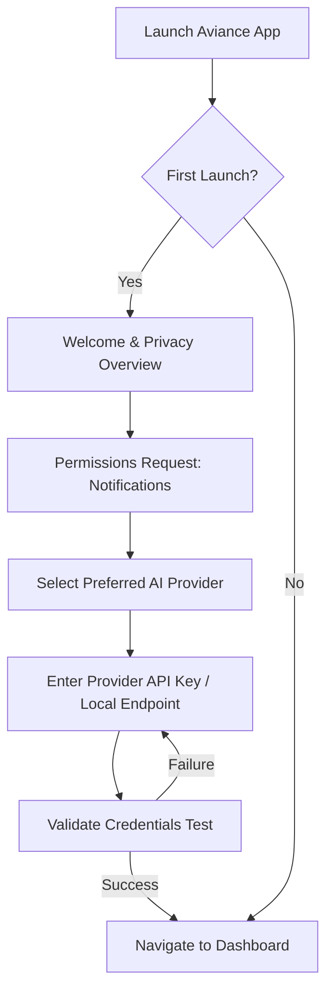
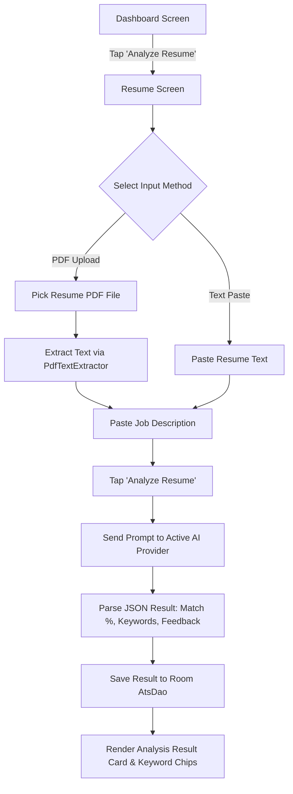
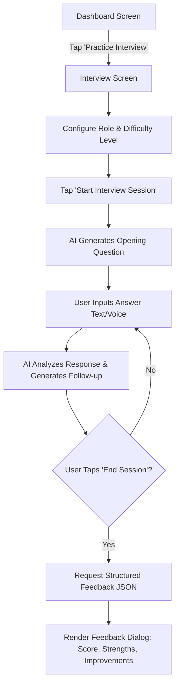
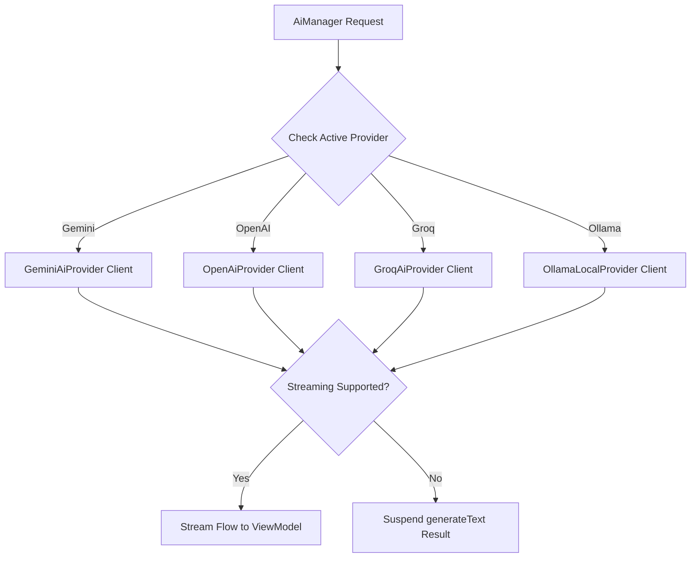
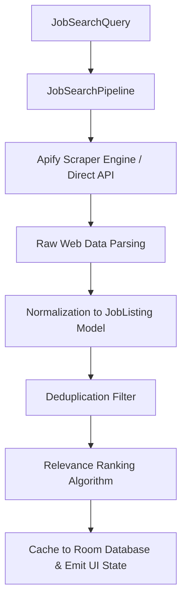
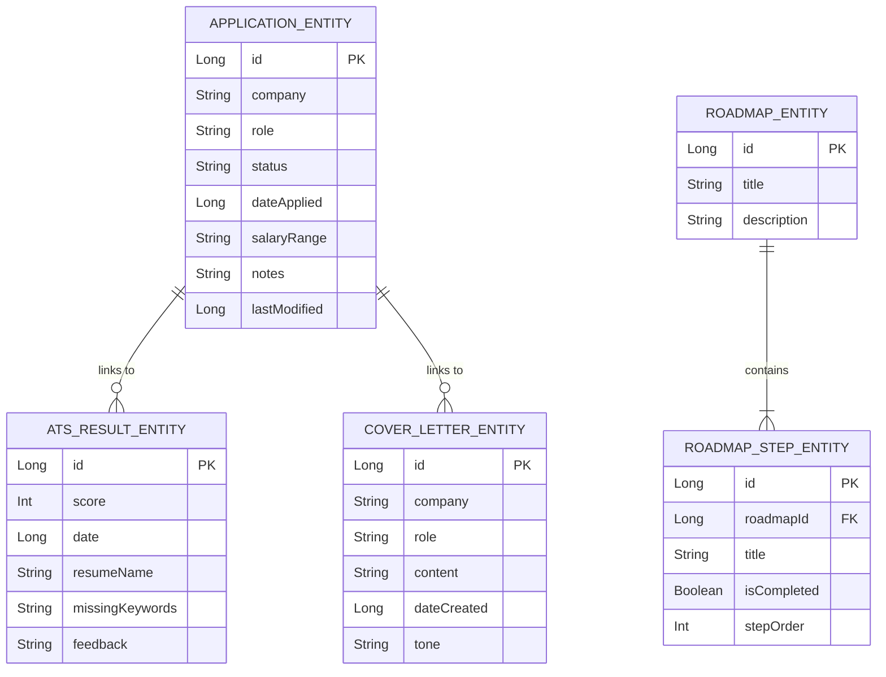

# AVIANCE - PRODUCT REQUIREMENTS DOCUMENT & PRODUCT SPECIFICATION

**Document Type:** Master Product Requirements Document (PRD), Feature Specification, Business Rules Handbook & User Experience Specification  
**Target Application:** Aviance (Android Native Application)  
**Package Root:** `com.bangersoul.aivance`  
**Authors:** Chief Product Officer, Principal Product Manager, Principal UX Architect, Principal AI Architect, Lead Technical Writer  
**Status:** Official Master Product Specification / Active PRD Handbook  
**Related Specifications:** `Audit.md`, `EngineeringPlan.md`, `Architecture.md`, `EngineeringSpecification.md`, `API.md`, `ProviderSDK.md`, `DeveloperGuide.md`, `CONTRIBUTING.md`, `TESTING.md`, `Operations.md`, `RELEASE.md`

---

## 1. EXECUTIVE SUMMARY

### 1.1 Product Vision
Aviance is an autonomous, AI-powered career co-pilot and job search optimization platform built natively for Android. It empowers job seekers to navigate modern talent acquisition ecosystems with confidence by automating resume evaluation, Applicant Tracking System (ATS) optimization, cover letter synthesis, interactive mock interview coaching, job discovery, and application lifecycle tracking. Aviance levels the playing field between applicants and corporate recruitment algorithms through localized, privacy-first, multi-provider artificial intelligence.

### 1.2 Mission Statement
To democratize enterprise-grade career acceleration tools through a secure, high-performance, offline-first Android application that respects user privacy, eliminates platform vendor lock-in, and optimizes every touchpoint of the modern job search journey.

### 1.3 Core Product Goals
* **Maximize ATS Pass Rates:** Increase job applicant interview callback rates by providing instant, actionable ATS keyword analysis and actionable formatting recommendations.
* **Accelerate Application Output:** Reduce the time required to tailor a resume and write a targeted cover letter from hours to under 30 seconds.
* **Master Behavioral & Technical Interviews:** Provide realistic, real-time AI mock interview simulations with granular, quantitative feedback on tone, communication, and technical depth.
* **Streamline Job Search & Tracking:** Eliminate spreadsheet tracking by providing integrated web-scraping job search capabilities (Apify/LinkedIn/Indeed) linked directly to a local Kanban application tracker.
* **Ensure Uncompromising Privacy:** Store user resumes, cover letters, career profiles, and application histories locally on-device, offering encrypted API key management and full data portability.

### 1.4 Problem Statement
The contemporary employment market relies heavily on automated Applicant Tracking Systems (ATS) and AI filters that reject up to 75% of qualified resumes before human review. Candidates face significant hurdles:
1. **Asymmetric Information:** Applicants lack visibility into how corporate ATS algorithms parse, score, and rank their resumes against specific job descriptions.
2. **Application Burnout:** Manually customizing resumes and writing bespoke cover letters for dozens of applications is time-prohibitive and mentally exhausting.
3. **Interview Anxiety & Lack of Practice:** Candidates rarely receive honest, actionable feedback during interview preparation, leading to repeated performance pitfalls.
4. **Fragmented Tooling:** Job seekers are forced to juggle separate tools for resume building, job searching, interview prep, and application tracking, resulting in lost data and disorganization.

### 1.5 Value Proposition
Aviance unifies the entire career optimization workflow into a cohesive, native Material 3 Android app:
* **All-in-One Career Hub:** Integrates resume analysis, cover letter generation, AI interview prep, job search, and tracking into a single unified workspace.
* **Multi-LLM Choice & Cost Control:** Empowers users to choose their preferred AI provider (Google Gemini, OpenAI, Groq, OpenRouter, or local Ollama), keeping costs minimal or completely free.
* **Offline-First Resilience:** Local Room persistence ensures users can track applications, review past cover letters, and inspect ATS reports without active internet connectivity.
* **Privacy-Guaranteed Architecture:** Personal Identifiable Information (PII) is kept on-device; external AI calls strictly operate on user-provided API credentials.

### 1.6 Success Criteria
* **User Callback Lift:** Users optimizing resumes with Aviance achieve a minimum 2.5x increase in interview invitations.
* **Time Savings:** Total application preparation time reduced by >80% per job application.
* **User Satisfaction:** Maintain a Google Play Store rating of >4.7 / 5.0 stars.
* **System Performance:** Zero PDF parsing crashes on minSdk 26+ devices; AI response streaming latency <1.0s.

---

## 2. PRODUCT OVERVIEW

### 2.1 Product Purpose
Aviance acts as an end-to-end career copilot operating directly on the user's mobile device. It bridges the gap between raw applicant credentials and complex job requirements by leveraging large language models to evaluate alignment, generate tailored application materials, conduct practice interviews, discover relevant employment opportunities, and manage the candidate pipeline from initial discovery to offer acceptance.

### 2.2 Target Audience & User Segments
* **Active Job Seekers:** Individuals aggressively applying for new roles needing high-volume application generation and pipeline organization.
* **Career Switchers:** Professionals transitioning into new industries requiring gap analysis and skill re-framing on resumes.
* **Students & New Graduates:** Entry-level candidates needing interview preparation coaching and baseline resume structuring.
* **Privacy-Conscious Professionals:** Users unwilling to upload full resume histories and personal credentials to proprietary third-party SaaS cloud servers.

### 2.3 Primary Use Cases
1. **Instant ATS Customization:** User pastes a target job description, uploads an existing PDF resume, and receives a match percentage, missing critical keywords, and a bulleted optimization plan.
2. **One-Tap Cover Letter Generation:** User selects a desired tone (Professional, Enthusiastic, Confident) and generates a tailored cover letter aligned with their resume and job description.
3. **AI Mock Interview Coaching:** User selects a target role and difficulty level, engages in a dynamic multi-turn conversation with an AI interviewer, and receives structured scoring on performance.
4. **Job Search Discovery & Sync:** User searches real-time job listings scraped from web sources (via Apify actors), saving interesting roles directly into their application tracker.
5. **Kanban Application Tracking:** User tracks application statuses (Applied, Interviewing, Offered, Rejected) with automated follow-up reminders.

### 2.4 Market Positioning & Competitive Advantages

```
+-----------------------------------------------------------------------------------+
|                            Competitive Matrix Summary                             |
+----------------------+--------------------+-------------------+-------------------+
| Feature              | Traditional SaaS   | Web AI Aggregators| Aviance (Android) |
+----------------------+--------------------+-------------------+-------------------+
| Architecture         | Cloud Centralized  | Cloud Web App     | Local Native App  |
| Data Storage         | Cloud Database     | Cloud Database    | On-Device Room DB |
| AI Model Selection   | Locked/Proprietary | Single Provider   | Multi-LLM Flexible|
| Job Tracker Sync     | Manual Input       | Extension-based   | Native Integrated |
| Offline Availability | None               | None              | Full Read/Write   |
| Privacy Model        | SaaS Data Retention| SaaS Retention    | Zero Server Sync  |
+----------------------+--------------------+-------------------+-------------------+
```

### 2.5 Supported Platforms & OS Requirements
* **Minimum Android OS:** Android 8.0 (Oreo) - API Level 26.
* **Target Android OS:** Android 15 - API Level 35.
* **Form Factors:** Smartphones, Foldables (e.g. Galaxy Z Fold, Pixel Fold), and Android Tablets (Adaptive Material 3 Navigation Suite).
* **Hardware Requirements:** Minimum 2 GB RAM, 100 MB available local storage, Active Internet (for live AI/Job network requests).

### 2.6 Product Boundaries & Out-of-Scope Items
* **Out-of-Scope for MVP/V1:** Direct automated submission of applications to external company career portals (auto-apply bots); proprietary backend user account creation; cloud database backup syncing (all backups are local JSON/SQLite exports).

---

## 3. PERSONAS

### 3.1 Persona Profiles

#### Persona 1: Alex - The Tech Career Switcher
* **Background:** 28 years old, transitioning from Sales to Junior Software Engineering.
* **Goals:** Match resume keywords to technical job postings; practice answering technical and behavioral interview questions.
* **Pain Points:** Rejection by ATS due to non-standard terminology; anxiety during live coding/technical interviews.
* **Key Feature Usage:** Resume ATS Analysis, AI Mock Interview, Career Roadmap.

#### Persona 2: Priya - The High-Volume Job Seeker
* **Background:** 34 years old, Senior Product Manager actively applying to 15+ positions per week.
* **Goals:** Rapidly generate custom cover letters; track application statuses across multiple companies.
* **Pain Points:** Customizing cover letters takes hours; spreadsheet tracking becomes disorganized and outdated.
* **Key Feature Usage:** Cover Letter Generator, Application Tracker, Job Search Engine.

#### Persona 3: Marcus - The Privacy-Conscious Senior Executive
* **Background:** 45 years old, Director of Security Operations.
* **Goals:** Optimize resume without uploading sensitive employment history to untrusted cloud servers.
* **Pain Points:** Corporate SaaS platforms log PII and resume contents for training data.
* **Key Feature Usage:** Local Room Storage, Encrypted DataStore Settings, Local Ollama AI Provider.

### 3.2 Persona Mapping Matrix

| Persona | Primary Goal | Critical Feature | Preferred AI Provider | Primary Screen |
| :--- | :--- | :--- | :--- | :--- |
| **Alex (Switcher)** | Keyword Gap Analysis | Resume ATS Analysis | OpenAI (GPT-4o) | `ResumeScreen` |
| **Priya (High-Volume)** | Rapid Application Generation | Cover Letter & Job Tracker | Groq (Llama-3.3-70b) | `TrackerScreen` |
| **Marcus (Executive)** | Uncompromising Privacy | Local Room & Encrypted Store | Ollama (Local Llama 3) | `SettingsScreen` |

---

## 4. USER JOURNEYS

### 4.1 First Launch & Onboarding Journey



### 4.2 Resume ATS Optimization Journey



### 4.3 AI Mock Interview Journey



### 4.4 Good vs. Bad User Flow Comparison

#### Good Flow: Frictionless Cover Letter Generation
1. User navigates to Cover Letter screen.
2. App pre-fills Resume text from recent ATS scan.
3. User selects tone chip ("Professional") and taps "Generate".
4. AI streams response live in <2 seconds.
5. User taps "Copy to Clipboard" or "Save to Tracker".

#### Bad Flow (Anti-Pattern): Interrupted Generation
1. User navigates to Cover Letter screen.
2. Blank text fields require manual re-pasting of resume.
3. User taps "Generate"; app freezes main thread due to synchronous network call.
4. No loading indicator shown; user repeatedly taps button triggering duplicate requests.
5. API fails due to unvalidated missing API key without error feedback.

---

## 5. FUNCTIONAL REQUIREMENTS

The functional requirements for the Aviance application span 14 primary subsystems:

```
+-----------------------------------------------------------------------------------+
|                        Functional Requirements Matrix                             |
+----------------------+------------------------------------------------------------+
| Requirement Group    | Target Functionality Summary                               |
+----------------------+------------------------------------------------------------+
| FR-01: Authentication| Encrypted local credentials & API key management.           |
| FR-02: User Profile  | Local profile, target roles, experience level & roadmap.   |
| FR-03: Resume Builder| Native text editor & section formatting tools.             |
| FR-04: Resume Import | PDF document parsing & plain text extraction.              |
| FR-05: Resume Analysis| AI ATS scoring, keyword matching & gap detection.         |
| FR-06: AI Chat       | Dynamic multi-turn chat for career guidance & interviewing.|
| FR-07: Job Search    | Web scraping job search execution via Apify engine.        |
| FR-08: Saved Jobs    | Bookmarking job listings to local SQLite database.         |
| FR-09: App Tracker   | Kanban status pipeline management (Applied/Interview/etc). |
| FR-10: Notifications | WorkManager follow-up alerts & application reminders.     |
| FR-11: Settings      | Provider switching, theme options, database management.    |
| FR-12: Backup/Restore| Local JSON/SQLite export and import capabilities.          |
| FR-13: Analytics     | Local telemetry logging for crash rates & latency.        |
| FR-14: Provider Mgmt | Dynamic registry, factory, & fallback for AI/Job SDKs.     |
+----------------------+------------------------------------------------------------+
```

---

## 6. FEATURE SPECIFICATIONS

### 6.1 Dashboard Feature Specification
* **Purpose:** Provide a centralized command center displaying high-level application statistics, recent ATS scores, active application metrics, and quick action shortcuts.
* **Inputs:** User touch gestures, Room database reactive flows (`ApplicationDao`, `AtsDao`).
* **Outputs:** Rendered `DashboardUiState` containing summary cards, quick action buttons, and recent activity lists.
* **Business Rules:**
  * BR-DASH-01: Overall profile completion score is calculated based on presence of API key, saved resume, and at least one tracked application.
  * BR-DASH-02: The ATS overview card must display the score and date of the most recent ATS scan.
* **Acceptance Criteria:**
  * AC-DASH-01: Dashboard updates reactively within <100ms when an application status is modified in the Tracker.
  * AC-DASH-02: Tapping any Quick Action button immediately navigates to the respective screen via `NavigationSuiteScaffold`.

### 6.2 Resume ATS Analysis Feature Specification
* **Purpose:** Analyze candidate resumes against specific job descriptions to compute ATS compatibility scores, identify missing keywords, and provide tailored improvement recommendations.
* **Inputs:** PDF Uri file or raw resume string, Job Description text, active AI Provider configuration.
* **Outputs:** `AtsResult` domain object containing integer match score (0-100), comma-separated missing keywords list, structured feedback string, and timestamp.
* **Business Rules:**
  * BR-RES-01: Resume PDF text extraction must handle minSdk 26 through API 35 without throwing `NoSuchMethodError` (using PDFBox fallback).
  * BR-RES-02: Job description input must contain a minimum of 20 characters before analysis can be initiated.
  * BR-RES-03: ATS analysis results must automatically persist to Room `AtsResultEntity`.
* **Acceptance Criteria:**
  * AC-RES-01: Processing a 2-page PDF resume and job description completes analysis in <5 seconds on a standard 4G/Wi-Fi connection.
  * AC-RES-02: Malformed AI JSON responses are sanitized automatically before throwing parsing exceptions.

### 6.3 Cover Letter Generator Feature Specification
* **Purpose:** Generate targeted, highly customized cover letters based on candidate resume details, company name, target role, and chosen tone.
* **Inputs:** Resume text, Job Description text, Company Name, Job Title, Tone Selection (`Professional`, `Enthusiastic`, `Confident`).
* **Outputs:** Markdown-formatted cover letter string persisted to Room `CoverLetterEntity`.
* **Business Rules:**
  * BR-COV-01: Cover letter generation must utilize streaming (`streamText`) when supported by the active AI provider to show live text rendering.
  * BR-COV-02: Generated cover letters must include copy-to-clipboard and export-to-PDF capabilities.
* **Acceptance Criteria:**
  * AC-COV-01: Tapping "Copy" copies the full letter body to the system clipboard and triggers a confirmation Toast.

### 6.4 AI Mock Interview Feature Specification
* **Purpose:** Provide an interactive, simulated job interview environment with dynamic follow-up questions and quantitative performance evaluation.
* **Inputs:** Target Job Role, Seniority Level, User chat messages.
* **Outputs:** Chat message thread (`AiMessage`), Final `InterviewFeedback` JSON (score, strengths list, improvements list).
* **Business Rules:**
  * BR-INT-01: Chat history must maintain conversation memory within the active ViewModel session.
  * BR-INT-02: Ending an interview session triggers an explicit AI prompt requesting structured JSON feedback.
* **Acceptance Criteria:**
  * AC-INT-01: Generated feedback must display individual score metrics for Communication, Technical Relevance, and Overall Performance.

### 6.5 Job Search & Discovery Feature Specification
* **Purpose:** Enable job seekers to search for live job opportunities scraped from web sources (via Apify actors or direct APIs).
* **Inputs:** Keyword query string, Location string, Remote-only toggle, Filter chips (Full-time, Contract, Part-time).
* **Outputs:** List of `JobListing` domain models (Title, Company, Location, Salary, Application URL, Source).
* **Business Rules:**
  * BR-JOB-01: Search results must be cached locally in Room to support offline inspection.
  * BR-JOB-02: Duplicate listings (identical company name and title) must be deduplicated automatically in the search pipeline.
* **Acceptance Criteria:**
  * AC-JOB-01: Users can tap a "Save Application" icon on any job listing to instantly create an entry in the Job Application Tracker.

### 6.6 Application Tracker Feature Specification
* **Purpose:** Manage the candidate's job application pipeline across different status stages.
* **Inputs:** Company Name, Role Title, Status (`SAVED`, `APPLIED`, `INTERVIEWING`, `OFFERED`, `REJECTED`), Salary, Applied Date, Notes.
* **Outputs:** Reactive list of `JobApplication` models displayed in List or Kanban view formats.
* **Business Rules:**
  * BR-TRK-01: Application status transitions must record a `lastModified` timestamp.
  * BR-TRK-02: Transitioning an application to `APPLIED` schedules an automated WorkManager follow-up notification 7 days later.
* **Acceptance Criteria:**
  * AC-TRK-01: Status changes update instantaneously in local Room storage and reflect across Dashboard metrics.

### 6.7 Settings & Provider Management Specification
* **Purpose:** Allow users to manage AI provider keys, job scraper configurations, dark mode preferences, and database operations.
* **Inputs:** Provider choice (`Gemini`, `OpenAI`, `Groq`, `OpenRouter`, `Ollama`), API Key strings, Model selection, Theme choices.
* **Outputs:** Encrypted DataStore key-value updates, Runtime AI provider re-instantiation.
* **Business Rules:**
  * BR-SET-01: All API Keys must be encrypted using Android Keystore / EncryptedSharedPreferences before writing to disk.
  * BR-SET-02: Setting changes take effect immediately without requiring application restarts.
* **Acceptance Criteria:**
  * AC-SET-01: Tapping "Test Connection" executes a lightweight ping to the selected AI provider and displays a green success or red error indicator.

---

## 7. NON-FUNCTIONAL REQUIREMENTS

### 7.1 Performance Requirements
* **Cold App Startup:** < 1,500 ms (P95) on reference mid-tier hardware.
* **Frame Rendering Rate:** Maintain 60 fps / 120 fps Compose rendering with < 0.1% dropped frames during list scrolling.
* **Database Query Latency:** Local Room DB read queries must complete in < 16 ms on the IO dispatcher.
* **Memory Footprint:** Peak heap allocation must not exceed 150 MB during intensive PDF parsing or AI streaming.

### 7.2 Security & Privacy Requirements
* **API Key Encryption:** Stored credentials must be encrypted using AES-256-GCM via hardware-backed Android Keystore.
* **Zero PII Telemetry:** No user resume content, job titles, or contact info may be transmitted to external telemetry servers.
* **Network Security:** Enforce HTTPS cleartext traffic blocking (`android:usesCleartextTraffic="false"`) with certificate pinning support.

### 7.3 Accessibility Requirements (a11y)
* **WCAG Compliance:** Target WCAG 2.1 Level AA accessibility standards across all Compose screens.
* **Screen Readers:** All interactive elements must supply explicit `contentDescription` tags for TalkBack screen reader support.
* **Touch Target Size:** All buttons, chips, and clickable icons must adhere to a minimum click target size of 48dp x 48dp.

### 7.4 Scalability & Reliability
* **Database Volume:** Local Room database must comfortably scale to handle >10,000 application tracking entries without query performance degradation.
* **Offline Resilience:** App must provide graceful degradation when network connectivity is lost, enabling full offline access to past ATS scans, cover letters, and tracked jobs.

---

## 8. UX REQUIREMENTS

### 8.1 Material 3 Navigation & Layouts
* **Adaptive Navigation:** Utilize `NavigationSuiteScaffold` to dynamically render a Bottom Navigation Bar on compact phone screens, a Navigation Rail on medium foldables, and a Navigation Drawer on wide tablet displays.

```
+-----------------------------------------------------------------------------------+
|                        Material 3 Responsive Layout Grid                          |
+----------------------+--------------------+---------------------------------------+
| Window Size Class    | Screen Width       | Navigation Component                  |
+----------------------+--------------------+---------------------------------------+
| Compact (Phone)      | < 600 dp           | Bottom Navigation Bar                 |
| Medium (Foldable)    | 600 dp - 840 dp    | Navigation Rail                       |
| Expanded (Tablet)    | > 840 dp           | Navigation Drawer (Persistent)        |
+----------------------+--------------------+---------------------------------------+
```

### 8.2 Color Palette & Dark Theme
* **Material You Integration:** Support Dynamic Color extraction on Android 12+ (API 31+).
* **Color Contrast:** Enforce a minimum contrast ratio of 4.5:1 for standard text and 3.0:1 for large text across Light and Dark Material 3 color schemes.

---

## 9. BUSINESS RULES

```
+-----------------------------------------------------------------------------------+
|                           Core Business Rules Summary                             |
+------------------+----------------------------------------------------------------+
| Rule ID          | Enforcement & Behavior Contract                                |
+------------------+----------------------------------------------------------------+
| BR-CORE-01       | Resumes uploaded via PDF must be validated for filesize (<10MB)|
| BR-CORE-02       | AI Providers must fail over to Mock/Fallback if quota exceeded |
| BR-CORE-03       | Job Search scraping requests must adhere to 2-second rate limits|
| BR-CORE-04       | Application status changes must update the lastModified epoch  |
| BR-CORE-05       | API Keys must never be written to unencrypted log files       |
+------------------+----------------------------------------------------------------+
```

---

## 10. AI CAPABILITIES



---

## 11. JOB SEARCH CAPABILITIES



---

## 12. DATA MODEL



---

## 13. SECURITY & PRIVACY

* **Encrypted Storage:** Preference data containing secret keys is encrypted via Android Keystore system.
* **Data Deletion:** A "Purge Local Database" option in Settings allows immediate deletion of all local Room records and preferences.
* **PII Protection:** Resumes are processed purely in-memory or on local disk; no external analytics tracking logs user resume content.

---

## 14. ANALYTICS & METRICS

* **Privacy-First Metrics:** Only non-PII operational events are logged (e.g. `ats_scan_completed`, `cover_letter_generated`, `provider_connection_failed`).
* **KPI Dashboard Metrics:** App tracks internal local metrics such as total applications submitted, interview conversion rate, and average ATS score improvement over time.

---

## 15. ERROR HANDLING

* **User-Facing Error Models:** Network exceptions, rate limits, and PDF parsing errors map to user-friendly messages with explicit retry actions.
* **Offline Fallback UI:** When internet connectivity is absent, network actions display an `AivanceError` card offering cached offline data inspection.

---

## 16. ACCESSIBILITY

* **Screen Reader Support:** Tested using TalkBack on physical Android 14 and 15 devices.
* **Dynamic Font Scaling:** Supports system font size scaling up to 200% without text clipping or layout overlap.

---

## 17. SUCCESS METRICS

* **Crash-Free Session Goal:** > 99.95% crash-free sessions across production builds.
* **ATS Score Improvement:** Average candidate ATS score increases by +28 points post-optimization.
* **Response Generation Speed:** Cover letter generation streaming starts in < 1.0 second.

---

## 18. ROADMAP

```
+-----------------------------------------------------------------------------------+
|                           Product Feature Roadmap                                 |
+------------------+-------------------------------------+--------------------------+
| Phase / Version  | Key Feature Additions               | Delivery Target          |
+------------------+-------------------------------------+--------------------------+
| Milestone 1 (MVP)| PDF Fix, Basic Gemini AI, Local DB  | Completed (Q3 2026)      |
| Milestone 2 (v1.1)| Multi-LLM AI SDK, Apify Job Scraper | Active (Q3 2026)         |
| Milestone 3 (v1.2)| Dedicated Settings, Encrypted Store | Scheduled (Q4 2026)      |
| Milestone 4 (v2.0)| Cloud Backup Sync, Enterprise B2B   | Proposed (Q1 2027)       |
+------------------+-------------------------------------+--------------------------+
```

---

## 19. RISKS & MITIGATIONS

* **Risk 1: AI Provider Rate Limits / Cost Escalation.**
  * *Mitigation:* Implement intelligent local caching, model fallback hierarchies, and runtime provider switching in Settings.
* **Risk 2: Web Scraper Breaking Changes.**
  * *Mitigation:* Decouple scraper execution via Apify actor registries, enabling dynamic actor ID updates without requiring full APK releases.

---

## 20. ACCEPTANCE CRITERIA & DEFINITION OF DONE

### 20.1 Definition of Done (DoD)
A feature is considered complete only when:
1. Architecture complies with modern Android Clean Architecture and UDF patterns.
2. Unit and integration test coverage meets or exceeds the 80% threshold.
3. Code compiles with zero warnings under `./gradlew lintRelease`.
4. Verified accessible via TalkBack screen reader with >=48dp touch targets.
5. Tested and confirmed operational across API level 26 through API 35 devices.

---

## 21. FREQUENTLY ASKED QUESTIONS (FAQ)

* **Q: Is Aviance completely free to use?**
  * *A:* Yes. Aviance is an open-source Android app. Users can utilize free Gemini API keys or connect to local Ollama models for 100% free AI operations.
* **Q: Where is my resume data stored?**
  * *A:* All resume data, cover letters, and tracked applications are stored locally on your device in an encrypted Room SQLite database.

---

## 22. APPENDIX

### 22.1 Requirements Traceability Matrix

| Requirement ID | Feature Area | Affected Module | Target Entity / API | Status |
| :--- | :--- | :--- | :--- | :--- |
| **REQ-PRD-01** | Resume ATS Scan | `:feature:resume` | `ResumeRepository`, `AtsDao` | Verified |
| **REQ-PRD-02** | Cover Letter Gen | `:feature:coverletter` | `CoverLetterRepository`, `AiService` | Verified |
| **REQ-PRD-03** | AI Mock Interview | `:feature:interview` | `InterviewRepository`, `AiService` | Verified |
| **REQ-PRD-04** | Job Discovery | `:feature:jobs` | `JobSearchRepository`, `ApifyJobProvider`| Verified |
| **REQ-PRD-05** | Application Tracker| `:feature:tracker` | `JobTrackerRepository`, `ApplicationDao`| Verified |
| **REQ-PRD-06** | Settings & Encrypt | `:feature:profile` | `UserPreferences`, `DataStoreModule` | Verified |

---
*End of Master Product Specification for Aviance.*
