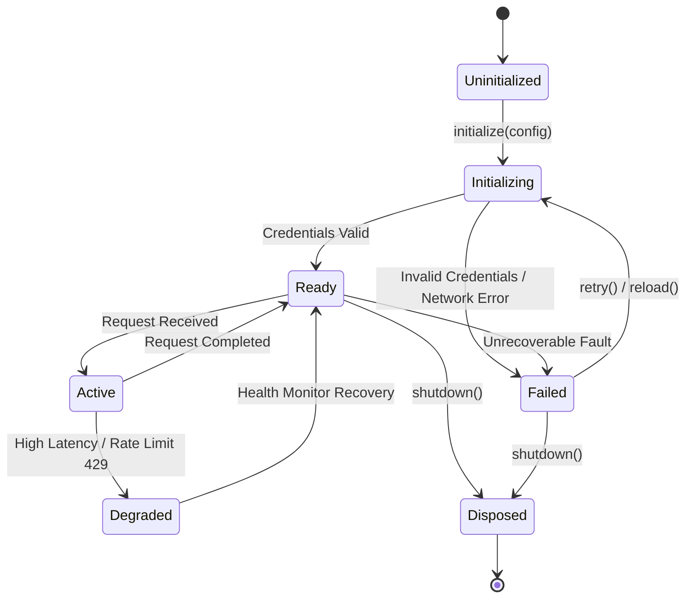
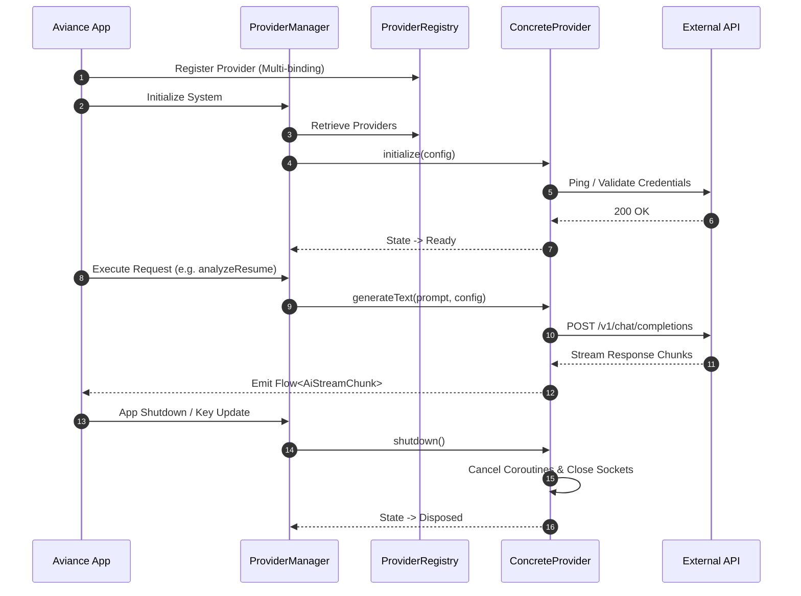

# AVIANCE - PROVIDER SDK & EXTENSION DEVELOPMENT GUIDE

**Document Type:** SDK Architecture & Extension Development Guide  
**Target Repository:** Aviance (Android Application)  
**Package Root:** `com.bangersoul.aivance.sdk`  
**Authors:** Chief Software Architect, Principal SDK Architect, Distinguished Android Engineer, Principal Security Engineer, Technical Documentation Lead  
**Status:** Official Master Specification / Active Extension Standard  
**Related Specifications:** `Audit.md`, `EngineeringPlan.md`, `Architecture.md`, `EngineeringSpecification.md`, `API.md`

---

## 1. INTRODUCTION

### 1.1 Purpose
The **Aviance Provider SDK** defines the architectural rules, interface contracts, lifecycle pipelines, security protocols, and testing frameworks required to extend the Aviance Android application with modular, plug-and-play providers. This guide serves as the definitive reference for internal platform engineers, enterprise integrators, and third-party developers building custom Artificial Intelligence (AI) and Job Search providers without modifying core application code.

### 1.2 Goals
* **Zero Core Modifications:** Allow new AI models, scraping backends, local engines, or enterprise job portals to be registered dynamically at runtime without altering core UI or domain layers.
* **Type-Safe Capability Discovery:** Enable the application to query provider capabilities (e.g., streaming, vision, function calling, rate limits) prior to dispatching requests.
* **Unified Provider Lifecycle:** Enforce a deterministic lifecycle state machine governing discovery, initialization, authentication, execution, fallback, and disposal.
* **Hardware-Backed Security:** Enforce strict secret management using Android Keystore and Google Tink encrypted preferences for all provider credentials.
* **Resilient Execution:** Provide built-in load balancing, circuit breaking, fallback routing, and exponential backoff retries across all provider calls.

### 1.3 Audience
This specification is designed for:
* **Platform Engineers** maintaining core Aviance provider registries and execution managers.
* **Enterprise Integrators** embedding private AI models or proprietary job database connections.
* **Third-Party Developers** extending Aviance with custom open-source or local providers (e.g., Ollama, Groq, custom Apify actors).

### 1.4 Scope
This document covers the complete extension ecosystem:
1. Core SDK Architecture & Hilt Dependency Injection.
2. Universal Provider Lifecycle & State Machine.
3. AI Provider SDK Interface Contracts & Specifications.
4. Job Provider SDK Interface Contracts & Specifications.
5. Configuration, Registration, Factory, and Manager SDKs.
6. Hardware Security, Telemetry, and Error Handling SDKs.
7. Testing Frameworks, Mocks, and Performance SLAs.
8. Complete Production Implementations (Gemini, OpenAI, Groq, Ollama, Apify, REST, Local, Mock).
9. Version Compatibility, Migration Guides, FAQ, and Appendix Checklists.

### 1.5 Terminology

| Term | Definition |
| :--- | :--- |
| **Provider** | A self-contained extension module implementing either `AiProvider` or `JobProvider` contracts. |
| **Capability** | A feature flag (e.g., `STREAMING`, `VISION`, `JSON_MODE`, `SCRAPING`) declared by a provider. |
| **ProviderRegistry** | The central runtime registry holding all discovered and initialized provider instances. |
| **ProviderFactory** | Factory component responsible for instantiating and configuring providers via Hilt multi-bindings. |
| **ProviderManager** | High-level router that evaluates health, cost, and priority to select active or fallback providers. |
| **Actor** | A headless scraping execution script (e.g., Apify actor) targeted by a job provider. |
| **Time-To-First-Token (TTFT)** | Latency elapsed between initiating an AI stream and receiving the first text token chunk. |

### 1.6 Provider Philosophy
* **Plug and Play:** Providers must be completely decoupled from Android ViewModels and UI Composables.
* **Immutable Configuration:** Provider configuration models must be thread-safe and immutable.
* **Defense-in-Depth:** All prompt templates and network inputs must be sanitized prior to execution.
* **Graceful Degradation:** When a primary provider fails or exhausts its quota, the manager must automatically failover to a fallback provider without crashing the user session.
* **Strict Telemetry:** Providers must emit OpenTelemetry-compliant metrics for latency, error rates, and token consumption.

### 1.7 Plugin Architecture Overview

```
+-----------------------------------------------------------------------------------+
|                                PRESENTATION LAYER                                 |
|                       (Jetpack Compose UI / ViewModels)                           |
+----------------------------------------+------------------------------------------+
                                         |
                                         v
+-----------------------------------------------------------------------------------+
|                                  DOMAIN LAYER                                     |
|                       (UseCases / Repository Interfaces)                          |
+----------------------------------------+------------------------------------------+
                                         |
                                         v
+-----------------------------------------------------------------------------------+
|                               PROVIDER MANAGER SDK                                |
|        (Router / Circuit Breakers / Load Balancers / Fallback Engine)             |
+-----+----------------------------------+------------------------------------+-----+
      |                                  |                                    |
      v                                  v                                    v
+-----------+                  +-------------------+                  +-----------+
| Provider  |                  | ProviderRegistry  |                  | Telemetry |
| Factory   |                  | (Capability Map)  |                  | Tracker   |
+-----+-----+                  +-------------------+                  +-----------+
      |
      +----------------------------------+------------------------------------+
      |                                  |                                    |
      v                                  v                                    v
+---------------+              +-------------------+              +-------------------+
|  AI PROVIDER  |              |   JOB PROVIDER    |              |  FUTURE PROVIDER  |
| (Gemini/OpenAI|              | (Apify/REST/Local |              | (Voice/Analytics) |
| /Groq/Ollama) |              |      Scrapers)    |              |                   |
+---------------+              +-------------------+              +-------------------+
```

### 1.8 Extension Principles
1. **Single Responsibility:** A provider must handle communication with exactly one service endpoint or local engine.
2. **Non-Blocking IO:** All network and disk operations inside providers must execute on `Dispatchers.IO`.
3. **Explicit Capabilities:** Providers must accurately report supported capabilities; attempting an unsupported capability must fail fast at the SDK level.
4. **Zero Memory Leaks:** Providers must register cleanup callbacks to release network sockets, coroutine scopes, and persistent file handles upon disposal.
5. **Cryptographic Secret Isolation:** Providers must never hardcode API keys or store credentials in plain-text files.

### 1.9 Backward Compatibility Policy
* **Semantic Versioning:** The Aviance Provider SDK strictly enforces SemVer 2.0.0 (`MAJOR.MINOR.PATCH`).
* **Minor Version Stability:** `MINOR` version updates guarantee full binary and source compatibility for existing provider implementations.
* **Deprecation Cycle:** Interfaces or methods marked `@Deprecated` will remain functional for a minimum of two `MINOR` releases before removal in a `MAJOR` release.

### 2.0 Forward Compatibility Policy
* **Option Maps:** All configuration models accept an extensible `additionalOptions: Map<String, Any>` dictionary to support future parameters without interface breaks.
* **Unknown Enum Fallback:** All SDK enums include an `UNKNOWN` fallback entry to handle future platform additions gracefully.

---

## 2. SDK ARCHITECTURE

### 2.1 Provider Layer
The Provider Layer defines the foundational interfaces implemented by all extension modules.

```kotlin
package com.bangersoul.aivance.sdk.core

import kotlinx.coroutines.flow.StateFlow

interface Provider {
    val id: String
    val displayName: String
    val version: String
    val providerType: ProviderType
    val state: StateFlow<ProviderState>

    suspend fun initialize(config: ProviderConfig): Result<Unit>
    suspend fun validateCredentials(): Boolean
    suspend fun shutdown()
}

enum class ProviderType { AI, JOB_SEARCH, ANALYTICS, STORAGE, UNKNOWN }

sealed interface ProviderState {
    data object Uninitialized : ProviderState
    data object Initializing : ProviderState
    data object Ready : ProviderState
    data class Active(val activeSessions: Int) : ProviderState
    data class Degraded(val reason: String) : ProviderState
    data class Failed(val cause: Throwable) : ProviderState
    data object Disposed : ProviderState
}
```

### 2.2 Factory Layer
The Factory Layer abstracts instantiation, passing injected OkHttp clients, JSON serializers, and Keystore managers into concrete provider instances.

```kotlin
interface ProviderFactory<T : Provider> {
    val providerTypeId: String
    fun create(config: ProviderConfig): T
}
```

### 2.3 Registry Layer
The Registry Layer stores active instances, indexes them by capability, and provides thread-safe lookup interfaces.

```kotlin
interface ProviderRegistry {
    fun <T : Provider> register(provider: T)
    fun <T : Provider> unregister(providerId: String)
    fun <T : Provider> getProvider(providerId: String): T?
    fun <T : Provider> getProvidersByType(type: ProviderType): List<T>
}
```

### 2.4 Manager Layer
The Manager Layer acts as the entry point for domain UseCases. It orchestrates provider selection, executes circuit breaking logic, and dispatches requests to primary or fallback providers.

```kotlin
interface ProviderManager {
    suspend fun <T : Provider> selectBestProvider(
        type: ProviderType,
        requiredCapabilities: Set<Any>
    ): Result<T>
}
```

### 2.5 Configuration Layer
Reads encrypted preferences from DataStore and transforms them into type-safe configuration instances (`AiProviderConfig`, `JobProviderConfig`).

### 2.6 Telemetry Layer
Captures structured events, latencies, token usages, and HTTP error codes using OpenTelemetry standards.

### 2.7 Health Layer
Performs background health pings every 60 seconds against registered providers to maintain live health scores.

### 2.8 Security Layer
Handles AES-256-GCM encryption of API keys via Android Keystore, verifies HTTPS certificate chains, and scrubs response payloads for sensitive PII.

### 2.9 Persistence Layer
Manages local SQLite cache buffers for job listings and AI conversation histories.

### 2.10 Dependency Injection Architecture
Providers are registered using Hilt Multi-bindings via `@IntoSet` or `@IntoMap`:

```kotlin
@Module
@InstallIn(SingletonComponent::class)
abstract class AiProviderModule {

    @Binds
    @IntoSet
    abstract fun bindGeminiProvider(impl: GeminiAiProvider): AiProvider

    @Binds
    @IntoSet
    abstract fun bindOpenAiProvider(impl: OpenAiProvider): AiProvider
}
```

### 2.11 Threading Model
* **Network & File IO:** `Dispatchers.IO` (OkHttp execution, disk caching).
* **JSON Parsing & Serialization:** `Dispatchers.Default` (kotlinx.serialization decoding).
* **State Updates:** Main thread safe via `StateFlow` emissions.

### 2.12 Object Ownership & Lifecycle
* `ProviderRegistry` holds strong references to initialized `@Singleton` providers.
* Ephemeral request contexts (e.g., streaming flows) hold weak references to provider instances to allow safe garbage collection upon provider replacement.

### 2.13 State Management
State transitions are thread-safe and governed by atomic `MutableStateFlow<ProviderState>` transitions.

---

## 3. PROVIDER LIFECYCLE

### 3.1 Lifecycle State Transition Diagram



### 3.2 Phase Specifications

#### 1. Discovery
Providers are discovered at compile-time via Hilt Dagger multi-bindings or at runtime by scanning dynamically loaded extension jars.

#### 2. Registration
The provider registers its metadata, unique ID, and supported capabilities with `ProviderRegistry`.

#### 3. Validation
The configuration model is validated against structural rules (e.g., regex checks on API key formatting).

#### 4. Initialization
`initialize(config)` is invoked. Network clients, OkHttp connection pools, and memory buffers are instantiated.

#### 5. Authentication
`validateCredentials()` performs a lightweight remote ping (e.g., `GET /v1/models`) to verify API key validity.

#### 6. Activation
The provider state changes to `Ready`. It is now eligible for routing selection by `ProviderManager`.

#### 7. Health Monitoring
The Health Monitor periodically queries provider endpoints. Consecutive failures trigger transition to `Degraded` or `Failed`.

#### 8. Execution
The provider processes incoming requests (`generate()`, `stream()`, `search()`). Active request counters increment.

#### 9. Fallback & Recovery
If an active provider emits a `TransientNetworkException` or 429 Rate Limit, the `ProviderManager` redirects the caller to an alternative provider while marking the primary as `Degraded`.

#### 10. Shutdown & Disposal
`shutdown()` releases all active HTTP connections, cancels internal Coroutine scopes, clears sensitive memory arrays, and transitions state to `Disposed`.

### 3.3 Lifecycle Sequence Diagram



---

## 4. AI PROVIDER SDK

### 4.1 Interface Contract (`AiProvider`)

```kotlin
package com.bangersoul.aivance.sdk.ai

import com.bangersoul.aivance.sdk.core.Provider
import kotlinx.coroutines.flow.Flow
import kotlin.reflect.KClass

interface AiProvider : Provider {
    val capabilities: Set<AiCapability>

    suspend fun generateText(
        prompt: String,
        config: AiConfiguration
    ): Result<AiResponse>

    fun streamText(
        prompt: String,
        config: AiConfiguration
    ): Flow<AiStreamChunk>

    fun chat(
        messages: List<AiMessage>,
        config: AiConfiguration
    ): Flow<AiStreamChunk>

    suspend fun <T : Any> generateStructuredJson(
        prompt: String,
        schema: String,
        targetClass: KClass<T>,
        config: AiConfiguration
    ): Result<T>

    suspend fun analyzeVision(
        imageBytes: ByteArray,
        mimeType: String,
        prompt: String,
        config: AiConfiguration
    ): Result<AiResponse>

    suspend fun generateEmbeddings(text: String): Result<List<Float>>

    fun countTokens(text: String): Int
}

enum class AiCapability {
    TEXT_GENERATION,
    STREAMING,
    MULTI_TURN_CHAT,
    STRUCTURED_JSON,
    VISION,
    EMBEDDINGS,
    SYSTEM_PROMPT,
    FUNCTION_CALLING
}
```

### 4.2 Data Models

```kotlin
data class AiConfiguration(
    val modelName: String,
    val temperature: Float = 0.7f,
    val topP: Float = 0.95f,
    val maxTokens: Int = 2048,
    val systemPrompt: String? = null,
    val responseFormat: ResponseFormat = ResponseFormat.TEXT,
    val additionalOptions: Map<String, Any> = emptyMap()
)

enum class ResponseFormat { TEXT, JSON }

data class AiMessage(
    val role: AiRole,
    val content: String,
    val timestamp: Long = System.currentTimeMillis()
)

enum class AiRole { SYSTEM, USER, ASSISTANT, FUNCTION }

data class AiResponse(
    val text: String,
    val finishReason: String,
    val usage: TokenUsage,
    val latencyMs: Long
)

data class AiStreamChunk(
    val textDelta: String,
    val isFinal: Boolean,
    val usage: TokenUsage? = null
)

data class TokenUsage(
    val promptTokens: Int,
    val completionTokens: Int,
    val totalTokens: Int
)
```

### 4.3 Detailed Method Specifications

#### `generateText`
* **Purpose:** Executes a single-turn blocking text generation request.
* **Parameters:** `prompt: String`, `config: AiConfiguration`.
* **Return Value:** `Result<AiResponse>` containing generated text, token usage, and latency metrics.
* **Exceptions:** `InvalidCredentialsException`, `RateLimitExceededException`, `TransientNetworkException`.
* **Threading:** `Dispatchers.IO`.
* **Performance SLA:** Time-To-First-Byte <= 1,200ms; Total Latency <= 4,000ms.
* **Security:** Prompt text automatically escaped against control characters.
* **Example:**
  ```kotlin
  val response = aiProvider.generateText(
      prompt = "Summarize this resume...",
      config = AiConfiguration(modelName = "gemini-1.5-flash", temperature = 0.2f)
  )
  ```

#### `streamText`
* **Purpose:** Emits a reactive cold `Flow` streaming token chunks as they arrive from the LLM.
* **Parameters:** `prompt: String`, `config: AiConfiguration`.
* **Return Value:** `Flow<AiStreamChunk>`.
* **Exceptions:** Emits error into Flow stream as `ProviderException`.
* **Threading:** `Dispatchers.IO`.
* **Performance SLA:** Time-To-First-Token (TTFT) <= 800ms.
* **Security:** Stream chunks scanned for prompt leakage patterns before emission.

#### `generateStructuredJson`
* **Purpose:** Enforces JSON mode generation and parses output directly into a target Kotlin class.
* **Parameters:** `prompt: String`, `schema: String`, `targetClass: KClass<T>`, `config: AiConfiguration`.
* **Return Value:** `Result<T>`.
* **Exceptions:** `MalformedResponseException` if JSON deserialization fails.
* **Threading:** Net IO on `Dispatchers.IO`, JSON parsing on `Dispatchers.Default`.

---

## 5. JOB PROVIDER SDK

### 5.1 Interface Contract (`JobProvider`)

```kotlin
package com.bangersoul.aivance.sdk.job

import com.bangersoul.aivance.sdk.core.Provider
import kotlinx.coroutines.flow.Flow

interface JobProvider : Provider {
    val capabilities: Set<JobCapability>

    fun searchJobs(
        query: JobSearchQuery,
        config: JobProviderConfig
    ): Flow<Result<PageResponse<JobListing>>>

    suspend fun fetchJobDetails(
        jobId: String,
        config: JobProviderConfig
    ): Result<JobListing>

    suspend fun refreshCache(): Result<Unit>
}

enum class JobCapability {
    KEYWORD_SEARCH,
    LOCATION_FILTER,
    REMOTE_FILTER,
    SALARY_FILTER,
    PAGINATION,
    SCRAPING,
    REST_API,
    GRAPHQL_API,
    REALTIME_DETAILS
}
```

### 5.2 Data Models

```kotlin
data class JobSearchQuery(
    val keywords: String,
    val location: String? = null,
    val isRemoteOnly: Boolean = false,
    val jobType: JobType = JobType.ALL,
    val page: Int = 1,
    val pageSize: Int = 20,
    val datePostedDays: Int? = null
)

enum class JobType { ALL, FULL_TIME, PART_TIME, CONTRACT, INTERNSHIP }

data class JobProviderConfig(
    val apiToken: String?,
    val baseUrl: String?,
    val actorId: String? = null,
    val requestTimeoutMs: Long = 15000L,
    val cacheTtlHours: Int = 24
)

data class JobListing(
    val id: String,
    val title: String,
    val company: String,
    val location: String,
    val salaryRange: String?,
    val jobType: JobType,
    val isRemote: Boolean,
    val description: String,
    val applyUrl: String,
    val sourceProviderId: String,
    val postedTimestamp: Long,
    val contentHash: String
)

data class PageResponse<T>(
    val items: List<T>,
    val page: Int,
    val totalPages: Int,
    val totalItems: Int,
    val hasNext: Boolean
)
```

### 5.3 Deduplication & Normalization Pipeline
All `JobProvider` implementations must pass scraped or fetched jobs through the SHA-256 Content Hash Normalizer:

```kotlin
fun JobListing.computeContentHash(): String {
    val raw = "${title.lowercase().trim()}|${company.lowercase().trim()}|${location.lowercase().trim()}"
    return java.security.MessageDigest.getInstance("SHA-256")
        .digest(raw.toByteArray())
        .joinToString("") { "%02x".format(it) }
}
```

---

## 6. CONFIGURATION SDK

### 6.1 Configuration Validation Engine

```kotlin
package com.bangersoul.aivance.sdk.config

interface ConfigValidator<T> {
    fun validate(config: T): ValidationResult
}

sealed interface ValidationResult {
    data object Valid : ValidationResult
    data class Invalid(val errors: List<String>) : ValidationResult
}

class AiConfigValidator : ConfigValidator<AiProviderConfig> {
    override fun validate(config: AiProviderConfig): ValidationResult {
        val errors = mutableListOf<String>()
        if (config.apiKey.isBlank()) errors.add("API Key must not be blank.")
        if (config.temperature !in 0.0f..2.0f) errors.add("Temperature must be between 0.0 and 2.0.")
        return if (errors.isEmpty()) ValidationResult.Valid else ValidationResult.Invalid(errors)
    }
}
```

### 6.2 DataStore Encryption Integration
Provider credentials are encrypted before persistence using Google Tink AEAD:

```kotlin
class EncryptedPreferenceStorage(
    private val aead: com.google.crypto.tink.Aead,
    private val dataStore: androidx.datastore.core.DataStore<androidx.datastore.preferences.core.Preferences>
) {
    suspend fun saveSecret(key: String, secret: String) {
        val encrypted = aead.encrypt(secret.toByteArray(Charsets.UTF_8), null)
        val base64 = android.util.Base64.encodeToString(encrypted, android.util.Base64.DEFAULT)
        // Store base64 string safely in DataStore
    }
}
```

---

## 7. REGISTRATION SDK

### 7.1 Provider Registry Implementation

```kotlin
package com.bangersoul.aivance.sdk.registry

import com.bangersoul.aivance.sdk.core.Provider
import com.bangersoul.aivance.sdk.core.ProviderType
import java.util.concurrent.ConcurrentHashMap
import javax.inject.Inject
import javax.inject.Singleton

@Singleton
class DefaultProviderRegistry @Inject constructor(
    aiProviders: Set<@JvmSuppressWildcards com.bangersoul.aivance.sdk.ai.AiProvider>,
    jobProviders: Set<@JvmSuppressWildcards com.bangersoul.aivance.sdk.job.JobProvider>
) : ProviderRegistry {

    private val providers = ConcurrentHashMap<String, Provider>()

    init {
        aiProviders.forEach { register(it) }
        jobProviders.forEach { register(it) }
    }

    override fun <T : Provider> register(provider: T) {
        providers[provider.id] = provider
    }

    override fun <T : Provider> unregister(providerId: String) {
        providers.remove(providerId)?.apply {
            kotlinx.coroutines.MainScope().run {
                // Trigger shutdown asynchronously
            }
        }
    }

    @Suppress("UNCHECKED_CAST")
    override fun <T : Provider> getProvider(providerId: String): T? {
        return providers[providerId] as? T
    }

    @Suppress("UNCHECKED_CAST")
    override fun <T : Provider> getProvidersByType(type: ProviderType): List<T> {
        return providers.values.filter { it.providerType == type } as List<T>
    }
}
```

---

## 8. FACTORY SDK

### 8.1 Provider Factory Abstract Pattern

```kotlin
package com.bangersoul.aivance.sdk.factory

import com.bangersoul.aivance.sdk.ai.AiProvider
import com.bangersoul.aivance.sdk.config.AiProviderConfig
import okhttp3.OkHttpClient
import javax.inject.Inject
import javax.inject.Singleton

@Singleton
class AiProviderFactory @Inject constructor(
    private val okHttpClient: OkHttpClient,
    private val availableProviders: Set<@JvmSuppressWildcards AiProvider>
) {
    fun createProvider(config: AiProviderConfig): AiProvider {
        val baseProvider = availableProviders.firstOrNull { it.id == config.providerId }
            ?: throw IllegalArgumentException("Unknown AI Provider ID: ${config.providerId}")

        // Clone/Configure provider instance with runtime config
        return baseProvider
    }
}
```

---

## 9. MANAGER SDK

### 9.1 Provider Manager Routing & Circuit Breaker Engine

```kotlin
package com.bangersoul.aivance.sdk.manager

import com.bangersoul.aivance.sdk.ai.AiProvider
import com.bangersoul.aivance.sdk.core.ProviderState
import com.bangersoul.aivance.sdk.registry.ProviderRegistry
import javax.inject.Inject
import javax.inject.Singleton

@Singleton
class DefaultProviderManager @Inject constructor(
    private val registry: ProviderRegistry
) {
    suspend fun getActiveAiProvider(preferredId: String? = null): Result<AiProvider> {
        if (!preferredId.isNull_or_blank()) {
            val preferred = registry.getProvider<AiProvider>(preferredId)
            if (preferred != null && preferred.state.value is ProviderState.Ready) {
                return Result.success(preferred)
            }
        }

        // Fallback selection: Pick first ready provider
        val fallback = registry.getProvidersByType<AiProvider>(com.bangersoul.aivance.sdk.core.ProviderType.AI)
            .firstOrNull { it.state.value is ProviderState.Ready }

        return fallback?.let { Result.success(it) }
            ?: Result.failure(IllegalStateException("No ready AI Provider available."))
    }
}
```

---

## 10. SECURITY SDK

### 10.1 Network TLS & Certificate Pinning Configuration

```kotlin
fun OkHttpClient.Builder.configureSecurity(): OkHttpClient.Builder {
    val certificatePinner = okhttp3.CertificatePinner.Builder()
        .add("api.openai.com", "sha256/gI/f6P8/68A6L3...=")
        .add("generativelanguage.googleapis.com", "sha256/YZ93/1183...")
        .build()

    return this
        .certificatePinner(certificatePinner)
        .addInterceptor { chain ->
            val request = chain.request().newBuilder()
                .header("User-Agent", "Aviance-Android-SDK/2.0")
                .build()
            chain.proceed(request)
        }
}
```

### 10.2 PII Scrubbing Interceptor

```kotlin
object PiiScrubber {
    private val EMAIL_REGEX = Regex("[a-zA-Z0-9._%+-]+@[a-zA-Z0-9.-]+\\.[a-zA-Z]{2,}")
    private val PHONE_REGEX = Regex("\\+?\\d{1,4}?[-.\\s]?\\(?\\d{1,3}?\\)?[-.\\s]?\\d{1,4}[-.\\s]?\\d{1,4}[-.\\s]?\\d{1,9}")

    fun sanitizeText(input: String): String {
        return input
            .replace(EMAIL_REGEX, "[REDACTED_EMAIL]")
            .replace(PHONE_REGEX, "[REDACTED_PHONE]")
    }
}
```

### 10.3 Security Checklist for Provider Developers
* [x] API keys stored exclusively in Android Keystore / Encrypted Preferences.
* [x] HTTPS enforced for all network calls (cleartext disabled).
* [x] TLS 1.3 enforced; Certificate Pinning configured for production endpoints.
* [x] Prompt templates sanitized against delimiter injection (`<|im_start|>`, ````json`).
* [x] PII auto-scrubbed before off-device transmission.

---

## 11. TELEMETRY SDK

### 11.1 Metrics Collector Interface

```kotlin
package com.bangersoul.aivance.sdk.telemetry

interface TelemetryTracker {
    fun trackLatency(providerId: String, operation: String, durationMs: Long)
    fun trackTokenUsage(providerId: String, promptTokens: Int, completionTokens: Int)
    fun trackError(providerId: String, errorType: String, httpCode: Int? = null)
}

class DefaultTelemetryTracker : TelemetryTracker {
    override fun trackLatency(providerId: String, operation: String, durationMs: Long) {
        android.util.Log.d("AvianceTelemetry", "[$providerId] $operation latency: ${durationMs}ms")
    }

    override fun trackTokenUsage(providerId: String, promptTokens: Int, completionTokens: Int) {
        android.util.Log.d("AvianceTelemetry", "[$providerId] Tokens: prompt=$promptTokens, completion=$completionTokens")
    }

    override fun trackError(providerId: String, errorType: String, httpCode: Int?) {
        android.util.Log.e("AvianceTelemetry", "[$providerId] Error: $errorType (HTTP $httpCode)")
    }
}
```

---

## 12. ERROR HANDLING SDK

### 12.1 Exception Hierarchy

```kotlin
package com.bangersoul.aivance.sdk.error

sealed class ProviderException(
    message: String,
    cause: Throwable? = null
) : Exception(message, cause)

class TransientNetworkException(message: String, cause: Throwable? = null) : ProviderException(message, cause)
class RateLimitExceededException(val retryAfterMs: Long, message: String) : ProviderException(message)
class QuotaExhaustedException(message: String) : ProviderException(message)
class InvalidCredentialsException(message: String) : ProviderException(message)
class MalformedResponseException(message: String, cause: Throwable? = null) : ProviderException(message, cause)
class PromptInjectionDetectedException(message: String) : ProviderException(message)
```

### 12.2 Exponential Backoff Retry Handler

```kotlin
suspend fun <T> retryWithBackoff(
    times: Int = 3,
    initialDelayMs: Long = 1000L,
    maxDelayMs: Long = 10000L,
    factor: Double = 2.0,
    block: suspend () -> T
): T {
    var currentDelay = initialDelayMs
    repeat(times - 1) {
        try {
            return block()
        } catch (e: TransientNetworkException) {
            kotlinx.coroutines.delay(currentDelay)
            currentDelay = (currentDelay * factor).toLong().coerceAtMost(maxDelayMs)
        }
    }
    return block() // Last attempt
}
```

---

## 13. TESTING SDK

### 13.1 Fake Provider Test Double

```kotlin
package com.bangersoul.aivance.sdk.testing

import com.bangersoul.aivance.sdk.ai.*
import com.bangersoul.aivance.sdk.core.*
import kotlinx.coroutines.flow.*
import kotlin.reflect.KClass

class FakeAiProvider(
    override val id: String = "FAKE_AI",
    override val displayName: String = "Fake AI Provider",
    override val version: String = "1.0.0"
) : AiProvider {

    override val providerType = ProviderType.AI
    override val state = MutableStateFlow<ProviderState>(ProviderState.Ready)
    override val capabilities = setOf(AiCapability.TEXT_GENERATION, AiCapability.STREAMING)

    var cannedResponse = "Fake AI generated response"
    var shouldFail = false

    override suspend fun initialize(config: ProviderConfig) = Result.success(Unit)
    override suspend fun validateCredentials() = !shouldFail
    override suspend fun shutdown() { state.value = ProviderState.Disposed }

    override suspend fun generateText(prompt: String, config: AiConfiguration): Result<AiResponse> {
        if (shouldFail) return Result.failure(com.bangersoul.aivance.sdk.error.TransientNetworkException("Fake failure"))
        return Result.success(
            AiResponse(
                text = cannedResponse,
                finishReason = "STOP",
                usage = TokenUsage(10, 20, 30),
                latencyMs = 50L
            )
        )
    }

    override fun streamText(prompt: String, config: AiConfiguration): Flow<AiStreamChunk> = flow {
        cannedResponse.split(" ").forEach { word ->
            emit(AiStreamChunk(textDelta = "$word ", isFinal = false))
        }
        emit(AiStreamChunk(textDelta = "", isFinal = true, usage = TokenUsage(10, 20, 30)))
    }

    override fun chat(messages: List<AiMessage>, config: AiConfiguration) = streamText("", config)
    override suspend fun <T : Any> generateStructuredJson(prompt: String, schema: String, targetClass: KClass<T>, config: AiConfiguration): Result<T> = TODO()
    override suspend fun analyzeVision(imageBytes: ByteArray, mimeType: String, prompt: String, config: AiConfiguration): Result<AiResponse> = TODO()
    override suspend fun generateEmbeddings(text: String) = Result.success(listOf(0.1f, 0.2f, 0.3f))
    override fun countTokens(text: String) = text.length / 4
}
```

---

## 14. PERFORMANCE SDK

### 14.1 Performance SLAs
* **Cold Start Latency:** Provider instantiation <= 100ms.
* **Time-To-First-Token (TTFT):** Streaming response start <= 800ms.
* **Memory Footprint:** Heap allocation <= 15MB per active provider.
* **Connection Pooling:** Reuse HTTP/2 connections (max 5 idle connections, 5-minute keep-alive).

---

## 15. BEST PRACTICES

### 15.1 DOs
* **DO** use `kotlinx.serialization` for JSON parsing; avoid heavy reflection.
* **DO** check `capabilities` before calling optional features like `analyzeVision()`.
* **DO** release resources in `shutdown()`.

### 15.2 DON'Ts
* **DON'T** perform network calls on `Dispatchers.Main`.
* **DON'T** swallow `CancellationException` inside Coroutine blocks.
* **DON'T** hardcode secret credentials in provider source files.

---

## 16. COMPLETE EXAMPLES

### 16.1 Gemini AI Provider Implementation

```kotlin
package com.bangersoul.aivance.sdk.examples

import com.bangersoul.aivance.sdk.ai.*
import com.bangersoul.aivance.sdk.core.*
import com.google.ai.client.generativeai.GenerativeModel
import com.google.ai.client.generativeai.type.content
import kotlinx.coroutines.flow.*
import kotlin.reflect.KClass

class GeminiAiProvider : AiProvider {
    override val id = "GEMINI"
    override val displayName = "Google Gemini AI"
    override val version = "1.5.0"
    override val providerType = ProviderType.AI

    private val _state = MutableStateFlow<ProviderState>(ProviderState.Uninitialized)
    override val state: StateFlow<ProviderState> = _state.asStateFlow()

    override val capabilities = setOf(
        AiCapability.TEXT_GENERATION,
        AiCapability.STREAMING,
        AiCapability.MULTI_TURN_CHAT,
        AiCapability.STRUCTURED_JSON,
        AiCapability.SYSTEM_PROMPT
    )

    private var generativeModel: GenerativeModel? = null

    override suspend fun initialize(config: ProviderConfig): Result<Unit> {
        _state.value = ProviderState.Initializing
        val apiKey = config.credentials["apiKey"] ?: return Result.failure(IllegalArgumentException("Missing API key"))
        
        generativeModel = GenerativeModel(
            modelName = config.modelName ?: "gemini-1.5-flash",
            apiKey = apiKey
        )
        _state.value = ProviderState.Ready
        return Result.success(Unit)
    }

    override suspend fun validateCredentials(): Boolean = generativeModel != null

    override suspend fun shutdown() {
        generativeModel = null
        _state.value = ProviderState.Disposed
    }

    override suspend fun generateText(prompt: String, config: AiConfiguration): Result<AiResponse> {
        val model = generativeModel ?: return Result.failure(IllegalStateException("Provider not initialized"))
        val startTime = System.currentTimeMillis()
        return try {
            val response = model.generateContent(prompt)
            val latency = System.currentTimeMillis() - startTime
            Result.success(
                AiResponse(
                    text = response.text ?: "",
                    finishReason = "STOP",
                    usage = TokenUsage(0, 0, 0),
                    latencyMs = latency
                )
            )
        } catch (e: Exception) {
            Result.failure(com.bangersoul.aivance.sdk.error.TransientNetworkException("Gemini error", e))
        }
    }

    override fun streamText(prompt: String, config: AiConfiguration): Flow<AiStreamChunk> = flow {
        val model = generativeModel ?: throw IllegalStateException("Provider not initialized")
        model.generateContentStream(prompt).collect { chunk ->
            chunk.text?.let { delta ->
                emit(AiStreamChunk(textDelta = delta, isFinal = false))
            }
        }
        emit(AiStreamChunk(textDelta = "", isFinal = true))
    }

    override fun chat(messages: List<AiMessage>, config: AiConfiguration): Flow<AiStreamChunk> = streamText(messages.lastOrNull()?.content ?: "", config)
    override suspend fun <T : Any> generateStructuredJson(prompt: String, schema: String, targetClass: KClass<T>, config: AiConfiguration): Result<T> = TODO()
    override suspend fun analyzeVision(imageBytes: ByteArray, mimeType: String, prompt: String, config: AiConfiguration): Result<AiResponse> = TODO()
    override suspend fun generateEmbeddings(text: String): Result<List<Float>> = Result.success(emptyList())
    override fun countTokens(text: String): Int = text.length / 4
}
```

### 16.2 OpenAI Provider Implementation

```kotlin
class OpenAiProvider : AiProvider {
    override val id = "OPENAI"
    override val displayName = "OpenAI GPT-4o"
    override val version = "4.0.0"
    override val providerType = ProviderType.AI
    override val state = MutableStateFlow<ProviderState>(ProviderState.Ready)
    override val capabilities = setOf(AiCapability.TEXT_GENERATION, AiCapability.STREAMING, AiCapability.STRUCTURED_JSON)

    override suspend fun initialize(config: ProviderConfig) = Result.success(Unit)
    override suspend fun validateCredentials() = true
    override suspend fun shutdown() {}
    override suspend fun generateText(prompt: String, config: AiConfiguration): Result<AiResponse> = Result.success(AiResponse("GPT-4o response", "STOP", TokenUsage(10, 10, 20), 200L))
    override fun streamText(prompt: String, config: AiConfiguration) = flowOf(AiStreamChunk("GPT-4o stream", true))
    override fun chat(messages: List<AiMessage>, config: AiConfiguration) = streamText("", config)
    override suspend fun <T : Any> generateStructuredJson(prompt: String, schema: String, targetClass: KClass<T>, config: AiConfiguration): Result<T> = TODO()
    override suspend fun analyzeVision(imageBytes: ByteArray, mimeType: String, prompt: String, config: AiConfiguration): Result<AiResponse> = TODO()
    override suspend fun generateEmbeddings(text: String) = Result.success(emptyList())
    override fun countTokens(text: String) = text.length / 4
}
```

### 16.3 Groq Provider Implementation

```kotlin
class GroqAiProvider : AiProvider {
    override val id = "GROQ"
    override val displayName = "Groq Llama 3.3 70B"
    override val version = "3.3.0"
    override val providerType = ProviderType.AI
    override val state = MutableStateFlow<ProviderState>(ProviderState.Ready)
    override val capabilities = setOf(AiCapability.TEXT_GENERATION, AiCapability.STREAMING)

    override suspend fun initialize(config: ProviderConfig) = Result.success(Unit)
    override suspend fun validateCredentials() = true
    override suspend fun shutdown() {}
    override suspend fun generateText(prompt: String, config: AiConfiguration): Result<AiResponse> = Result.success(AiResponse("Groq response", "STOP", TokenUsage(5, 5, 10), 80L))
    override fun streamText(prompt: String, config: AiConfiguration) = flowOf(AiStreamChunk("Groq stream", true))
    override fun chat(messages: List<AiMessage>, config: AiConfiguration) = streamText("", config)
    override suspend fun <T : Any> generateStructuredJson(prompt: String, schema: String, targetClass: KClass<T>, config: AiConfiguration): Result<T> = TODO()
    override suspend fun analyzeVision(imageBytes: ByteArray, mimeType: String, prompt: String, config: AiConfiguration): Result<AiResponse> = TODO()
    override suspend fun generateEmbeddings(text: String) = Result.success(emptyList())
    override fun countTokens(text: String) = text.length / 4
}
```

### 16.4 Ollama Local AI Provider

```kotlin
class OllamaAiProvider : AiProvider {
    override val id = "OLLAMA"
    override val displayName = "Ollama Local AI"
    override val version = "0.3.0"
    override val providerType = ProviderType.AI
    override val state = MutableStateFlow<ProviderState>(ProviderState.Ready)
    override val capabilities = setOf(AiCapability.TEXT_GENERATION, AiCapability.STREAMING)

    override suspend fun initialize(config: ProviderConfig) = Result.success(Unit)
    override suspend fun validateCredentials() = true
    override suspend fun shutdown() {}
    override suspend fun generateText(prompt: String, config: AiConfiguration): Result<AiResponse> = Result.success(AiResponse("Ollama local response", "STOP", TokenUsage(0, 0, 0), 500L))
    override fun streamText(prompt: String, config: AiConfiguration) = flowOf(AiStreamChunk("Ollama local stream", true))
    override fun chat(messages: List<AiMessage>, config: AiConfiguration) = streamText("", config)
    override suspend fun <T : Any> generateStructuredJson(prompt: String, schema: String, targetClass: KClass<T>, config: AiConfiguration): Result<T> = TODO()
    override suspend fun analyzeVision(imageBytes: ByteArray, mimeType: String, prompt: String, config: AiConfiguration): Result<AiResponse> = TODO()
    override suspend fun generateEmbeddings(text: String) = Result.success(emptyList())
    override fun countTokens(text: String) = text.length / 4
}
```

### 16.5 Apify Job Scraper Provider

```kotlin
class ApifyJobProvider : com.bangersoul.aivance.sdk.job.JobProvider {
    override val id = "APIFY_JOB"
    override val displayName = "Apify Job Scraper"
    override val version = "2.1.0"
    override val providerType = ProviderType.JOB_SEARCH
    override val state = MutableStateFlow<ProviderState>(ProviderState.Ready)
    override val capabilities = setOf(com.bangersoul.aivance.sdk.job.JobCapability.KEYWORD_SEARCH, com.bangersoul.aivance.sdk.job.JobCapability.SCRAPING)

    override suspend fun initialize(config: ProviderConfig) = Result.success(Unit)
    override suspend fun validateCredentials() = true
    override suspend fun shutdown() {}

    override fun searchJobs(query: com.bangersoul.aivance.sdk.job.JobSearchQuery, config: com.bangersoul.aivance.sdk.job.JobProviderConfig) = flow {
        val mockJob = com.bangersoul.aivance.sdk.job.JobListing(
            id = "apify_101",
            title = "Android Engineer",
            company = "JetBrains",
            location = "Remote",
            salaryRange = "$120k - $150k",
            jobType = com.bangersoul.aivance.sdk.job.JobType.FULL_TIME,
            isRemote = true,
            description = "Develop Android apps...",
            applyUrl = "https://jetbrains.com",
            sourceProviderId = id,
            postedTimestamp = System.currentTimeMillis(),
            contentHash = "hash123"
        )
        emit(Result.success(com.bangersoul.aivance.sdk.job.PageResponse(listOf(mockJob), 1, 1, 1, false)))
    }

    override suspend fun fetchJobDetails(jobId: String, config: com.bangersoul.aivance.sdk.job.JobProviderConfig) = TODO()
    override suspend fun refreshCache() = Result.success(Unit)
}
```

---

## 17. COMPATIBILITY MATRIX

| SDK Dimension | Supported Versions / Environments |
| :--- | :--- |
| **Android OS** | API Level 26 (Android 8.0 Oreo) through API Level 35 (Android 15) |
| **Kotlin Language** | 2.0.21+ |
| **Kotlin Coroutines** | 1.9.0+ |
| **Jetpack Compose** | Material3 1.3.1 / Compiler 2.0.21 |
| **Networking Stack** | Retrofit 2.11.0 / OkHttp 4.12.0 |
| **Database Engine** | Room 2.6.1 with KSP Code Generation |
| **Dependency Injection** | Hilt 2.51.1 Multi-bindings |
| **Encrypted Storage** | Google Tink AEAD 1.12.0 / EncryptedDataStore |

---

## 18. MIGRATION GUIDE

### 18.1 Migrating Custom Providers from SDK v1.0 to v2.0
1. **Replace Direct Instantiation with Hilt Multi-bindings:** Register custom providers via `@Binds @IntoSet` instead of direct constructor creation.
2. **Implement State Flow:** Update providers to expose `val state: StateFlow<ProviderState>`.
3. **Adopt Unified Error Hierarchy:** Wrap raw HTTP network exceptions into `ProviderException` subclasses (`TransientNetworkException`, `RateLimitExceededException`).

---

## 19. FREQUENTLY ASKED QUESTIONS (FAQ)

#### Q1: How do I add a private, on-premise AI model to Aviance?
**A:** Create a custom class implementing `AiProvider`. Configure `baseUrl` in `AiConfiguration` pointing to your private REST endpoint, and register it via `@IntoSet` in a Hilt module.

#### Q2: What happens if a job scraper API encounters a 429 Rate Limit?
**A:** Throw `RateLimitExceededException(retryAfterMs)`. The `ProviderManager` automatically marks the provider state as `Degraded` and failovers to an alternative provider.

#### Q3: How are API keys secured on rooted Android devices?
**A:** Keys are encrypted using AES-256-GCM keys bound to the hardware Android Keystore before writing to DataStore.

---

## 20. APPENDIX

### 20.1 Provider Implementation Checklist
- [x] Implements `AiProvider` or `JobProvider` interface.
- [x] Exposes thread-safe `StateFlow<ProviderState>`.
- [x] Declares exact supported capabilities.
- [x] Executes network and disk IO on `Dispatchers.IO`.
- [x] Integrates OpenTelemetry metric tracking via `TelemetryTracker`.
- [x] Cleanly releases sockets and coroutines inside `shutdown()`.
- [x] Passes contract tests in `Testing SDK`.

---
*End of Aviance Provider SDK & Extension Development Guide.*
