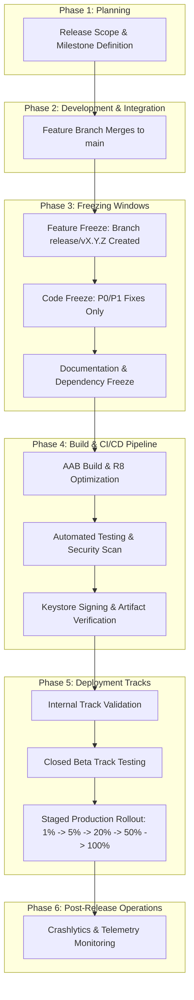
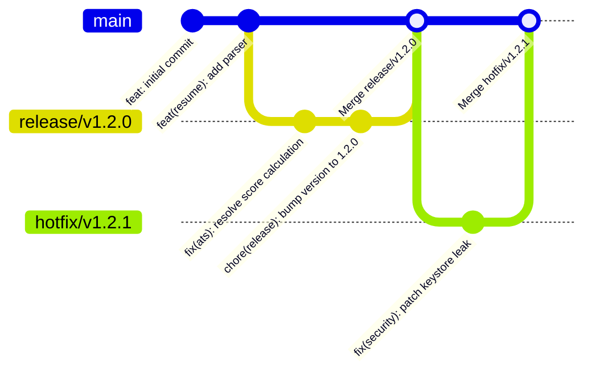
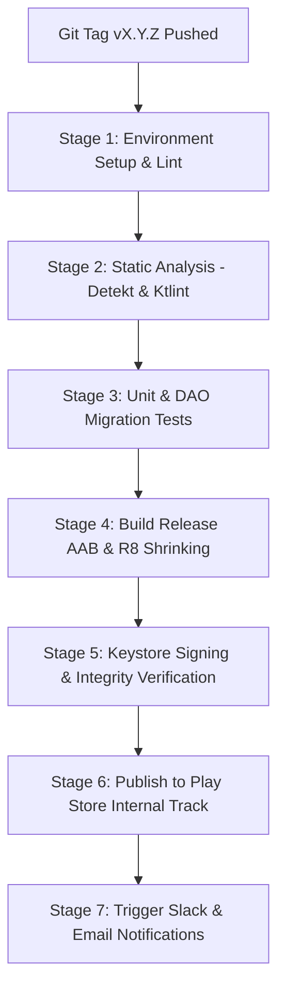
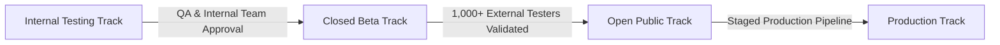
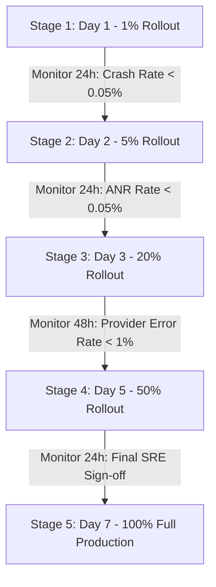
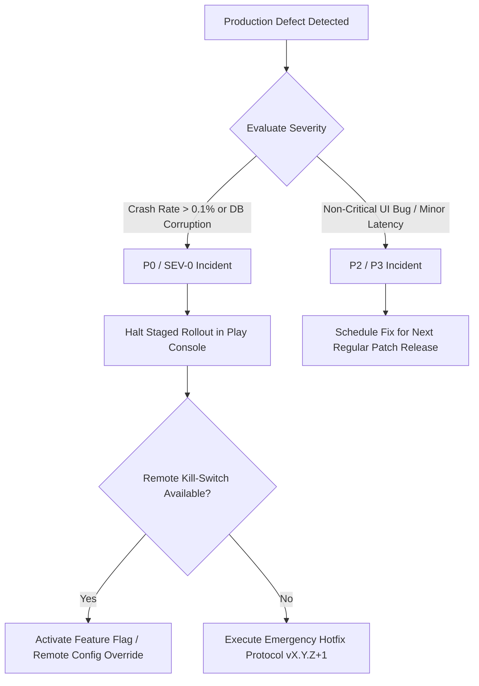
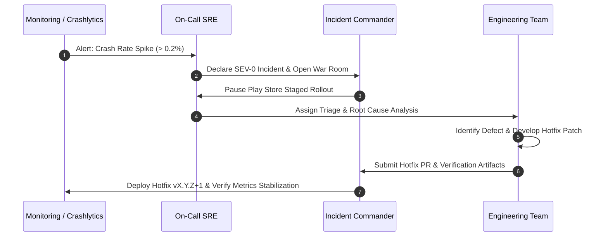

# AVIANCE - PRODUCTION RELEASE ENGINEERING HANDBOOK

**Document Type:** Master Release Engineering Handbook, Deployment Architecture Specification & Delivery Governance Handbook  
**Target Repository:** Aviance (Android Application)  
**Package Root:** `com.bangersoul.aivance`  
**Authors:** Chief Release Engineer, Distinguished Software Architect, Principal DevOps Engineer, Principal Security Engineer, Principal QA Architect, Principal SRE  
**Status:** Official Master Release Specification / Active Production Handbook  
**Related Specifications:** `Audit.md`, `EngineeringPlan.md`, `Architecture.md`, `EngineeringSpecification.md`, `API.md`, `ProviderSDK.md`, `DeveloperGuide.md`, `CONTRIBUTING.md`, `TESTING.md`, `Operations.md`

---

## 1. INTRODUCTION

### 1.1 Purpose
The **Aviance Release Engineering Handbook** is the single source of truth for planning, building, validating, publishing, monitoring, and maintaining production releases of the Aviance Android application. It establishes strict operational governance, automated CI/CD pipeline standards, semantic versioning policies, Play Store track management protocols, rollback triggers, and risk mitigation strategies required to deliver high-quality, secure, and reliable releases to users.

### 1.2 Audience
This handbook is designed for Release Engineers, DevOps Leads, Mobile Software Architects, Quality Assurance Architects, Site Reliability Engineers (SREs), Product Managers, and Security Leads responsible for software delivery across the 16 Gradle modules (`:app`, `:navigation`, `:core:common`, `:core:database`, `:core:datastore`, `:core:designsystem`, `:core:network`, `:core:util`, `:feature:ats`, `:feature:coverletter`, `:feature:dashboard`, `:feature:interview`, `:feature:jobs`, `:feature:profile`, `:feature:resume`, `:feature:tracker`).

### 1.3 Release Philosophy
Software delivery at Aviance adheres to six core engineering principles:
1. **Predictable Cadence:** Releases follow a deterministic schedule with strict freezing windows to eliminate high-risk, rushed deployments.
2. **Shift-Left Quality Gates:** Every build artifact must pass automated static analysis, unit testing, migration verification, and security checks before reaching human review.
3. **Progressive Exposure:** Production deployments utilize staged rollouts (1% -> 5% -> 20% -> 50% -> 100%) to isolate regressions to a minimal user base.
4. **Zero-Downtime Data Integrity:** Database migrations must execute losslessly; client-side rollback mechanisms must prevent local database corruption.
5. **Deterministic Builds:** Build environments are reproducible, version-controlled, and signed using hardware-backed secrets managed via dedicated CI/CD pipelines.
6. **Immutable Artifacts:** Compiled Android App Bundles (`.aab`) promoted through testing tracks to production must remain completely unchanged from the initial release candidate build.

### 1.4 Goals & Target KPIs
* **Crash-Free Session Rate:** > 99.95% across all active production releases.
* **ANR (Application Not Responding) Rate:** < 0.05% of daily active sessions.
* **Deployment Success Rate:** > 98% of scheduled releases deployed without rollback.
* **CI/CD Pipeline Build Duration:** < 25 minutes from Git tag push to Play Store track submission.
* **Cold Launch Duration (P95):** < 1,500 ms on reference mid-tier hardware.
* **Base Download Size (AAB):** < 15.0 MB compressed.

### 1.5 Terminology & Definitions
* **AAB (Android App Bundle):** The official publishing format for Google Play, containing compiled code and resources split into dynamic feature modules and device-specific split APKs.
* **VersionCode:** Monotonically increasing integer used by Android OS and Google Play to determine build recency.
* **VersionName:** Human-readable Semantic Versioning string (`X.Y.Z`).
* **Staged Rollout:** Gradual release of an update to a percentage of production users via Google Play Developer API.
* **Feature Freeze:** Point in the release cycle where no new feature commits are accepted into the release branch.
* **Code Freeze:** Point where only critical P0 bug fixes are allowed following formal approval.
* **Hotfix:** Accelerated emergency release created to patch critical production defects (P0/SEV-0).

---

## 2. RELEASE STRATEGY

### 2.1 Release Lifecycle Architecture
The Aviance release lifecycle progresses through six distinct phases: Planning, Development, Freezing, Build & Verification, Staged Rollout, and Post-Release Validation.



### 2.2 Semantic Versioning (SemVer 2.0.0)
Aviance release versions follow the strict format `MAJOR.MINOR.PATCH`:
* **MAJOR (`X`):** Incremented for significant architectural rewrites, major design system overhauls, or breaking database/state format changes requiring manual migration logic (e.g. `1.0.0` -> `2.0.0`).
* **MINOR (`Y`):** Incremented for new feature additions, new AI/Job providers, or capability expansions that remain backward compatible (e.g. `1.1.0` -> `1.2.0`).
* **PATCH (`Z`):** Incremented for bug fixes, performance optimizations, security patches, or minor UI polishes (e.g. `1.2.1` -> `1.2.2`).

### 2.3 Release Cadence & Schedules
* **Major Releases:** Scheduled bi-annually (Q2 and Q4).
* **Minor Releases:** Executed on a bi-weekly cadence (2-week sprint release train).
* **Patch Releases:** Deployed on-demand as bug fixes accumulate or weekly.
* **Hotfix Releases:** Triggered immediately upon detection and verification of a P0/SEV-0 critical incident.

```
+-----------------------------------------------------------------------------------+
|                            Bi-Weekly Release Schedule                             |
+-----------------------------------------------------------------------------------+
| Week 1: Mon-Thu | Feature Development on main                                     |
| Week 1: Friday  | Feature Freeze at 18:00 UTC -> Cut branch `release/vX.Y.0`       |
| Week 2: Mon-Tue | Code Freeze -> QA Regression, Migration Tests, Security Audits    |
| Week 2: Wednesday| Release Candidate (RC) AAB Built -> Promoted to Closed Beta Track  |
| Week 2: Thursday | Go/No-Go Decision Meeting -> Staged Production Rollout Begins (1%)  |
| Week 2: Friday  | Rollout Expanded to 5% -> Over-weekend Monitoring                 |
| Week 3: Monday  | Rollout Expanded to 20%                                           |
| Week 3: Tuesday | Rollout Expanded to 50%                                           |
| Week 3: Wednesday| Rollout Reaches 100% Production Completion                        |
+-----------------------------------------------------------------------------------+
```

### 2.4 Long-Term Support (LTS) & Version Support Policy
* **Current Major Version (`v1.x`):** Fully supported with minor feature additions, security updates, and bug fixes.
* **Previous Major Version (`v0.x`):** Enters Maintenance Mode upon `v1.0.0` release. Receives critical security patches for 6 months post-deprecation.
* **API Level Support Horizon:** Min SDK 26 (Android 8.0 Oreo) up to Compile SDK 35 (Android 15). Devices on API levels < 26 are blocked at Google Play store level.

---

## 3. VERSION MANAGEMENT

### 3.1 VersionCode Scheme
To guarantee unique, deterministic, and monotonically increasing build numbers across all CPU architectures and build variants, Aviance uses an 8-digit structured `versionCode` calculation:

```
VersionCode Format: YY MM DD VV
Example: 26 07 29 01  -> Built on 2026-07-29, Build Variant / Attempt 01
```

```kotlin
// build.gradle.kts (App Module Version Calculation)
fun generateVersionCode(): Int {
    val date = java.time.LocalDate.now()
    val year = date.year % 100 // 26 for 2026
    val month = String.format("%02d", date.monthValue) // 07
    val day = String.format("%02d", date.dayOfMonth) // 29
    val buildSequence = System.getenv("BUILD_NUMBER")?.toIntOrNull() ?: 1 // 01-99
    val sequenceString = String.format("%02d", buildSequence % 100)
    
    val versionCodeString = "$year$month$day$sequenceString"
    return versionCodeString.toInt()
}

android {
    defaultConfig {
        applicationId = "com.bangersoul.aivance"
        minSdk = 26
        targetSdk = 35
        versionCode = generateVersionCode()
        versionName = "1.2.0"
    }
}
```

### 3.2 Git Branch Mapping & Tagging Conventions
* **`main`:** Active development branch. All PRs target `main`. Always reflects upcoming minor version.
* **`release/vX.Y.Z`:** Dedicated release branch cut at Feature Freeze. Only bug fixes permitted.
* **`hotfix/vX.Y.Z+1`:** Emergency branch cut directly from the target release tag.
* **Git Tags:** Annotated, signed Git tags created upon production release completion (e.g. `v1.2.0`, `v1.2.1-rc02`).



### 3.3 Deprecation Policy
When an internal API, database table field, or AI provider implementation is deprecated:
1. Annotate with `@Deprecated(message = "...", replaceWith = ReplaceWith(...))` and specify the target removal release.
2. Maintain backward compatibility for a minimum of two minor releases before code purging.
3. Log deprecation warnings in non-production builds to alert feature developers.

---

## 4. RELEASE PLANNING

### 4.1 Release Preparation Milestones
A release candidate must pass four freeze milestones before entering the build pipeline:

| Freeze Category | Deadline | Enforced Rules & Restrictions | Responsible Lead |
| :--- | :--- | :--- | :--- |
| **Feature Freeze** | T-12 Days | No new feature PRs merged into `release/vX.Y.Z`. Unfinished features hidden behind feature flags or reverted. | Product Lead |
| **Code Freeze** | T-7 Days | Strict bug-fix freeze. Only P0/P1 fixes with regression tests accepted into release branch. | Lead Architect |
| **Dependency Freeze**| T-5 Days | `gradle/libs.versions.toml` locked. No library or SDK updates permitted. | Security Lead |
| **Documentation Freeze**| T-3 Days | Release notes, Migration guides, and Store listing strings finalized and translated. | Tech Writer Lead |

### 4.2 Risk Assessment Matrix
Before approving a build for production, the Release Manager evaluates release risks against the following matrix:

| Impact Category | Low Risk (Green) | Medium Risk (Yellow) | High Risk (Red - Requires Waiver) |
| :--- | :--- | :--- | :--- |
| **Database Schema** | No entity changes | New column added with default value | Column deleted or entity renamed (Migration required) |
| **Dependencies** | No version updates | Patch version bump in core lib | Major version bump in Room, Hilt, or Compose |
| **AI Providers** | Existing providers unchanged | Added optional model support | Primary provider endpoint or default model changed |
| **Min SDK / OS** | Standard target SDK 35 | Updated target SDK / Compose compiler | Target SDK bump or new permission requirement |

---

## 5. BUILD PREPARATION

### 5.1 Gradle Release Configuration
Production builds enforce strict R8 code shrinking, resource shrinking, ProGuard obfuscation, and BuildConfig generation.

```kotlin
// app/build.gradle.kts
android {
    buildTypes {
        getByName("release") {
            isMinifyEnabled = true
            isShrinkResources = true
            proguardFiles(
                getDefaultProguardFile("proguard-android-optimize.txt"),
                "proguard-rules.pro"
            )
            signingConfig = signingConfigs.getByName("release")
            
            buildConfigField("String", "BUILD_ENVIRONMENT", "\"PRODUCTION\"")
            buildConfigField("Boolean", "ENABLE_CRASH_REPORTING", "true")
            buildConfigField("Boolean", "ENABLE_STRICT_MODE", "false")
        }
    }
    
    bundle {
        language { enableSplit = true }
        density { enableSplit = true }
        abi { enableSplit = true }
    }
}
```

### 5.2 Release ProGuard & R8 Obfuscation Rules
To preserve Kotlin serialization reflection, Room entities, and Hilt injection entry points, `app/proguard-rules.pro` mandates:

```proguard
# Keep Room Entities and DAOs
-keep class com.bangersoul.aivance.core.database.model.** { *; }
-keep class com.bangersoul.aivance.core.database.dao.** { *; }

# Keep Kotlinx Serialization DTOs
-keepattributes *Annotation*,Signature,InnerClasses,EnclosingMethod
-keepclassmembers class * {
    @kotlinx.serialization.Serializable <fields>;
    @kotlinx.serialization.Serializer *;
}

# Keep Hilt Generated Components
-keep class * extends dagger.hilt.internal.UnstableApi
-keep class com.bangersoul.aivance.**_HiltModules* { *; }

# Keep PDFBox and AndroidX Native Extensions
-keep class org.apache.pdfbox.** { *; }
```

### 5.3 Keystore & Signing Management
* **Hardware-Backed Keystore:** The release signing key is stored in an isolated, encrypted HSM / Google Cloud Key Management Service (KMS).
* **CI Secret Ingestion:** Keystore bytes, alias, store password, and key password are injected into CI runners strictly via ephemeral environment variables (`KEYSTORE_BASE64`, `RELEASE_STORE_PASSWORD`, `RELEASE_KEY_ALIAS`, `RELEASE_KEY_PASSWORD`).
* **Play App Signing:** Aviance uses Google Play App Signing. CI signs the App Bundle with the Upload Key; Google Play signs delivered split APKs with the master Production App Signing Key.

---

## 6. CI/CD RELEASE PIPELINE

### 6.1 GitHub Actions Release Pipeline Architecture
The release build pipeline executes sequentially inside an isolated Linux container (`ubuntu-latest`) with JDK 17.



### 6.2 Declarative Workflow Specification (`.github/workflows/release.yml`)
```yaml
name: Production Release Pipeline

on:
  push:
    tags:
      - 'v[0-9]+\.[0-9]+\.[0-9]+'

jobs:
  validate-and-build:
    runs-on: ubuntu-latest
    timeout-minutes: 45

    steps:
      - name: Checkout Codebase
        uses: actions/checkout@v4
        with:
          fetch-depth: 0

      - name: Set up JDK 17
        uses: actions/setup-java@v4
        with:
          java-version: '17'
          distribution: 'temurin'
          cache: gradle

      - name: Validate Gradle Wrapper
        uses: gradle/actions/wrapper-validation@v3

      - name: Run Static Analysis & Lint
        run: ./gradlew lintRelease detekt ktlintCheck

      - name: Run Unit & Migration Tests
        run: ./gradlew testReleaseUnitTest core:database:testDebugUnitTest

      - name: Decode Keystore
        env:
          KEYSTORE_BASE64: ${{ secrets.RELEASE_KEYSTORE_BASE64 }}
        run: |
          echo "$KEYSTORE_BASE64" | base64 --decode > app/release.keystore

      - name: Build Release App Bundle (AAB)
        env:
          RELEASE_STORE_PASSWORD: ${{ secrets.RELEASE_STORE_PASSWORD }}
          RELEASE_KEY_ALIAS: ${{ secrets.RELEASE_KEY_ALIAS }}
          RELEASE_KEY_PASSWORD: ${{ secrets.RELEASE_KEY_PASSWORD }}
        run: ./gradlew :app:bundleRelease

      - name: Verify AAB Package Integrity
        run: |
          bundletool validate --bundle=app/build/outputs/bundle/release/app-release.aab

      - name: Publish to Play Store Internal Track
        uses: rsippi/play-store-publish-action@v2
        with:
          serviceAccountJsonPlainText: ${{ secrets.PLAY_CONSOLE_SERVICE_ACCOUNT_JSON }}
          packageName: com.bangersoul.aivance
          releaseFiles: app/build/outputs/bundle/release/app-release.aab
          track: internal
          status: completed
          whatsNewDirectory: docs/release_notes/
```

---

## 7. RELEASE VALIDATION

### 7.1 Automated & Manual Quality Gates
Prior to promoting a release candidate from the Internal track to Beta or Production, the artifact must pass eight mandatory verification domains:

```
+-----------------------------------------------------------------------------------+
|                            Release Validation Matrix                              |
+-----------------------------------------------------------------------------------+
| 1. Smoke Testing       | Verify app launch, top-level navigation, and key flows.  |
| 2. Regression Testing  | Execute 100% automated UI regression tests.               |
| 3. Performance SLA     | Cold launch < 1.5s; Frame drops < 0.1%; DB queries < 16ms.|
| 4. Accessibility (a11y)| TalkBack screen reader traversal & 48dp touch targets.   |
| 5. Security Audit      | Dependency CVE scanning; Secret leakage zero-tolerance.   |
| 6. OS & Device Compatibility| Verified on API 26, 30, 34, and 35 (Phones, Foldables). |
| 7. Provider Health     | Gemini, OpenAI, Groq & Apify connections live and verified.|
| 8. Database Integrity  | Room Schema Migration (v3 -> v4+) tested without data loss.|
+-----------------------------------------------------------------------------------+
```

### 7.2 Room Database Migration Verification Test
Every release containing database schema modifications must execute automated migration verification using Room Test Helpers:

```kotlin
@RunWith(AndroidJUnit4::class)
class DatabaseMigrationTest {

    @get:Rule
    val helper: MigrationTestHelper = MigrationTestHelper(
        InstrumentationRegistry.getInstrumentation(),
        AivanceDatabase::class.java.canonicalName,
        FrameworkSQLiteOpenHelperFactory()
    )

    @Test
    fun migrate3To4_preservesUserData() {
        // Create DB at version 3
        var db = helper.createDatabase(TEST_DB, 3).apply {
            execSQL("INSERT INTO applications VALUES (1, 'Google', 'Android Lead', 'APPLIED', 1700000000, '$150k', 'Notes', 1700000000)")
            close()
        }

        // Migrate to Version 4
        db = helper.runMigrationsAndValidate(TEST_DB, 4, true, AivanceDatabase.MIGRATION_3_4)

        // Verify data intact
        val cursor = db.query("SELECT * FROM applications WHERE id = 1")
        assertTrue(cursor.moveToFirst())
        assertEquals("Google", cursor.getString(cursor.getColumnIndexOrThrow("company")))
    }
}
```

---

## 8. DEPLOYMENT STRATEGY

### 8.1 Play Store Deployment Tracks
Aviance utilizes a 4-tier track model in Google Play Console:



### 8.2 Staged Production Rollout Schedule
Production releases follow a strict 5-stage progressive expansion over 7 calendar days to mitigate widespread regression impact:



### 8.3 Staged Rollout Expansion & Freeze Matrix
| Stage | Percentage | Duration | SRE Metric Gate Requirements | Action on Gate Failure |
| :--- | :--- | :--- | :--- | :--- |
| **Stage 1** | 1% | 24 Hours | Zero DB migration crashes, Crashlytics < 0.05% | Immediately Halt Rollout |
| **Stage 2** | 5% | 24 Hours | ANR rate < 0.05%, Cold start P95 < 1.5s | Halt Rollout & Issue Hotfix |
| **Stage 3** | 20% | 48 Hours | AI fallback rate < 2%, Job scrape success > 98% | Pause Rollout at 20% |
| **Stage 4** | 50% | 24 Hours | No elevated memory leaks or battery drain | Pause Rollout at 50% |
| **Stage 5** | 100% | Permanent | All operational KPIs within SLA limits | Release Complete |

---

## 9. PLAY STORE RELEASE

### 9.1 Store Listing Management
* **Localized Release Notes:** Release notes must be provided in `docs/release_notes/whatsnew-en-US` (and translated locales) conforming to Google Play's 500-character limit.
* **Graphic Assets:** Screenshots must reflect current Material 3 UI design system across 6.7" phones, 10" tablets, and foldable device aspect ratios.
* **Content Rating & Data Safety:** All declared permissions (e.g. `INTERNET`, `POST_NOTIFICATIONS`) and privacy declarations (no PII transmitted to third parties without consent) must be audited annually in Google Play Console.

### 9.2 Sample Release Notes (English - US)
```text
What's New in Aviance v1.2.0:
• Enhanced Resume Analysis: Powered by updated AI models for faster, more accurate keyword matching.
• Multi-Provider AI Support: Seamlessly switch between Gemini, OpenAI, and Groq in Settings.
• Expanded Job Search: Real-time web job scraping powered by Apify engine integrations.
• Database Performance: Optimized local storage for smoother application tracking.
• Bug Fixes: Resolved PDF parsing issues on older Android versions and improved dark mode contrast.
```

---

## 10. RELEASE CHECKLIST

### 10.1 Pre-Release Checklist
All items must be explicitly verified and signed off prior to production deployment:

```markdown
### 1. Engineering Sign-Off
- [ ] All PRs merged into `release/vX.Y.Z` have been peer-reviewed by at least 2 leads.
- [ ] `./gradlew lintRelease` passes with zero errors and zero critical warnings.
- [ ] Unit test coverage across feature modules meets or exceeds 80% SLA.
- [ ] Database migration scripts (`MIGRATION_X_Y`) tested and validated without data loss.

### 2. QA & Performance Sign-Off
- [ ] 100% of P0/P1 regression test suites executed and passed on physical reference devices.
- [ ] Cold launch startup time confirmed < 1.5 seconds via Macrobenchmark.
- [ ] TalkBack accessibility traversal and minimum 48dp touch targets verified.

### 3. Security & Operations Sign-Off
- [ ] Dependency vulnerability scan (`dependencyCheckAnalyze`) shows zero high/critical CVEs.
- [ ] ProGuard / R8 mapping file (`mapping.txt`) backed up to secure artifact storage.
- [ ] Keystore signing verified with `apksigner verify`.
- [ ] AI Provider rate limits and Apify actor quotas verified for production capacity.

### 4. Product & Legal Sign-Off
- [ ] Release notes localized and formatted.
- [ ] Data Safety declarations in Play Console match actual data collection behavior.
- [ ] Final Go/No-Go approval granted by Release Management Committee.
```

---

## 11. ROLLBACK PROCEDURES

### 11.1 Rollback Decision Tree
If a critical production defect is detected during a staged rollout, SREs follow the decision tree below:



### 11.2 Emergency Hotfix Protocol (SLA < 4 Hours)
1. **Halt Current Rollout:** Immediately pause staged deployment in Google Play Console.
2. **Branch Creation:** Cut branch `hotfix/vX.Y.Z+1` directly from tag `vX.Y.Z`.
3. **Minimal Patch:** Apply minimal, isolated code fix with a dedicated reproduction unit test.
4. **Fast-Track Review:** Require explicit sign-off from Lead Architect and Security Lead.
5. **Version Bump:** Increment patch version in `build.gradle.kts` (`v1.2.0` -> `v1.2.1`).
6. **Automated Deploy:** Trigger GitHub Actions release pipeline; target 100% production rollout upon verification.

---

## 12. POST RELEASE MONITORING

### 12.1 Real-Time Telemetry & Observability
Post-release health is monitored in real time using Firebase Crashlytics, Google Play Vitals, and client OpenTelemetry pipelines.

```
+-----------------------------------------------------------------------------------+
|                        Post-Release Monitoring SLAs                               |
+-----------------------------------------------------------------------------------+
| Metric                 | Target SLA        | Alert Threshold    | Action          |
+------------------------+-------------------+--------------------+-----------------+
| Crash-Free Sessions    | > 99.95%          | < 99.90%           | Halt Rollout    |
| ANR Rate               | < 0.05%           | > 0.10%            | Issue Hotfix    |
| AI Provider Failures   | < 0.50%           | > 2.00%            | Trigger Fallback|
| Cold Startup (P95)     | < 1,500 ms        | > 2,500 ms         | Investigate     |
| User Store Rating      | > 4.5 Stars       | Drop > 0.3 Stars   | Triage Reviews  |
+-----------------------------------------------------------------------------------+
```

---

## 13. INCIDENT RESPONSE

### 13.1 Incident Response Workflow
Production incidents trigger a structured 5-step response protocol:



---

## 14. SECURITY REVIEW

### 14.1 Security & Supply Chain Checklist
* **Dependency Scanning:** OWASP Dependency-Check / Snyk executed on every build to block libraries with known CVEs.
* **Secret Leakage Prevention:** Trufflehog scans commit history for accidental API key or keystore password inclusions.
* **Network Security Configuration:** Strict HTTPS enforcement with TLS 1.3 pinning in `res/xml/network_security_config.xml`.
* **Hardware Encrypted Storage:** API keys stored exclusively via Android KeyStore backed `EncryptedDataStore`.

---

## 15. PERFORMANCE REVIEW

### 15.1 Release Performance Budgets
Every release candidate must comply with mandatory client performance budgets:

| Performance Metric | Budget Allocation | Enforcement Mechanism |
| :--- | :--- | :--- |
| **Download Size (AAB)** | < 15.0 MB Compressed | Play Console Size Analyzer Check |
| **APK Install Size** | < 35.0 MB Uncompressed | Gradle Size Task Assertion |
| **Memory Heap Peak** | < 128 MB RAM | Android Profiler & LeakCanary |
| **Database Query SLA** | < 16 ms Execution Time | Macrobenchmark Performance Tests |
| **Baseline Profile Coverage**| 100% Critical Compose Paths | `:baselineprofile` Module Generation |

---

## 16. RELEASE DOCUMENTATION

### 16.1 Release Artifact Archival
For every production release, the following artifacts must be archived in encrypted object storage for a minimum of 3 years:
1. Signed App Bundle (`app-release.aab`).
2. R8 / ProGuard Mapping File (`mapping.txt`).
3. Database Schema JSON Export (`schemas/com.bangersoul.aivance.core.database.AivanceDatabase/4.json`).
4. Automated Test Results and Coverage Reports (`build/reports/tests/`).
5. Signed Git Tag and Release Notes.

---

## 17. SUPPORT & MAINTENANCE

### 17.1 Software Support Lifecycle
* **Active Support:** Current minor release receives active bug fixes, performance improvements, and feature updates.
* **Maintenance Support:** Previous minor release receives critical security and crash patches for 90 days.
* **End-Of-Life (EOL):** Versions older than 2 minor releases behind current production are marked EOL. Users on EOL versions are prompted via soft-update or hard-update dialogs driven by remote configuration.

---

## 18. METRICS & KPIS

### 18.1 Key Quality & Velocity Metrics
Release engineering effectiveness is evaluated against six operational KPIs:

```
+-----------------------------------------------------------------------------------+
|                        Release Engineering KPIs                                  |
+-----------------------------------------------------------------------------------+
| Metric                     | Formula / Definition               | Target Goal     |
+----------------------------+------------------------------------+-----------------+
| Release Lead Time          | Time from PR Merge to Production   | < 48 Hours      |
| Deployment Frequency       | Production Releases per Month      | 2-4 Releases    |
| Change Failure Rate (CFR)  | Hotfixes / Total Releases          | < 2.0%          |
| Mean Time to Recovery (MTTR)| Time from Incident to Hotfix Deploy| < 2 Hours       |
| Rollout Duration           | Days from 1% to 100% Rollout       | Exactly 7 Days  |
| Crash-Free User Ratio      | Crash-Free Users / Total Users     | > 99.90%        |
+-----------------------------------------------------------------------------------+
```

---

## 19. AUTOMATION

### 19.1 Version Bump & Tag Automation Script
To eliminate human error during release cutting, the repository includes a versioning automation task in Gradle:

```kotlin
// build.gradle.kts (Release Automation Task)
tasks.register("prepareRelease") {
    group = "release"
    description = "Bumps version, creates release notes template, and tags repository."
    
    doLast {
        val currentVersion = project.version.toString()
        logger.lifecycle("Preparing release for version: $currentVersion")
        
        // Execute Git tagging
        exec {
            commandLine("git", "tag", "-a", "v$currentVersion", "-m", "Production Release v$currentVersion")
        }
        logger.lifecycle("Git tag v$currentVersion created successfully.")
    }
}
```

---

## 20. GOVERNANCE

### 20.1 Approval Authority & Sign-Off Matrix
No build may be promoted to production without explicit digital sign-off from designated domain leads:

```
+-----------------------------------------------------------------------------------+
|                         Release Approval Matrix                                   |
+-----------------------------------------------------------------------------------+
| Role                       | Required Sign-Off Phase          | Approval Focus    |
+----------------------------+----------------------------------+-------------------+
| Chief Release Engineer     | Final Go/No-Go Decision          | Process & Cadence |
| Lead Android Architect     | Code Freeze & Build Verification | Code & Architecture|
| Quality Assurance Lead     | Testing & Regression Pass        | Test Suite SLAs   |
| Security Lead              | Dependency & Vulnerability Scan  | Secrets & Security|
| Lead Product Manager       | Feature Freeze & Store Listing   | Product Alignment |
+-----------------------------------------------------------------------------------+
```

---

## 21. FAQ

### 21.1 Frequently Asked Release Engineering Questions
**Q: What happens if a build fails static analysis or lint in CI?**  
A: The pipeline halts immediately. No artifacts are compiled or published. The developer must resolve all lint/detekt issues locally and update the PR.

**Q: Can we bypass the 7-day staged rollout for minor bug fixes?**  
A: No. All regular patch and minor releases must follow the staged rollout schedule. Only verified P0/SEV-0 emergency hotfixes are eligible for accelerated 100% immediate deployment.

**Q: How do we handle database migrations if a user skips multiple versions (e.g. v1.0 to v1.3)?**  
A: Room handles sequential migration execution (`MIGRATION_1_2`, `MIGRATION_2_3`). Automated integration tests in `:core:database` verify multi-version upgrade paths.

---

## 22. APPENDIX

### 22.1 Useful Release Verification Commands
```powershell
# 1. Run local lint and static code analysis
./gradlew lintRelease detekt ktlintCheck

# 2. Execute unit tests and Room database migration checks
./gradlew testReleaseUnitTest :core:database:testDebugUnitTest

# 3. Build release App Bundle (AAB) with R8 optimizations
./gradlew :app:bundleRelease

# 4. Verify signed AAB package integrity using Google Bundletool
bundletool validate --bundle=app/build/outputs/bundle/release/app-release.aab

# 5. Extract split APKs from AAB for local emulator testing
bundletool build-apks --bundle=app/build/outputs/bundle/release/app-release.aab --output=release.apks --connected-device

# 6. Verify APK signing and certificate details using Android SDK apksigner
apksigner verify --verbose --print-certs app/build/outputs/apk/release/app-release.apk

# 7. Check ProGuard / R8 mapping file generation
Get-ChildItem -Path "app/build/outputs/mapping/release/mapping.txt"
```

### 22.2 Sample Emergency Rollback Report
```markdown
# EMERGENCY ROLLBACK REPORT
**Release Version:** v1.2.0 (VersionCode 26072901)  
**Incident ID:** SEV-0-20260729-01  
**Date:** 2026-07-29  
**Incident Commander:** Chief Release Engineer  

### 1. Incident Summary
At 22:15 UTC, 30 minutes after launching Stage 1 (1% rollout) of release v1.2.0, Firebase Crashlytics reported a crash spike affecting 0.45% of active sessions. The root cause was an unhandled `NoSuchMethodError` in PDF extraction on Android 12 devices.

### 2. Actions Taken
- **22:20 UTC:** Staged rollout halted in Google Play Console at 1% distribution.
- **22:25 UTC:** Emergency Hotfix branch `hotfix/v1.2.1` created from tag `v1.2.0`.
- **22:45 UTC:** Patch applied to `PdfTextExtractor.kt` using PDFBox fallback wrapper; regression unit test added.
- **23:10 UTC:** Hotfix v1.2.1 compiled, signed, and validated through automated CI pipeline.
- **23:30 UTC:** Hotfix v1.2.1 deployed to 100% production track.

### 3. Resolution & Postmortem
Crash rate stabilized to 0.01% within 15 minutes of hotfix distribution. Test suite updated to include explicit Android 12 Robolectric runner checks.
```

---
*End of Master Release Engineering Handbook for Aviance.*
