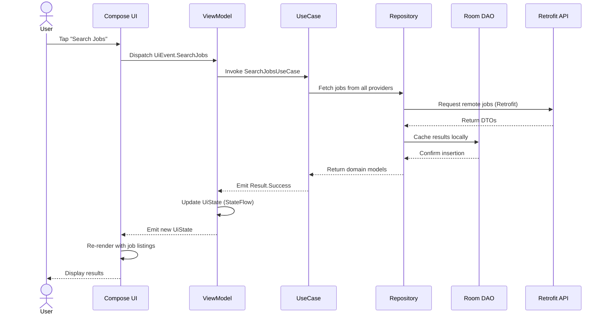
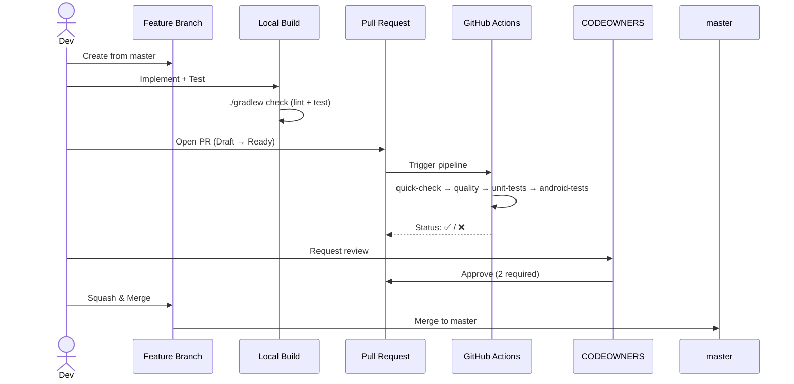

# Aivance Development Guide

> **Document Type:** Developer Onboarding & Engineering Reference  
> **Target Audience:** New engineers, open-source contributors, and team members  
> **Last Updated:** 2026-07-30

---

## Table of Contents

1. [Project Overview](#1-project-overview)
2. [System Requirements](#2-system-requirements)
3. [Getting Started](#3-getting-started)
4. [Architecture Overview](#4-architecture-overview)
5. [Module Dependency Graph](#5-module-dependency-graph)
6. [Clean Architecture Layers](#6-clean-architecture-layers)
7. [Tech Stack & Version Catalog](#7-tech-stack--version-catalog)
8. [Key Design Patterns](#8-key-design-patterns)
9. [Development Workflow](#9-development-workflow)
10. [Testing Guide](#10-testing-guide)
11. [Build & CI/CD Pipeline](#11-build--cicd-pipeline)
12. [Database Migrations](#12-database-migrations)
13. [Navigation Architecture](#13-navigation-architecture)
14. [AI Provider Integration](#14-ai-provider-integration)
15. [Troubleshooting](#15-troubleshooting)
16. [Reference: ADR Index](#16-reference-adr-index)

---

## 1. Project Overview

Aivance is a **production-grade Android application** built with multi-module Clean Architecture, Jetpack Compose, and Material 3. It serves as an AI-powered career companion with resume optimization, ATS matching, cover letter generation, interview coaching, job tracking, and career roadmap features.

### Key Features

| Feature | Module | Description |
|---------|--------|-------------|
| Resume Optimizer & ATS Matcher | `:feature:resume`, `:feature:ats` | Analyze and optimize resumes for ATS compatibility |
| AI Career Roadmap | `:feature:profile` | Generate personalized career paths based on skills |
| Cover Letter Generator | `:feature:coverletter` | Create tailored cover letters with AI |
| AI Interview Coach | `:feature:interview` | Practice interviews with real-time AI feedback |
| Universal Job Tracker | `:feature:tracker` | Full job search funnel management |
| Job Search | `:feature:jobs` | Multi-provider job search (RemoteOK, Remotive, LinkedIn, Indeed) |
| Dashboard | `:feature:dashboard` | Central hub with overview and recent activity |

### Repository

```
URL:      https://github.com/IamAzmathullaShaikh/Aivance
Remote:   Development (https://github.com/IamAzmathullaShaikh/Aivance.git)
Default:  master
License:  MIT
```

---

## 2. System Requirements

| Requirement | Version | Notes |
|-------------|---------|-------|
| **Android Studio** | Ladybug (2024.2.1+) | Koala or later may work |
| **JDK** | 17+ | Temurin recommended |
| **Android SDK** | API 26–37 | MinSdk 26, TargetSdk 37 |
| **Gradle** | 8.x (wrapper) | Managed via `gradle-wrapper.properties` |
| **Kotlin** | 2.4.10 | Multi-platform, Compose plugin |
| **AGP** | 9.3.1 | Android Gradle Plugin |

> **Android Studio Setup**: After cloning, Android Studio will detect the project and prompt you to sync Gradle. If not, go to `File > Sync Project with Gradle Files`.

---

## 3. Getting Started

### 3.1 Clone & Build

```bash
# Clone the repository
git clone https://github.com/IamAzmathullaShaikh/Aivance.git
cd Aivance

# Build the debug APK (verifies compilation)
./gradlew assembleDebug

# Run unit tests
./gradlew testDebug

# Run lint checks
./gradlew lintDebug
```

### 3.2 API Key Setup

AI features (Gemini, OpenAI, Groq) require API keys. Configure them in `local.properties`:

```properties
GEMINI_API_KEY=your_gemini_api_key_here
```

Or configure through the app at **Profile > Settings > AI Providers**.

> **⚠️ NEVER commit `local.properties`** — it is already in `.gitignore`.

### 3.3 Running on a Device/Emulator

1. Open the project in Android Studio
2. Select the `app` run configuration
3. Choose a device with API 26+
4. Click **Run** (or `Shift+F10`)

### 3.4 Common Gradle Commands

```bash
# Build
./gradlew assembleDebug                          # Debug APK
./gradlew assembleRelease                         # Release APK (requires keystore)
./gradlew :app:bundleRelease                      # Release AAB for Play Store

# Tests
./gradlew testDebug                               # All unit tests
./gradlew :core:domain:testDebugUnitTest           # Single module tests
./gradlew connectedDebugAndroidTest               # Instrumented tests

# Code Quality
./gradlew lintDebug                                # Android lint
./gradlew detekt                                   # Static analysis (config: config/detekt/detekt.yml)

# Database
./gradlew :core:database:kspDebugKotlin            # Generate Room schemas

# Clean
./gradlew clean                                    # Full clean
```

---

## 4. Architecture Overview

### 4.1 Clean Architecture Layers

```
┌─────────────────────────────────────────────────────────────────────────────┐
│                         PRESENTATION LAYER                                  │
│                                                                             │
│  ┌──────────────────────────────────────────────────────────────────────┐  │
│  │  Feature Modules (:feature:*)                                        │  │
│  │  ┌──────────────┐  ┌──────────────┐  ┌───────────────────────────┐  │  │
│  │  │ Compose UI   │  │  ViewModel   │  │ UiState / UiEvent / Effect│  │  │
│  │  │ (Screens,    │──│  (@HiltVM,   │──│ (Sealed Interface,        │  │  │
│  │  │  Components) │  │  StateFlow)  │  │  Immutable Data Class)    │  │  │
│  │  └──────────────┘  └──────┬───────┘  └───────────────────────────┘  │  │
│  └────────────────────────────┼─────────────────────────────────────────┘  │
│                               │                                            │
│  ┌────────────────────────────┼─────────────────────────────────────────┐  │
│  │  Design System Module      │  Navigation Module                      │  │
│  │  (:core:designsystem)      │  (:navigation)                          │  │
│  │  • Material 3 Theme        │  • Type-safe Destinations               │  │
│  │  • Color Schemes           │  • Adaptive NavigationSuiteScaffold     │  │
│  │  • Typography              │  • Deep linking                         │  │
│  │  • Reusable Components     │  • Nested graphs                        │  │
│  └────────────────────────────┼─────────────────────────────────────────┘  │
└───────────────────────────────┼─────────────────────────────────────────────┘
                                │  depends on
                                ▼
┌─────────────────────────────────────────────────────────────────────────────┐
│                           DOMAIN LAYER                                      │
│                                                                             │
│  Module: :core:domain (Pure Kotlin — NO Android dependencies)              │
│                                                                             │
│  ┌─────────────────────┐  ┌─────────────────────┐  ┌───────────────────┐  │
│  │ Use Cases           │  │ Repository           │  │ Domain Models     │  │
│  │ (Orchestrate        │──│ Interfaces           │──│ (JobListing,      │  │
│  │  repositories &     │  │ (Contracts for       │  │  Resume,          │  │
│  │  providers)         │  │  data layer)         │  │  UserProfile)     │  │
│  └─────────────────────┘  └─────────────────────┘  └───────────────────┘  │
│                                                                             │
│  ┌─────────────────────┐  ┌─────────────────────┐  ┌───────────────────┐  │
│  │ Analytics Engine    │  │ Telemetry Engine    │  │ Provider          │  │
│  │ Interface           │  │ Interface           │  │ Capabilities      │  │
│  └─────────────────────┘  └─────────────────────┘  └───────────────────┘  │
└───────────────────────────────┬─────────────────────────────────────────────┘
                                │  depends on
                                ▼
┌─────────────────────────────────────────────────────────────────────────────┐
│                             DATA LAYER                                      │
│                                                                             │
│  ┌──────────────┐ ┌──────────────┐ ┌──────────────┐ ┌──────────────────┐  │
│  │ :core:       │ │ :core:       │ │ :core:       │ │ :core:           │  │
│  │ database     │ │ datastore    │ │ network      │ │ job-providers    │  │
│  │ (Room, DAOs, │ │(Preferences, │ │ (Retrofit,   │ │ (RemoteOK,       │  │
│  │  Entities,   │ │ Proto)       │ │  OkHttp,     │ │  Remotive,       │  │
│  │  Migrations) │ └──────────────┘ │  APIs)       │ │  LinkedIn, etc)  │  │
│  └──────────────┘                  └──────────────┘ └──────────────────┘  │
│                                                                             │
│  ┌──────────────┐ ┌──────────────┐ ┌──────────────────────────────────┐   │
│  │ :core:data   │ │ :core:ai-    │ │ :core:sdk (Provider SDK)         │   │
│  │ (Repository  │ │ providers    │ │ • BaseProvider, ProviderManager  │   │
│  │  Implement-  │ │ (Gemini,     │ │ • AIProvider, JobProvider        │   │
│  │  ations,     │ │  OpenAI,     │ │ • ProviderCapability, Registry   │   │
│  │  Mappers)    │ │  Claude,     │ │ • SecretManager                  │   │
│  └──────────────┘ │  Groq)       │ └──────────────────────────────────┘   │
│                   └──────────────┘                                         │
├─────────────────────────────────────────────────────────────────────────────┤
│                     SHARED INFRASTRUCTURE                                   │
│  ┌──────────────┐ ┌──────────────┐ ┌──────────────┐ ┌──────────────────┐  │
│  │ :core:common │ │ :core:util   │ │ :app         │ │ Background       │  │
│  │ (Constants,  │ │ (Extensions, │ │ (MainActivity│ │ Workers          │  │
│  │  DTOs,       │ │  PDFBox,     │ │  AivanceApp, │ │ (Sync, Cleanup,  │  │
│  │  Enums,      │ │  Helpers)    │ │  DI setup)   │ │  Analytics)      │  │
│  │  Result<T>)  │ └──────────────┘ └──────────────┘ └──────────────────┘  │
│  └──────────────┘                                                          │
└─────────────────────────────────────────────────────────────────────────────┘
```

### 4.2 Architecture Decision Records (ADRs)

All significant architectural decisions are documented as ADRs in `docs/adr/`:

| # | Title | Status |
|---|-------|--------|
| 001 | Multi-Module Clean Architecture | ✅ Accepted |
| 002 | Tech Stack & Libraries | ✅ Accepted |
| 003 | Design System & Theming | ✅ Accepted |
| 004 | State-Driven Adaptive Navigation | ✅ Accepted |
| 005 | Dependency Injection with Hilt | ✅ Accepted |
| 006 | Local Persistence Strategy | ✅ Accepted |
| 007 | Network Layer Implementation | ✅ Accepted |
| 008 | UI State Management with UDF | ✅ Accepted |
| 009 | Logging & Error Handling | ✅ Accepted |
| 010 | AI Integration Strategy | ✅ Accepted |
| 011 | Image Loading with Coil | ✅ Accepted |
| 012 | Testing Strategy | ✅ Accepted |

---

## 5. Module Dependency Graph

### 5.1 Dependency Matrix

```
app
 ├── :core:common
 ├── :core:domain
 ├── :core:data
 ├── :core:network
 ├── :core:database
 ├── :core:datastore
 ├── :core:sdk
 ├── :core:util
 ├── :core:designsystem
 ├── :core:ai-providers
 ├── :feature:dashboard
 ├── :feature:resume
 ├── :feature:ats
 ├── :feature:coverletter
 ├── :feature:tracker
 ├── :feature:interview
 ├── :feature:jobs
 ├── :feature:profile
 └── :navigation

feature:dashboard
 ├── :core:common
 ├── :core:domain
 ├── :core:database
 └── :core:designsystem

feature:resume
 ├── :core:common
 ├── :core:domain
 ├── :core:util
 ├── :core:network
 ├── :core:database
 ├── :core:designsystem
 └── :feature:tracker

feature:ats
 ├── :core:common
 ├── :core:domain
 ├── :core:database
 └── :core:designsystem

feature:coverletter
 ├── :core:common
 ├── :core:domain
 ├── :core:database
 ├── :core:network
 ├── :core:designsystem
 └── :core:util

feature:jobs
 ├── :core:common
 ├── :core:domain
 ├── :core:designsystem
 └── :feature:tracker

feature:tracker
 ├── :core:common
 ├── :core:domain
 ├── :core:database
 └── :core:designsystem

feature:interview
 ├── :core:common
 ├── :core:domain
 ├── :core:designsystem
 ├── :core:network
 └── :core:sdk

feature:profile
 ├── :core:common
 ├── :core:domain
 ├── :core:designsystem
 ├── :core:database
 ├── :core:datastore
 └── :core:network

core:data
 ├── :core:domain
 ├── :core:database
 ├── :core:network
 ├── :core:datastore
 ├── :core:common
 └── :core:sdk

core:job-providers
 ├── :core:sdk
 ├── :core:common
 └── :core:network

core:ai-providers
 ├── :core:sdk
 └── :core:common
```

### 5.2 Visual Dependency Graph

```mermaid
graph TD
    app[":app"] --> core_common[":core:common"]
    app --> core_domain[":core:domain"]
    app --> core_data[":core:data"]
    app --> core_network[":core:network"]
    app --> core_db[":core:database"]
    app --> core_ds[":core:datastore"]
    app --> core_sdk[":core:sdk"]
    app --> core_util[":core:util"]
    app --> core_design[":core:designsystem"]
    app --> core_ai[":core:ai-providers"]
    app --> nav[":navigation"]
    app --> feat_dash[":feature:dashboard"]
    app --> feat_resume[":feature:resume"]
    app --> feat_ats[":feature:ats"]
    app --> feat_cover[":feature:coverletter"]
    app --> feat_tracker[":feature:tracker"]
    app --> feat_interview[":feature:interview"]
    app --> feat_jobs[":feature:jobs"]
    app --> feat_profile[":feature:profile"]

    feat_dash --> core_common & core_domain & core_db & core_design
    feat_resume --> core_common & core_domain & core_util & core_network & core_db & core_design & feat_tracker
    feat_ats --> core_common & core_domain & core_db & core_design
    feat_cover --> core_common & core_domain & core_db & core_network & core_design & core_util
    feat_jobs --> core_common & core_domain & core_design & feat_tracker
    feat_tracker --> core_common & core_domain & core_db & core_design
    feat_interview --> core_common & core_domain & core_design & core_network & core_sdk
    feat_profile --> core_common & core_domain & core_design & core_db & core_ds & core_network

    core_data --> core_domain & core_db & core_network & core_ds & core_common & core_sdk
    core_jp[":core:job-providers"] --> core_sdk & core_common & core_network
    core_ai --> core_sdk & core_common

    subgraph "Presentation Layer"
        feat_dash
        feat_resume
        feat_ats
        feat_cover
        feat_tracker
        feat_interview
        feat_jobs
        feat_profile
        nav
        core_design
    end

    subgraph "Domain Layer"
        core_domain
    end

    subgraph "Data Layer"
        core_data
        core_network
        core_db
        core_ds
        core_ai
        core_jp
        core_sdk
    end

    subgraph "Infrastructure"
        core_common
        core_util
    end

    subgraph "Application"
        app
    end
```



---

## 6. Clean Architecture Layers

### 6.1 Layer Rules

| Layer | Allows Dependencies | Forbidden Dependencies |
|-------|-------------------|----------------------|
| **Presentation** (`:feature:*`) | Domain interfaces, `:core:designsystem`, `:core:common` | DAOs, Retrofit, other `:feature:*` modules |
| **Domain** (`:core:domain`) | Core models, Kotlin stdlib, Coroutines | Android framework (`Context`, `View`), Room, Retrofit |
| **Data** (`:core:database`, `:core:network`, `:core:data`) | Domain interfaces, Room, Retrofit, `:core:common` | UI components, Jetpack Compose |
| **SDK** (`:core:sdk`) | `:core:common`, Coroutines | Android framework |
| **Cross-Feature** | Navigation module only | Never import another `:feature:*` directly |

### 6.2 Data Flow Pattern



### 6.3 Unidirectional Data Flow (UDF)

Every screen follows this pattern:

```
User Action → UiEvent → ViewModel.handleEvent() → Update State → Compose Re-renders
                                                ↓
                                          UiEffect (one-time: navigation, snackbar, toast)
```

**Key Rules:**
- UI state is an **immutable data class** exposed via `StateFlow`
- UI sends **events** (sealed interface) to ViewModel
- ViewModel emits **one-time effects** (sealed interface) via `SharedFlow`
- State is never mutated from the UI layer

---

## 7. Tech Stack & Version Catalog

### 7.1 Key Libraries

| Library | Version | Purpose |
|---------|---------|---------|
| Kotlin | 2.4.10 | Language |
| Android Gradle Plugin | 9.3.1 | Build system |
| Jetpack Compose BOM | 2024.09.00 | UI framework |
| Material 3 | via BOM | Design system |
| Hilt | 2.60.1 | Dependency injection |
| Room | 2.8.4 | Local database |
| Retrofit | 3.0.0 | HTTP client |
| OkHttp | 5.4.0 | HTTP engine |
| Coil | 3.5.0 | Image loading |
| Navigation 3 | 1.0.1 | Adaptive navigation |
| DataStore | 1.2.1 | Preferences storage |
| WorkManager | 2.11.2 | Background tasks |
| Timber | 5.0.1 | Logging |
| Paging 3 | 3.5.0 | Paginated lists |
| Firebase BoM | 34.10.0 | Firebase services |

### 7.2 Testing Libraries

| Library | Version | Purpose |
|---------|---------|---------|
| JUnit | 4.13.2 | Unit test framework |
| MockK | 1.14.11 | Mocking library |
| Turbine | 1.1.0 | Flow testing |
| Robolectric | 4.12.2 | Android unit tests |
| Truth | 1.4.2 | Assertions |
| MockWebServer | via OkHttp | HTTP mocking |

### 7.3 Dependency Management

All dependencies are declared in `gradle/libs.versions.toml` using Gradle Version Catalog. **Direct string dependencies in module `build.gradle.kts` files are prohibited.**

```toml
# gradle/libs.versions.toml — Single source of truth
[versions]
kotlin = "2.4.10"
composeBom = "2024.09.00"
hilt = "2.60.1"

[libraries]
androidx-compose-material3 = { group = "androidx.compose.material3", name = "material3" }
hilt-android = { group = "com.google.dagger", name = "hilt-android", version.ref = "hilt" }

[plugins]
android-application = { id = "com.android.application", version.ref = "agp" }
```

---

## 8. Key Design Patterns

### 8.1 ViewModel with UDF

```kotlin
// UiState — immutable data class
data class ResumeUiState(
    val isLoading: Boolean = false,
    val resume: Resume? = null,
    val error: String? = null
)

// UiEvent — sealed interface for user actions
sealed interface ResumeUiEvent {
    data class Analyze(val resumeId: Long) : ResumeUiEvent
    data object Refresh : ResumeUiEvent
}

// UiEffect — one-time effects
sealed interface ResumeUiEffect {
    data class ShowSnackbar(val message: String) : ResumeUiEffect
    data class NavigateToDetails(val resumeId: Long) : ResumeUiEffect
}

@HiltViewModel
class ResumeViewModel @Inject constructor(
    private val analyzeUseCase: AnalyzeResumeUseCase
) : ViewModel() {

    private val _uiState = MutableStateFlow(ResumeUiState())
    val uiState: StateFlow<ResumeUiState> = _uiState.asStateFlow()

    private val _effects = MutableSharedFlow<ResumeUiEffect>()
    val effects: SharedFlow<ResumeUiEffect> = _effects.asSharedFlow()

    fun handleEvent(event: ResumeUiEvent) {
        when (event) {
            is ResumeUiEvent.Analyze -> analyzeResume(event.resumeId)
            is ResumeUiEvent.Refresh -> loadResumes()
        }
    }

    private fun analyzeResume(id: Long) {
        viewModelScope.launch {
            _uiState.update { it.copy(isLoading = true) }
            analyzeUseCase(id).onSuccess { result ->
                _uiState.update { it.copy(isLoading = false, resume = result) }
                _effects.emit(ResumeUiEffect.ShowSnackbar("Analysis complete"))
            }.onFailure { error ->
                _uiState.update { it.copy(isLoading = false, error = error.message) }
            }
        }
    }
}
```

### 8.2 Repository Pattern

```kotlin
// Domain layer — interface
interface JobRepository {
    fun searchJobs(query: String, filter: SearchFilter): Flow<PagingData<JobListing>>
    fun getJobById(id: String): Flow<CoreResult<JobListing>>
}

// Data layer — implementation
class JobRepositoryImpl @Inject constructor(
    private val localDataSource: JobLocalDataSource,
    private val jobDao: JobDao,
    private val providerManager: ProviderManager
) : JobRepository {

    override fun searchJobs(query: String, filter: SearchFilter): Flow<PagingData<JobListing>> {
        return Pager(
            config = PagingConfig(pageSize = 20),
            pagingSourceFactory = { jobDao.getJobsPagingSource() }
        ).flow.map { pagingData ->
            pagingData.map { it.toDomain() }
        }
    }

    override fun getJobById(id: String): Flow<CoreResult<JobListing>> {
        return localDataSource.getJobs().map { jobs ->
            runCatchingCore { jobs.find { it.id == id } ?: throw Exception("Job not found") }
        }
    }
}
```

### 8.3 Use Case Pattern

```kotlin
class AnalyzeResumeUseCase @Inject constructor(
    private val resumeRepository: ResumeRepository,
    private val analyticsEngine: AnalyticsEngine
) {
    suspend operator fun invoke(resumeId: Long, jobDescription: String): CoreResult<ResumeAnalysis> {
        // 1. Validate input
        if (jobDescription.isBlank()) {
            return Result.Failure(ValidationError("jobDescription", "Job description cannot be empty"))
        }

        // 2. Orchestrate
        return resumeRepository.analyzeResume(resumeId, jobDescription)
            .onSuccess { analyticsEngine.trackFeatureUsage(FeatureCategory.ATS) }
    }
}
```

---

## 9. Development Workflow

### 9.1 Branch Strategy

The project follows GitHub Flow with protected `master` branch:

```
master (protected — no direct pushes)
  ├── feat/AV-XXX-feature-name      (new features)
  ├── fix/AV-XXX-bug-description     (bug fixes)
  ├── refactor/AV-XXX-description    (refactoring)
  ├── perf/AV-XXX-description        (performance)
  ├── sec/AV-XXX-description         (security)
  ├── docs/AV-XXX-description        (documentation)
  ├── test/AV-XXX-description        (tests only)
  └── release/vX.Y.Z                 (release branches)
```

### 9.2 Commit Convention

All commits must follow [Conventional Commits](https://www.conventionalcommits.org/):

```
feat(scope): short description

Optional body with details.

Fixes #AV-XXX
```

**Allowed types:** `feat`, `fix`, `docs`, `refactor`, `perf`, `test`, `build`, `ci`, `chore`, `sec`

### 9.3 PR Process



### 9.4 Code Review Checklist

Before requesting review, verify:

- [ ] `./gradlew assembleDebug` compiles
- [ ] `./gradlew lintDebug` has zero violations
- [ ] `./gradlew testDebug` passes all tests
- [ ] New code has corresponding tests (JUnit + MockK + Turbine)
- [ ] Commits follow Conventional Commits format
- [ ] No secrets, hardcoded credentials, or debug logs
- [ ] KDoc comments on public APIs
- [ ] Material 3 a11y: content descriptions, 48dp touch targets, 4.5:1 contrast

---

## 10. Testing Guide

### 10.1 Test Pyramid

```
         /\
        /  \     UI / Compose Tests (~10%)
       /    \    [createComposeRule, ComposeTestRule]
      /------\
     /        \   Integration Tests (~20%)
    /          \  [MockWebServer, Room In-Memory]
   /------------\
  /              \  Unit Tests (~70%)
 /                \ [JUnit4, MockK, Turbine, Coroutines Test]
/------------------\
```

### 10.2 Writing Tests

**ViewModel tests** use Turbine for StateFlow testing:

```kotlin
@Test
fun `analyzeResume success updates state`() = runTest {
    val mockResult = ResumeAnalysis(score = 85, matchSummary = "Great match")
    coEvery { mockUseCase.invoke(any()) } returns Result.Success(mockResult)

    viewModel.handleEvent(ResumeUiEvent.Analyze(1L))

    viewModel.uiState.test {
        assertEquals(ResumeUiState(isLoading = true), awaitItem())
        assertEquals(ResumeUiState(isLoading = false, resume = mockResult), awaitItem())
    }
}
```

**Repository tests** use MockK:

```kotlin
@Test
fun `getJobById returns success when job exists`() = runTest {
    val jobs = listOf(JobListing(id = "1", title = "Engineer", ...))
    every { localDataSource.getJobs() } returns flowOf(jobs)

    repository.getJobById("1").test {
        val result = awaitItem()
        assertTrue(result is Result.Success)
        assertEquals("Engineer", (result as Result.Success).data.title)
    }
}
```

### 10.3 Test Commands

```bash
# Run all unit tests
./gradlew testDebug

# Run single module
./gradlew :core:domain:testDebugUnitTest

# Run single test class
./gradlew :core:data:testDebugUnitTest --tests "*AnalyticsEngineTest*"

# Run instrumented tests (requires emulator)
./gradlew connectedDebugAndroidTest
```

---

## 11. Build & CI/CD Pipeline

### 11.1 Pipeline Overview

The project uses GitHub Actions with 10 jobs (defined in `.github/workflows/ci.yml`):

| Job | Timeout | Trigger | Description |
|-----|---------|---------|-------------|
| `quick-check` | 15 min | PR only | Fast compile of 4 core modules |
| `code-quality` | 15 min | All | detekt, lint, API compatibility |
| `unit-tests` | 30 min | All | Matrix test across 16 modules |
| `android-tests` | 45 min | Push only | Instrumented tests (API 29, 34) |
| `code-coverage` | 20 min | After tests | Merged coverage report |
| `security-scan` | 15 min | All | Dependency tree + vulnerability check |
| `build` | 30 min | Master push | Release AAB + APK + ProGuard |
| `benchmark` | 30 min | Master push | Baseline profile + macrobenchmark |
| `release` | 30 min | Manual | Play Store deployment |
| `notify` | — | All (except PR) | Slack + email on failure |

### 11.2 Build Types

| Build | Command | Minify | ProGuard | Use |
|-------|---------|--------|----------|-----|
| Debug | `./gradlew assembleDebug` | No | No | Development |
| Release | `./gradlew assembleRelease` | Yes | Yes | Production |

### 11.3 GitHub Actions Secrets

| Secret | Required For | Purpose |
|--------|-------------|---------|
| `AIVANCE_KEYSTORE_BASE64` | Release | Base64-encoded keystore |
| `AIVANCE_STORE_PASSWORD` | Release | Keystore password |
| `AIVANCE_KEY_ALIAS` | Release | Key alias |
| `AIVANCE_KEY_PASSWORD` | Release | Key password |
| `PLAY_SERVICE_ACCOUNT_JSON` | Play Store | Google Play API access |
| `SLACK_WEBHOOK_URL` | Notifications | Slack alert channel |
| `NOTIFY_EMAIL` | Notifications | Failure email recipient |

---

## 12. Database Migrations

### 12.1 Room Schema

The database (`AivanceDatabase`, version 9) includes:

| Entity | Table | DAO |
|--------|-------|-----|
| Resume | `resumes` | `ResumeDao` |
| ResumeSection | `resume_sections` | `ResumeDao` |
| ResumeAnalysis | `ats_results` | `AtsDao` |
| Job | `jobs` | `JobDao` |
| Company | `companies` | `CompanyDao` |
| JobApplication | `job_applications` | `TrackerDao` |
| InterviewSession | `interview_sessions` | `InterviewDao` |
| InterviewMessage | `interview_messages` | `InterviewDao` |
| AIConversation | `ai_conversations` | `AiDao` |
| AIMessage | `ai_messages` | `AiDao` |
| UserProfile | `user_profiles` | `ProfileDao` |
| AnalyticsEvent | `analytics_events` | `AnalyticsDao` |
| ProviderConfiguration | `provider_configs` | `AnalyticsDao` |

### 12.2 Running Migrations

```bash
# Export current schema
./gradlew :core:database:kspDebugKotlin

# Schema files are output to:
# core/database/schemas/com.bangersoul.aivance.core.database.AivanceDatabase/
```

### 12.3 Migration Guidelines

- Always write both `MIGRATION_X_Y` AND update `AivanceDatabase.version`
- Test migrations with `MigrationTestHelper`
- Never delete columns that might still be used by installed versions
- Schema JSON files are version-controlled in `core/database/schemas/`

---

## 13. Navigation Architecture

### 13.1 Type-Safe Destinations

Navigation uses Jetpack Navigation 3 with type-safe `Destination` objects:

```kotlin
// :navigation module — Destination.kt
sealed interface Destination {
    @Serializable data object Splash : Destination
    @Serializable data object Login : Destination
    @Serializable data object Dashboard : Destination
    @Serializable data class JobDetails(val jobId: String) : Destination
    @Serializable data class InterviewSession(val sessionId: String) : Destination
}
```

### 13.2 Supported Destinations

| Route | Screen | Deep Link |
|-------|--------|-----------|
| `/splash` | Splash | — |
| `/login` | Login | — |
| `/register` | Registration | — |
| `/dashboard` | Home Dashboard | — |
| `/resume` | Resume List | `aivance://resume/{id}` |
| `/resume/builder` | Resume Builder | — |
| `/ats` | ATS Scanner | — |
| `/cover-letter` | Cover Letter | — |
| `/chat` | AI Assistant | `aivance://chat/{id}` |
| `/interview` | Interview Prep | — |
| `/interview/session/{id}` | Live Interview | `aivance://interview/{id}` |
| `/jobs` | Job Search | — |
| `/jobs/{id}` | Job Details | `aivance://job/{id}` |
| `/jobs/saved` | Saved Jobs | — |
| `/tracker` | Job Tracker | — |
| `/roadmap` | Career Roadmap | `aivance://roadmap` |
| `/profile` | User Profile | — |
| `/settings` | Settings | — |
| `/providers` | Provider Management | — |

---

## 14. AI Provider Integration

### 14.1 Provider SDK Architecture

```
ProviderSDK (:core:sdk)
├── BaseProvider (abstract, lifecycle-managed)
├── AIProvider (abstract, extends BaseProvider)
│   ├── GeminiAIProvider
│   ├── OpenAIProvider
│   ├── ClaudeProvider
│   ├── GroqProvider
│   ├── OpenRouterProvider
│   └── OllamaProvider
├── JobProvider (abstract, extends BaseProvider)
│   ├── RemoteOKProvider
│   ├── RemotiveProvider
│   ├── LinkedInProvider (via Apify)
│   ├── IndeedProvider (via Apify)
│   ├── GreenhouseProvider (ATS)
│   └── LeverProvider (ATS)
├── ProviderManager (lifecycle orchestration)
├── ProviderRegistry (provider discovery)
├── SecretManager (secure credential storage)
└── ProviderCapability (sealed class hierarchy)
```

### 14.2 Adding a New Provider

1. Create a new class extending `AIProvider` or `JobProvider` in `:core:ai-providers` or `:core:job-providers`
2. Implement required abstract methods
3. Register in the Hilt module (`AiProvidersModule.kt` / `JobProvidersModule.kt`)
4. Add to `ProviderRegistry` via `@IntoSet` binding
5. Add tests with `MockWebServer` for network calls

---

## 15. Troubleshooting

### Common Issues & Solutions

| Issue | Likely Cause | Solution |
|-------|-------------|----------|
| `A failure occurred while executing BuildToolsApiCompilationWork` | Version catalog mismatches or KSP version | Run `./gradlew clean` and re-sync |
| `Unresolved reference: ...` | Missing import or dependency | Check `build.gradle.kts` for the dependency |
| `BUILD FAILED` on Room | Outdated schema or missing migration | Run `./gradlew :core:database:kspDebugKotlin` |
| `google-services.json` missing | Firebase not configured | Already included; if missing, create placeholder with `{"project_info":{"project_number":"0","project_id":"placeholder"},"client":[{"client_info":{"mobilesdk_app_id":"1:0:android:placeholder","android_client_info":{"package_name":"com.bangersoul.aivance"}},"api_key":[{"current_key":"placeholder"}]}]}` |
| Tests fail with `InvalidTestClassError` | JUnit 4 non-void `@Test` method | Ensure all `@Test` methods return `Unit` (add explicit `Unit` after `runBlocking{}`) |
| `KeyStoreException` in tests | Android KeyStore not available | Use Robolectric or mock `CryptoManager` |
| `./gradlew` permission denied | Wrong shell | Use `gradlew.bat` on Windows |

### 15.1 Android Studio Tips

- **Enable Room Query Validation**: Settings → Languages & Frameworks → Room → Enable annotation processing
- **Enable KSP Logging**: Add `-Dksp.showFullErrorMessages=true` to `gradle.properties`
- **Clear Cache**: File → Invalidate Caches / Restart
- **Build Analyzer**: View → Tool Windows → Build Analyzer (identifies slow tasks)

---

## 16. Reference: ADR Index

All Architecture Decision Records are in `docs/adr/`:

| # | Title | File |
|---|-------|------|
| 0001 | Multi-Module Clean Architecture | [0001-project-structure-and-multi-module.md](adr/0001-project-structure-and-multi-module.md) |
| 0002 | Tech Stack & Libraries | [0002-tech-stack-and-libraries.md](adr/0002-tech-stack-and-libraries.md) |
| 0003 | Design System & Theming | [0003-design-system-and-theming.md](adr/0003-design-system-and-theming.md) |
| 0004 | State-Driven Adaptive Navigation | [0004-navigation-strategy.md](adr/0004-navigation-strategy.md) |
| 0005 | Dependency Injection with Hilt | [0005-dependency-injection-with-hilt.md](adr/0005-dependency-injection-with-hilt.md) |
| 0006 | Local Persistence Strategy | [0006-local-persistence-strategy.md](adr/0006-local-persistence-strategy.md) |
| 0007 | Network Layer Implementation | [0007-network-layer-implementation.md](adr/0007-network-layer-implementation.md) |
| 0008 | UI State Management with UDF | [0008-ui-state-management.md](adr/0008-ui-state-management.md) |
| 0009 | Logging & Error Handling | [0009-logging-and-error-handling.md](adr/0009-logging-and-error-handling.md) |
| 0010 | AI Integration Strategy | [0010-ai-integration-strategy.md](adr/0010-ai-integration-strategy.md) |
| 0011 | Image Loading with Coil | [0011-image-loading-with-coil.md](adr/0011-image-loading-with-coil.md) |
| 0012 | Testing Strategy | [0012-testing-strategy.md](adr/0012-testing-strategy.md) |

---

## Additional Resources

- **[README.md](../README.md)** — Project overview, features, quick start
- **[CONTRIBUTING.md](../CONTRIBUTING.md)** — Full contributor guidelines, coding standards, PR process
- **[RELEASE_CHECKLIST.md](RELEASE_CHECKLIST.md)** — Pre/post-release verification checklist
- **[Architecture ADRs](adr/)** — Detailed architectural decision records
- **`.github/workflows/ci.yml`** — CI/CD pipeline configuration
- **`.github/dependabot.yml`** — Automated dependency updates
